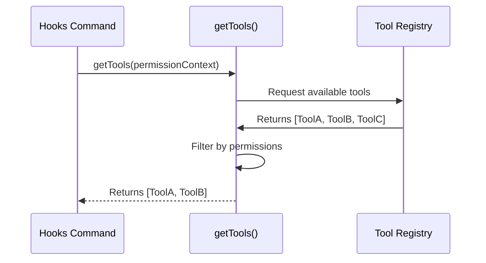

# Chapter 4: Tool Ecosystem Integration

Welcome back!

In the previous chapter, [Local JSX Execution](03_local_jsx_execution.md), we built the visual interface for our command. We created a "Pop-up Store" that displays a menu.

However, if you looked closely at the code in the last chapter, you might have noticed a problem. Our store shelves are empty! We have a menu component, but we don't know *what* items to put on it.

In this chapter, we will learn how to fill those shelves by using **Tool Ecosystem Integration**.

### The Motivation: The Universal Remote Wizard

Imagine you just bought a high-end Universal Remote Control. You want to program it to control your living room.

**The Problem:**
The remote comes from the factory blank. It doesn't know you own a Samsung TV, a Sony Soundbar, and a generic DVD player. If the remote assumed everyone owns a Sony TV, it wouldn't work for you.

**The Solution:**
You run the **Setup Wizard**. The remote "scans" the room, detects the signals from your specific devices, and then presents you with a list: *"I found a TV and a Soundbar. Which one do you want to configure?"*

In our `hooks` project:
*   **The Remote** is the `hooks` configuration command.
*   **The Devices** are the tools installed in your project (like a Linter, a Tester, or a Formatter).
*   **The Scanner** is the **Tool Ecosystem Integration**.

We need to bridge the gap between our generic command and the specific tools available in the user's environment.

### Core Concept: The `getTools` Scanner

The heart of this integration is a function usually named `getTools`. Its job is to look at the current environment and return a list of available tools.

Let's look at how we use this in our code.

**Input:** `hooks.tsx` (Logic section)
```typescript
import { getTools } from '../../tools.js';

// Inside the command's call function...

// 1. Get the list of all available tool objects
const allTools = getTools(permissionContext);

// 2. We only need their names for the menu
const toolNames = allTools.map(tool => tool.name);
```

**Explanation:**
1.  **`getTools(...)`**: This is our scanner. We ask it, "What is available?"
2.  **`permissionContext`**: This is a security badge we pass to the scanner (more on this below).
3.  **`.map(...)`**: The scanner returns heavy "Tool Objects" containing code and logic. The menu doesn't need that weight; it just needs the labels. We extract just the names (e.g., `['eslint', 'jest']`).

### Step 1: The Security Check (Permission Context)

Before we can scan the room, we need permission to enter. In our system, not every command is allowed to see every tool.

We retrieve this permission "badge" from the Application State.

**Input:** `hooks.tsx`
```typescript
// 'context' is passed to us by the Runner (see Chapter 3)
const appState = context.getAppState();

// We extract the specific permission slip for tools
const permissionContext = appState.toolPermissionContext;
```

**Explanation:**
The **Application State Context** (which we will cover in [Application State Context](05_application_state_context.md)) holds the global information. We grab the `toolPermissionContext` to prove to the scanner that we are allowed to see the tools.

### Step 2: Running the Scan

Now that we have the badge, we run the scan.

**Input:** `hooks.tsx`
```typescript
// Run the scanner with our badge
const tools = getTools(permissionContext);

// Result: tools is an array of objects
// [ { name: 'linter', ... }, { name: 'tester', ... } ]
```

**Explanation:**
The `getTools` function logic is decoupled from our command. Our `hooks` command doesn't know *how* to find a linter. It just asks the ecosystem, "Give me everything you have." This makes our command very flexible; if we install a new tool tomorrow, this code doesn't change.

### Step 3: Feeding the UI

Finally, we take this list and pass it to the UI component we built in the previous chapter.

**Input:** `hooks.tsx`
```typescript
// ... inside the return statement
<HooksConfigMenu 
  toolNames={toolNames} 
  onExit={onDone} 
/>
```

**Explanation:**
Now the `HooksConfigMenu` receives `['linter', 'tester']`. It dynamically generates a button for each one. We have successfully connected the "Brain" (the ecosystem) to the "Face" (the UI).

### Under the Hood: How the Scan Works

What actually happens inside `getTools`? It acts as a registry lookup.

When the application starts, various plugins "register" themselves. `getTools` simply returns the list of those who registered successfully.



1.  **Request:** The command asks for tools.
2.  **Fetch:** The scanner checks the central registry.
3.  **Filter:** It checks if the `permissionContext` allows access to these tools.
4.  **Return:** It gives the clean list back to the command.

### Deep Dive: Internal Implementation

Let's look at a simplified version of what `getTools` might look like inside `tools.js`.

**Input:** `tools.ts` (Simplified internal logic)
```typescript
// A private list where tools are stored
const registeredTools = [];

export function getTools(context) {
  // Simple check: do we have context?
  if (!context) return [];

  // Filter the list based on logic
  return registeredTools.filter(tool => {
     return tool.isCompatible(context);
  });
}
```

**Explanation:**
This abstraction is critical. It ensures that:
1.  **Safety:** Broken or unauthorized tools are filtered out before the UI ever sees them.
2.  **Stability:** If the list is empty, the array is just empty `[]`. The app doesn't crash; the menu simply shows no items.

### Summary

In this chapter, we learned about **Tool Ecosystem Integration**.
1.  We used the **"Universal Remote"** analogy to understand why we need to scan for tools dynamically.
2.  We learned that `getTools(context)` is our scanner function.
3.  We saw how to transform complex Tool Objects into a simple list of names for our UI.
4.  We briefly touched on `appState`, the source of our permissions.

We have now defined the command, loaded it, built its UI, and populated that UI with data. But where did that `appState` come from in the first place? How does the application know the state of the world?

In the final chapter, we will explore the **Application State Context**.

[Next: Application State Context](05_application_state_context.md)

---

Generated by [Code IQ](https://github.com/adityasoni99/Code-IQ)