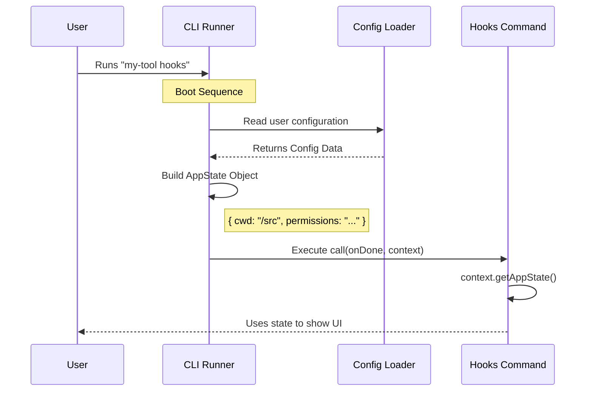

# Chapter 5: Application State Context

Welcome to the final chapter of our tutorial series!

In the previous chapter, [Tool Ecosystem Integration](04_tool_ecosystem_integration.md), we learned how to scan the environment to find available tools. To do that, we briefly used a variable called `permissionContext`, but we didn't explain where it came from.

Today, we solve that mystery. We are exploring the **Application State Context**.

### The Motivation: The Contractor and the Security Pass

Imagine you are a contractor hired to fix a lightbulb in a high-security office building.

**The Problem:**
You have your tools (screwdriver, ladder), but when you arrive at the front door, it's locked. You don't own the building. You don't have the keys. You don't even know which room the broken light is in.

**The Solution:**
The receptionist gives you a **Guest Badge** and a **Map**.
1.  **The Badge** proves who you are and allows you to unlock specific doors (Permissions).
2.  **The Map** tells you where things are located (Configuration).

In our CLI tool:
*   **The Contractor** is your Command (like `hooks`).
*   **The Building** is the User's Computer.
*   **The Guest Badge** is the **Application State Context**.

Without this context, your command is operating in a vacuum. It wouldn't know the current working directory, the user's preferences, or if it's allowed to access certain files.

### Accessing the Context

When we defined our `call` function in [Local JSX Execution](03_local_jsx_execution.md), we saw it accepted two arguments: `onDone` and `context`.

Let's look at how we open this "Guest Badge."

**Input:** `hooks.tsx`
```typescript
import type { LocalJSXCommandCall } from '../../types/command.js';

export const call: LocalJSXCommandCall = async (onDone, context) => {
  
  // 1. The context is our connection to the main app
  // We ask it to reveal the current state.
  const appState = context.getAppState();

  // ... rest of code
};
```

**Explanation:**
The `context` object is a wrapper. We use `getTools()` (conceptually) or `getAppState()` to retrieve the actual data object. This ensures we get the most up-to-date information the moment the command runs.

### What is Inside the Badge?

The `appState` is a plain JavaScript object that holds global information. Let's look at what specific data we extract for our `hooks` command.

**Input:** `hooks.tsx`
```typescript
// ... inside call function

// 2. We extract the Permission Context
// This tells the system what this command is allowed to see.
const permissionContext = appState.toolPermissionContext;

// 3. We use it to scan for tools (Recap from Chapter 4)
const toolNames = getTools(permissionContext).map(t => t.name);
```

**Explanation:**
*   **`toolPermissionContext`**: This acts like the magnetic strip on a keycard. When we pass this to `getTools`, the system checks: *"Does this user have permission to see the Linter tool?"*
*   **Centralization**: If the user updates their permissions in a config file, our command doesn't need to change code. The `appState` will simply update, and we will receive the new permissions automatically.

### Other Uses for App State

While our `hooks` command specifically uses permissions, the `appState` usually contains other vital info.

**Input:** Conceptual Usage
```typescript
const appState = context.getAppState();

// Example: Where is the user running this from?
console.log("Working Directory:", appState.cwd);

// Example: Is the user in 'verbose' mode?
if (appState.config.verbose) {
    console.log("Loading detailed logs...");
}
```

**Explanation:**
This allows your command to be "Environment Aware." It behaves differently depending on where and how the user runs the application.

### Under the Hood: How Context is Created

How does this object get created and passed to us? It happens during the application "Boot" sequence.

1.  **Boot:** The CLI starts.
2.  **Config Load:** It reads `tengu.config.json` (or similar) from the hard drive.
3.  **State Creation:** It combines the config, system environment variables, and arguments into a single `appState` object.
4.  **Injection:** It passes this object into every command it runs.



### Deep Dive: Internal Implementation

Let's look at the code inside the **CLI Runner** that prepares this package for us.

**Input:** `context-factory.ts` (Simplified)
```typescript
// A factory function that creates the context
export function createCommandContext(globalConfig) {
  
  // 1. Build the State Object
  const appState = {
    cwd: process.cwd(),
    toolPermissionContext: globalConfig.permissions,
    // ... other global data
  };

  // 2. Return the wrapper object
  return {
    getAppState: () => appState
  };
}
```

**Explanation:**
*   **`createCommandContext`**: This function runs *before* your command is ever loaded.
*   **`process.cwd()`**: Node.js allows us to see the current folder.
*   **Closure**: The `appState` variable is "trapped" inside the returned object. This ensures that every command gets access to the exact same instance of the state.

### Tying It All Together

We have now covered the entire lifecycle of a command in the **hooks** project. Let's review the journey:

1.  **[Command Registry Definition](01_command_registry_definition.md)**: We created a menu item so the app knows `hooks` exists.
2.  **[Dynamic Command Loading](02_dynamic_command_loading.md)**: We set up lazy loading so the code is only fetched when needed.
3.  **[Local JSX Execution](03_local_jsx_execution.md)**: We built an interactive UI using React and Ink components.
4.  **[Tool Ecosystem Integration](04_tool_ecosystem_integration.md)**: We learned how to scan for plugins and tools to populate our UI.
5.  **Application State Context**: (This Chapter) We learned how to pass global data and permissions into our command securely.

### Conclusion

Congratulations! You have successfully navigated the architecture of the **hooks** project.

By understanding these five pillars, you can now build commands that are:
*   **Fast** (via Lazy Loading).
*   **Interactive** (via Local JSX).
*   **Extensible** (via Tool Ecosystem).
*   **Smart** (via Application State Context).

You now possess the "Badge" and the "Map" to build your own powerful CLI tools. Happy coding!

---

Generated by [Code IQ](https://github.com/adityasoni99/Code-IQ)