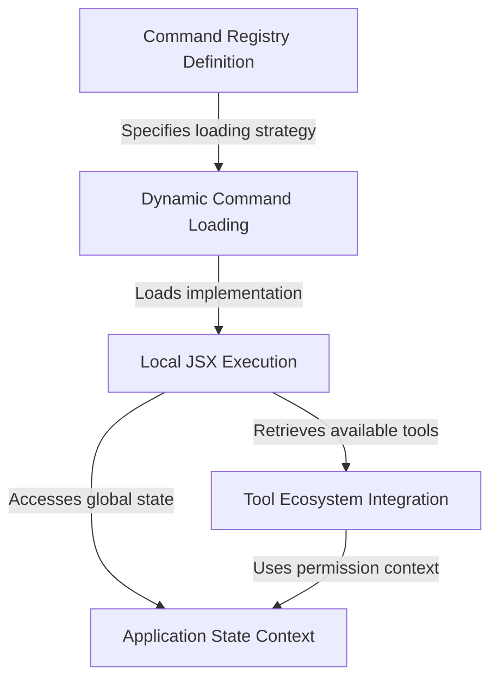

# Tutorial: hooks

This project defines a **CLI command** called "hooks" that allows users to view and configure settings for various system tools. It employs a *dynamic loading* strategy to import the heavy logic and interactive **React-based UI** only when the command is actually executed. The command integrates with the global **application state** to verify permissions and dynamically retrieve the list of available tools to display.

## Chapters

1. [Command Registry Definition](01_command_registry_definition.md)
2. [Dynamic Command Loading](02_dynamic_command_loading.md)
3. [Local JSX Execution](03_local_jsx_execution.md)
4. [Tool Ecosystem Integration](04_tool_ecosystem_integration.md)
5. [Application State Context](05_application_state_context.md)

---

Generated by [Code IQ](https://github.com/adityasoni99/Code-IQ)