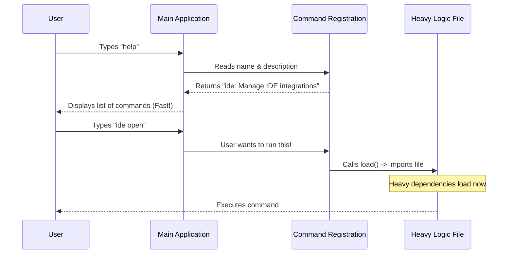

# Chapter 1: Command Registration

Welcome to the **ide** project! If you are new to building Command Line Interface (CLI) tools, you are in the right place.

In this first chapter, we are going to look at the very first step of creating a command: **Command Registration**.

## Why do we need this?

Imagine you walk into a restaurant. You sit down, and the waiter hands you a menu. The menu lists the names of the dishes (like "Burger" or "Pasta") and a short description. It does **not** bring the actual food to your table immediately. The chef only starts cooking when you actually order something.

Command Registration works exactly the same way.

### The Problem: Slow Startups
If our CLI tool has 50 different commands, and we load all the heavy programming logic for every single one of them just to start the app, the tool would feel very slow and "heavy."

### The Solution: The Menu Approach
We create a lightweight "menu entry" for our `ide` command. It tells the main application:
1.  **Name:** What the user types (`ide`).
2.  **Description:** What the command does.
3.  **Loader:** A special instruction to only load the heavy code when the user asks for it.

## How to Register a Command

Let's look at how we define this "menu entry" in our code. We use a simple JavaScript/TypeScript object to define the command.

### Step 1: Defining the Metadata
First, we define the basic information about our command. This is lightweight and fast to read.

```typescript
// File: index.ts

const ide = {
  // 'local-jsx' tells the CLI we will render a UI later
  type: 'local-jsx', 
  
  // This is the keyword the user types in the terminal
  name: 'ide',
  
  // A helpful description shown in the help menu
  description: 'Manage IDE integrations and show status',
```
*Explanation:* Here we are just setting up strings. The `type` property is interesting—it hints that this command will eventually use an [Interactive Terminal Interface](03_interactive_terminal_interface.md), but we don't need to load that UI system yet.

### Step 2: The "Lazy" Loader
This is the most important part. Instead of writing the command logic right here, we provide a function to find it later.

```typescript
  // Hints about arguments (optional)
  argumentHint: '[open]',

  // THE MAGIC PART: 
  // Only import the heavy 'ide.js' file when this function is called
  load: () => import('./ide.js'),
} satisfies Command
```
*Explanation:* The `load` function uses a technique called **Lazy Loading**. It promises the application: *"If the user runs this command, go find `./ide.js` and run it. Until then, ignore it."*

### Step 3: Exporting the Command
Finally, we export this object so the main CLI application can add it to its list.

```typescript
// We export the object to be used by the main CLI app
export default ide
```

## Internal Implementation: Under the Hood

What actually happens when a user types `ide` in their terminal? Let's visualize the flow.

### Sequence Diagram
This diagram shows how the CLI reads the "Menu" (Registration) first, and only "Cooks" (Loads Logic) when necessary.



### Deep Dive
The file `index.ts` acts as a **Proxy**. It is a lightweight gatekeeper.

When the CLI application starts up, it scans `index.ts`. Because there are no heavy imports at the top of the file (like network libraries or complex UI frameworks), the scan happens in milliseconds.

The `satisfies Command` part at the end of the object is a TypeScript feature. It acts like a spell-checker. It ensures that our `ide` object has all the required fields (like `name` and `description`) and prevents us from making typos.

## Conclusion

You have successfully created the entry point for the `ide` command! By using **Command Registration**, you've ensured that the application remains fast and responsive, acting like a lightweight menu before the heavy cooking begins.

But what happens when the "cooking" starts? Once the `load()` function is triggered, the application needs to figure out if your coding environment (like VS Code or Cursor) is actually set up.

In the next chapter, we will explore exactly what happens inside that loaded file.

[Next Chapter: IDE Discovery and Setup Flow](02_ide_discovery_and_setup_flow.md)

---

Generated by [Code IQ](https://github.com/adityasoni99/Code-IQ)