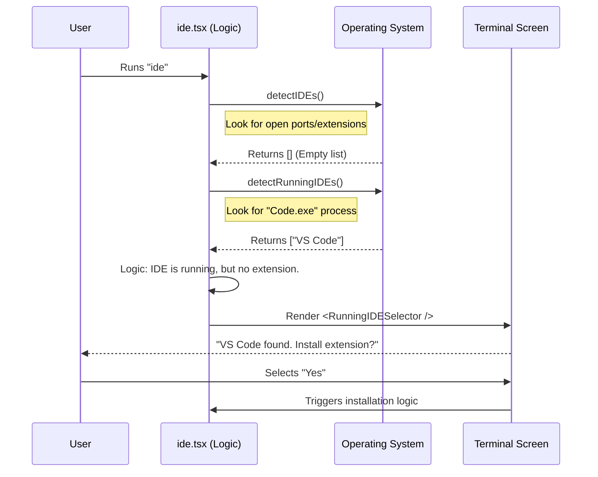

# Chapter 2: IDE Discovery and Setup Flow

Welcome back! In the previous chapter, [Command Registration](01_command_registration.md), we created the "Menu" for our application. We learned how to register the command so the CLI knows it exists without loading heavy code.

Now, the user has actually ordered the dish. They typed `ide` in the terminal.

In this chapter, we will explore **IDE Discovery and Setup Flow**. This is the brain of the operation that runs immediately after the code loads. Its job is to answer one question: *"Is there an IDE (like VS Code) ready to talk to me?"*

## The Problem: The "Empty Room"

Imagine trying to call a friend. Before you can have a conversation, three things must be true:
1.  Your friend must exist.
2.  Your friend must have a phone.
3.  Your friend must pick up the phone.

If our CLI tool simply tries to send commands to VS Code without checking if it's running, the program will crash or hang. We need a **Setup Wizard** to check the environment first.

## The Solution: A Decision Tree

The `ide` command acts like a smart assistant. Instead of blindly executing, it looks around the computer and follows a logic flow (a Decision Tree):

1.  **Scan:** Are any IDEs running?
2.  **Verify:** Do they have our extension installed?
3.  **Act:**
    *   **No IDEs?** Tell the user to open one.
    *   **IDE running but no extension?** Ask to install it.
    *   **Multiple IDEs?** Ask the user to pick one.
    *   **One ready IDE?** Connect immediately.

## The Code: How Discovery Works

The logic for this lives in `ide.tsx`. Let's break down the `call` function, which is the function executed when the command starts.

### Step 1: Detecting the Environment
First, we look for IDEs that are already "connected" (meaning they have the extension installed and the server is listening).

```typescript
// File: ide.tsx

// Detect IDEs that have the extension ready
const detectedIDEs = await detectIDEs(true);

// Filter to keep only the valid ones
const availableIDEs = detectedIDEs.filter(ide => ide.isValid);
```
*Explanation:* `detectIDEs` scans the computer for specific ports or files that indicate our extension is active. We filter this list to ensure we only try to talk to valid connections.

### Step 2: The "Helpful Installer" Flow
This is a critical user experience feature. If we find an IDE running (like VS Code), but it *doesn't* have our extension, we shouldn't just error out. We should help the user install it.

```typescript
// If no valid extensions found, but we handle installation...
if (availableIDEs.length === 0 && context.onInstallIDEExtension) {
  
  // Look for IDE processes (just the app running, no extension needed)
  const runningIDEs = await detectRunningIDEs();
```
*Explanation:* Here we use a different function, `detectRunningIDEs`. This doesn't look for our extension; it just looks at the operating system's process list to see if `code.exe` or `cursor.exe` is alive.

### Step 3: Prompting the Installation
If we find a running IDE that needs the extension, we return a UI component to ask the user if they want to install it.

```typescript
  // If we found running IDEs, show a selector to install the extension
  if (runningIDEs.length > 0) {
    return <RunningIDESelector 
      runningIDEs={runningIDEs} 
      onSelectIDE={onInstall} 
    />;
  }
}
```
*Explanation:* This `RunningIDESelector` is a visual component (we will cover UI in the next chapter). It presents a list to the user. If the user selects an IDE, the `onInstall` function runs to set up the environment automatically.

### Step 4: Connecting to an Existing IDE
If everything is already set up (the "Happy Path"), we pass the list of available IDEs to the main flow.

```typescript
// We have found valid, connected IDEs!
return <IDECommandFlow 
  availableIDEs={availableIDEs} 
  currentIDE={currentIDE} 
  onDone={onDone} 
/>;
```
*Explanation:* `IDECommandFlow` is the main screen. If there is only one IDE, it might auto-connect. If there are multiple, it asks the user to choose which one to control.

## Internal Implementation: Under the Hood

How does the logic decide what to show? Let's visualize the flow of data when the user runs the command.

### Sequence Diagram: The Setup Wizard



### Deep Dive: React in the Terminal?
You might have noticed syntax like `<RunningIDESelector />` in the code snippets.

The `ide` project uses a special library called **Ink**. It allows us to write **React** components (usually used for websites), but renders them as text in your terminal.

When the `call` function returns `<IDECommandFlow />`, it isn't finishing the program. It is telling the terminal: *"Please render this interactive screen and wait for the user to press keys."*

This allows us to create complex setup wizards where the user can use arrow keys to select their IDE, rather than typing difficult flags like `--ide-path /usr/bin/code`.

## Conclusion

In this chapter, we learned how the **IDE Discovery and Setup Flow** acts as a bridge between the user's command and the actual connection.

1.  It **Discovers** what is running.
2.  It **Distinguishes** between "running" (process active) and "connected" (extension active).
3.  It **Guides** the user to setup the environment if pieces are missing.

Now that we have discovered the IDEs and decided what to show the user, we need to actually render that beautiful, interactive menu in the terminal.

In the next chapter, we will dive into how we build that UI.

[Next Chapter: Interactive Terminal Interface](03_interactive_terminal_interface.md)

---

Generated by [Code IQ](https://github.com/adityasoni99/Code-IQ)