# Chapter 3: Interactive Terminal Interface

Welcome back! 

In the previous chapter, [IDE Discovery and Setup Flow](02_ide_discovery_and_setup_flow.md), we successfully detected which IDEs (like VS Code or Cursor) are running on your computer.

But now we face a new problem. If we find *three* different windows of VS Code open, how do we ask the user which one they want to connect to? 

We could ask them to type a specific Process ID number (e.g., "Type 4521 to select"), but that is unfriendly and error-prone.

In this chapter, we will explore the **Interactive Terminal Interface**. We are going to build a rich, graphical user interface (GUI) right inside the text-based terminal.

## The Problem: The "Dumb" Terminal

Traditionally, terminals are very simple:
1.  The program prints a line of text.
2.  The program waits for you to type something.
3.  You hit Enter.

This works for simple "Yes/No" questions. But for a list of options, navigating with **Arrow Keys** and seeing a visual **Selection Highlight** is a much better experience.

## The Solution: React for the Terminal

To solve this, we use a library called **Ink**. 

If you have ever built a website using **React**, you already know how to build this CLI tool! Ink allows us to use the same component-based logic (Components, Hooks, State) used for websites, but instead of rendering HTML (`<div>`, `<h1>`), it renders text and layout boxes to the terminal.

It treats the terminal window like a mini-browser.

## Building the Interface

Let's look at how we build the "Select IDE" screen found in `ide.tsx`.

### Step 1: The Container (The Dialog)
Instead of just printing text, we wrap our content in a nice visual container. In our project, we have a custom component called `<Dialog />`.

```tsx
// File: ide.tsx (Simplified)

return (
  <Dialog 
    title="Select IDE" 
    subtitle="Connect to an IDE for features."
    color="ide"
    onCancel={onClose}
  >
    {/* Content goes here */}
  </Dialog>
);
```
*Explanation:* This draws a box with a border and a title. It handles the "look and feel" so we don't have to manually print `----------------` lines to make borders.

### Step 2: Preparing the Data
We need to convert our list of "Detected IDEs" (raw data) into a list of "Options" (label and value) for our UI.

```tsx
// We map the raw IDE data into options for the menu
const options = availableIDEs.map(ide => {
  return {
    label: ide.name,           // e.g., "VS Code"
    value: ide.port.toString() // e.g., "63712"
  };
});
```
*Explanation:* We transform the complex computer data into human-readable labels. This array is exactly what a standard HTML `<select>` dropdown would expect.

### Step 3: The Interactive Selection
Now comes the magic. We render a `<Select />` component. This component listens for your keyboard presses (Up/Down arrows) and updates the screen instantly.

```tsx
// Inside our Component
<Select 
  options={options} 
  
  // When the user hits Enter, run this function
  onChange={(value) => {
    handleSelectIDE(value);
  }} 
/>
```
*Explanation:* We don't need to write code to detect "Key Down" or "Key Up." The `<Select />` component handles that. When the user finally presses Enter, the `onChange` function is triggered with the value they chose.

### Step 4: Managing State
Just like a website, our terminal UI needs **State**. We need to track what the user has currently selected.

```tsx
// Standard React Hook
const [selectedValue, setSelectedValue] = useState(initialValue);

// Update the UI when selection changes
const handleSelect = (value) => {
  setSelectedValue(value);
  // trigger connection logic...
};
```
*Explanation:* `useState` allows the interface to be dynamic. If the user selects something, we can re-render the screen to show a loading spinner or a success message immediately.

## Internal Implementation: Under the Hood

How does a text window behave like a graphical app?

### The Render Loop
When you use **Ink**, it takes over the standard output. It constantly "repaints" the screen when things change.

```mermaid
sequenceDiagram
    participant User
    participant React as React Logic (Ink)
    participant ANSI as ANSI Translator
    participant Term as Terminal Screen

    User->>React: Starts Command
    React->>ANSI: Renders <Dialog><Select /></Dialog>
    ANSI->>Term: Sends text + layout codes
    Term-->>User: Displays Menu Box

    User->>React: Presses "Down Arrow" key
    React->>React: Updates 'Selected' State
    React->>ANSI: Re-renders the changes
    ANSI->>Term: Clears screen, draws new selection
    Term-->>User: Highlight moves down
```



### Deep Dive: Flexbox in the Terminal
You might wonder how we position text side-by-side or create margins in a terminal that is essentially just a grid of characters.

Ink uses **Yoga**, a layout engine that implements **Flexbox**.

Look at this snippet from `ide.tsx`:

```tsx
// Example of layout formatting
<Box marginTop={1} flexDirection="column">
  <Text dimColor={true}>
    Found other running IDE(s)...
  </Text>
  {/* List of other items */}
</Box>
```
*Explanation:*
1.  `<Box>` is like an HTML `<div>`.
2.  `flexDirection="column"` tells the system to stack items vertically.
3.  `marginTop={1}` adds exactly one blank line above this element.
4.  `<Text>` handles styling, like rendering the text in a gray (`dimColor`) font.

This abstraction saves us from calculating character positions manually (e.g., "print 5 spaces, then the word").

## Summary

In this chapter, we learned that the **Interactive Terminal Interface** transforms a command-line tool into a user-friendly application.

1.  We use **React** concepts (Components, State) via the **Ink** library.
2.  We use standard UI elements like **Dialogs** and **Select Lists**.
3.  We avoid manual text formatting by using **Flexbox** layouts.

Now the user has navigated the menu and pressed "Enter" on their chosen IDE. The UI says "Connecting...".

But what does "Connecting" actually mean? How does this terminal tool talk to VS Code?

In the next chapter, we will explore the protocol used to bridge these two worlds.

[Next Chapter: MCP Connection Lifecycle](04_mcp_connection_lifecycle.md)

---

Generated by [Code IQ](https://github.com/adityasoni99/Code-IQ)