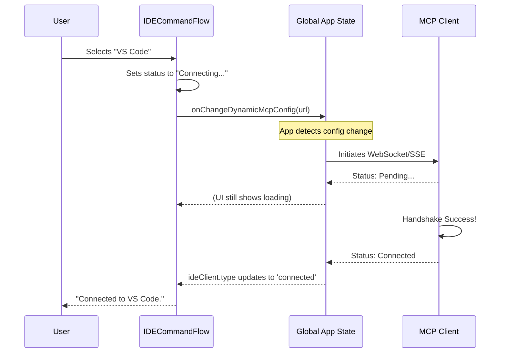

# Chapter 4: MCP Connection Lifecycle

Welcome back! 

In the previous chapter, [Interactive Terminal Interface](03_interactive_terminal_interface.md), we built a beautiful menu that allows the user to select an IDE (like VS Code) from a list.

But clicking an option in a menu is just the beginning. Now, our CLI tool needs to actually *talk* to that IDE. It needs to establish a complex data pipeline called the **Model Context Protocol (MCP)**.

In this chapter, we will explore the **MCP Connection Lifecycle**. Think of this as the "Switchboard Operator" of our application. It ensures a stable line is connected, maintained, and properly disconnected.

## The Problem: The "Handshake" is Hard

Connecting two separate applications is not as simple as flipping a switch.
1.  **Protocol Selection:** Does the IDE speak via WebSockets (`ws://`) or Server-Sent Events (`http://`)?
2.  **Latency:** The connection isn't instant. We need to show a "Connecting..." state.
3.  **Failures:** What if the IDE crashes while we are trying to connect? We need a timeout.
4.  **Cleanup:** If the user changes their mind, we must cut the line cleanly to free up resources.

## The Solution: Reactive State Management

Instead of writing a long, linear script (e.g., `connect()`, then `wait()`, then `send()`), we use a **Reactive** approach.

We simply tell the application: *"Here is the configuration I want."*
The application then runs a background process to try and make that reality happen, updating a status variable that we watch.

## Implementing the Lifecycle

The lifecycle logic lives inside the `IDECommandFlow` component in `ide.tsx`. Let's break it down into three stages: **Configuration**, **Monitoring**, and **Timeout**.

### Stage 1: Setting the Configuration (The Trigger)

When the user selects an IDE from our menu, we don't manually open a socket. Instead, we update a global configuration object. This triggers the main application to start working.

```typescript
// File: ide.tsx

const handleSelectIDE = useCallback((selectedIDE) => {
  // 1. Create a config object telling the app HOW to connect
  const newConfig = {
    ide: {
      type: selectedIDE.url.startsWith('ws:') ? 'ws-ide' : 'sse-ide',
      url: selectedIDE.url,
      scope: 'dynamic' // This tells the app this config can change
    }
  };

  // 2. Dispatch this change to the main system
  onChangeDynamicMcpConfig(newConfig);
}, []);
```
*Explanation:* Think of `onChangeDynamicMcpConfig` as submitting a work order. We are saying, *"Please ensure the system is connected to this URL using this protocol."* We don't care *how* the system does it; we just provide the specs.

### Stage 2: Monitoring the Connection (The Wait)

Once the work order is submitted, we sit back and watch. We use a **React Hook** to listen to the global application state.

```typescript
// We grab the specific client named 'ide' from the global state
const ideClient = useAppState(s => s.mcp.clients.find(c => c.name === 'ide'));

useEffect(() => {
  // If we are fully connected, finish the task!
  if (ideClient && ideClient.type === 'connected') {
    onDone(`Connected to ${connectingIDE.name}.`);
  } 
  
  // If connection failed, tell the user
  else if (ideClient && ideClient.type === 'failed') {
    onDone(`Failed to connect to ${connectingIDE.name}.`);
  }
}, [ideClient]); // Run this code whenever 'ideClient' changes
```
*Explanation:* This acts like a status light. The `ideClient.type` will automatically change from `pending` -> `connected` (or `failed`) as the background process does its work. Our code simply reacts to the green light.

### Stage 3: The Safety Net (The Timeout)

Computers are unpredictable. Sometimes a request gets lost in the void. We must set a limit on how long we wait.

```typescript
// Define a timeout (e.g., 35 seconds)
const IDE_CONNECTION_TIMEOUT_MS = 35000;

useEffect(() => {
  if (!connectingIDE) return;

  // Start a timer
  const timer = setTimeout(() => {
    onDone(`Connection to ${connectingIDE.name} timed out.`);
  }, IDE_CONNECTION_TIMEOUT_MS);

  // If the component closes or connects successfully, STOP the timer
  return () => clearTimeout(timer);
}, [connectingIDE]);
```
*Explanation:* This ensures our CLI doesn't hang forever. If 35 seconds pass and nothing has happened, we force the program to stop and alert the user.

### Stage 4: Disconnecting (Cleanup)

What if the user wants to switch IDEs or cancel? We need to clean up. This is done by removing the entry from the configuration.

```typescript
// Inside handleSelectIDE, if no IDE is selected (Cancel)

if (!selectedIDE) {
  // Remove the 'ide' key from the config
  delete newConfig.ide;
  
  // Clear the cache so old data doesn't linger
  void clearServerCache('ide', ideClient.config);
  
  // Update the system to reflect 'No Connection'
  onChangeDynamicMcpConfig(newConfig);
}
```
*Explanation:* By deleting the configuration, the main application realizes: *"Oh, I'm not supposed to be connected anymore,"* and automatically closes the sockets and shuts down the listeners.

## Internal Implementation: Under the Hood

What happens between updating the config and the client becoming "connected"?

### Sequence Diagram
Here is the lifecycle of an MCP connection request:



### Deep Dive: Dynamic Scope
You might have noticed the property `scope: 'dynamic'` in Stage 1.

Most CLI tools load their configuration once at startup. However, because our tool is interactive, we need **Dynamic Scope**. This allows the `ide` command to inject new server definitions into the application *while it is running*.

This is what makes the "Switchboard" concept possible. We are hot-swapping cables while the machine is on.

## Summary

In this chapter, we learned that the **MCP Connection Lifecycle** is about managing state, not just sending data.

1.  We **Trigger** a connection by updating a configuration object.
2.  We **Monitor** the global state using React hooks to know when the connection succeeds.
3.  We **Protect** the user experience with timeouts.
4.  We **Cleanup** resources by removing configuration entries.

Now that we have a secure, connected line to the IDE, we can start sending information about our project. But file paths on your computer can be messy and long. How do we make them look good?

In the next chapter, we will look at how we format this data.

[Next Chapter: Workspace Path Formatting](05_workspace_path_formatting.md)

---

Generated by [Code IQ](https://github.com/adityasoni99/Code-IQ)