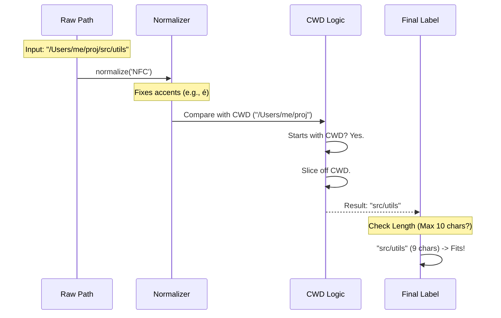

# Chapter 5: Workspace Path Formatting

Welcome to the final chapter of our `ide` command tutorial!

In the previous chapter, [MCP Connection Lifecycle](04_mcp_connection_lifecycle.md), we successfully established a connection between our CLI tool and the IDE. We are ready to exchange data.

However, we have one final User Experience (UX) hurdle to cross. Computers see file paths as long, precise strings like `/Users/alice/development/projects/my-cool-app/src/utils`. Humans, on the other hand, just want to know "Where am I?" without reading a novel.

In this chapter, we will explore **Workspace Path Formatting**. We will build a utility that turns messy, technical file paths into clean, readable labels for our [Interactive Terminal Interface](03_interactive_terminal_interface.md).

## The Problem: "Path Spaghetti"

Terminals have limited space. If we display the full absolute path for every project, the UI will look cluttered and break onto multiple lines.

**Raw Path:**
`/Users/username/work/repositories/frontend/react-app/src/components/Button.tsx`

**The Issue:**
1.  **Redundancy:** We already know we are in `/Users/username/work/repositories`. We don't need to see it repeated.
2.  **Length:** This path is 78 characters long. A standard terminal might only be 80 characters wide!
3.  **Cross-Platform Weirdness:** macOS and Windows handle special characters (like é or ü) differently, which can break string comparisons.

## The Solution: The "GPS" Approach

Think about a GPS navigation system.
*   **Raw Data:** Latitude 40.7128° N, Longitude 74.0060° W.
*   **Display:** "Home".

Our formatter acts like that GPS. It takes the raw coordinate (Absolute Path) and calculates the most readable label based on where you currently are.

## Key Concepts

To achieve this, our code performs three specific magic tricks.

### 1. Relative Path Calculation
If you are currently standing in `/Users/alice/project`, and you point to a file at `/Users/alice/project/src/index.ts`, you don't say the full address. You just say `src/index.ts`.

We need to subtract the **Current Working Directory (CWD)** from the file path.

### 2. Unicode Normalization (NFC)
This is a tricky concept!
*   **Windows/Linux:** Stores the character `é` as one unit.
*   **macOS:** Often stores `é` as two units: the letter `e` + a "combining accent mark".

To a human, they look identical. To code, `"café" === "café"` returns `false`. We use a process called **Normalization (NFC)** to force both strings to use the same format so we can compare them accurately.

### 3. Intelligent Truncation
Even after shortening the path, it might still be too long. We need to cut it. But where?
*   **Bad:** `.../react-app/src/comp...` (We lost the filename!)
*   **Good:** `.../src/components/Button.tsx` (We kept the most specific part).

## The Code: Implementing the Formatter

The logic for this resides in the `formatWorkspaceFolders` function in `ide.tsx`. Let's build it step-by-step.

### Step 1: Normalization Setup
First, we get the current directory and normalize it. This ensures we are speaking the same "language" regarding special characters.

```typescript
// File: ide.tsx

export function formatWorkspaceFolders(folders: string[], maxLength: number = 100): string {
  const cwd = getCwd();

  // Normalize current directory to 'NFC' standard
  // This combines separate accents into single characters
  const cwdNFC = cwd.normalize('NFC');
```
*Explanation:* `getCwd()` asks the OS where we are. `.normalize('NFC')` smooths over the differences between macOS and Windows file systems.

### Step 2: Stripping the Root
Now we loop through the folders. We normalize the folder path and check if it starts with our current directory.

```typescript
  const formattedFolders = foldersToShow.map(folder => {
    // Normalize the target folder too
    const folderNFC = folder.normalize('NFC');

    // If the folder is inside our current directory...
    if (folderNFC.startsWith(cwdNFC + path.sep)) {
      // ...remove the current directory from the start
      folder = folderNFC.slice(cwdNFC.length + 1);
    }
```
*Explanation:* `path.sep` is the slash (`/` on Mac/Linux, `\` on Windows). If the folder starts with `CWD/`, we slice that part off. Now `/Users/me/project/src` becomes just `src`.

### Step 3: The Ellipsis Truncation
Finally, if the remaining path is *still* too long for our UI, we chop off the beginning and add an ellipsis (`…`).

```typescript
    // If it fits, return it as is
    if (folder.length <= maxLengthPerPath) {
      return folder;
    }

    // Otherwise, keep the END of the path (negative slice)
    // and add "…" at the start
    return '…' + folder.slice(-(maxLengthPerPath - 1));
  });
```
*Explanation:* `slice(-number)` takes characters from the *end* of the string. This preserves the filename or the deepest folder name, which is usually what the user cares about most.

## Internal Implementation: Under the Hood

Let's visualize exactly what happens to a file path string as it passes through this utility.

### Sequence Diagram



### Deep Dive: Why NFC?
Without `normalize('NFC')`, the command `folderNFC.startsWith(cwdNFC)` would fail randomly for users with international characters in their project names. It's a subtle bug that frustrates users, and fixing it here ensures the CLI feels robust and professional.

## Putting It All Together

Let's look at the result.

**Scenario:**
*   **CWD:** `/Users/kai/dev/portfolio`
*   **Files to show:**
    1.  `/Users/kai/dev/portfolio/src/styles/main.css`
    2.  `/Users/kai/dev/other-project/backend/server.ts`

**Output:**
1.  Since file #1 is inside the CWD, it becomes: `src/styles/main.css`.
2.  Since file #2 is *outside* the CWD, the absolute path is kept, but it might get truncated: `…/backend/server.ts`.

This creates a UI that feels "aware" of the user's context.

## Conclusion

Congratulations! You have completed the tutorial for the `ide` command project.

Let's recap our journey:
1.  **[Command Registration](01_command_registration.md):** We learned how to create a lazy-loading "menu entry" so the CLI starts fast.
2.  **[IDE Discovery and Setup Flow](02_ide_discovery_and_setup_flow.md):** We built logic to detect running apps and installed extensions.
3.  **[Interactive Terminal Interface](03_interactive_terminal_interface.md):** We used React and Ink to build a GUI inside the terminal.
4.  **[MCP Connection Lifecycle](04_mcp_connection_lifecycle.md):** We managed the complex state of connecting to a server.
5.  **Workspace Path Formatting:** We polished the data presentation to make it human-readable.

You now understand the full stack of a modern, interactive CLI tool—from the first command typed by the user to the pixel-perfect rendering of file paths.

Happy coding!

---

Generated by [Code IQ](https://github.com/adityasoni99/Code-IQ)