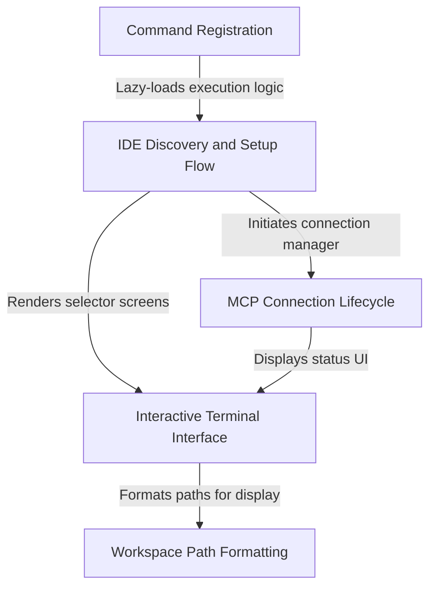

# Tutorial: ide

This functionality acts as a bridge between the CLI and **Integrated Development Environments (IDEs)**. It provides an **interactive terminal interface** to detect running IDEs (like VS Code or JetBrains), install extensions, and manage the **Model Context Protocol (MCP)** connection lifecycle to ensure seamless communication between the tools.

## Chapters

1. [Command Registration](01_command_registration.md)
2. [IDE Discovery and Setup Flow](02_ide_discovery_and_setup_flow.md)
3. [Interactive Terminal Interface](03_interactive_terminal_interface.md)
4. [MCP Connection Lifecycle](04_mcp_connection_lifecycle.md)
5. [Workspace Path Formatting](05_workspace_path_formatting.md)

---

Generated by [Code IQ](https://github.com/adityasoni99/Code-IQ)