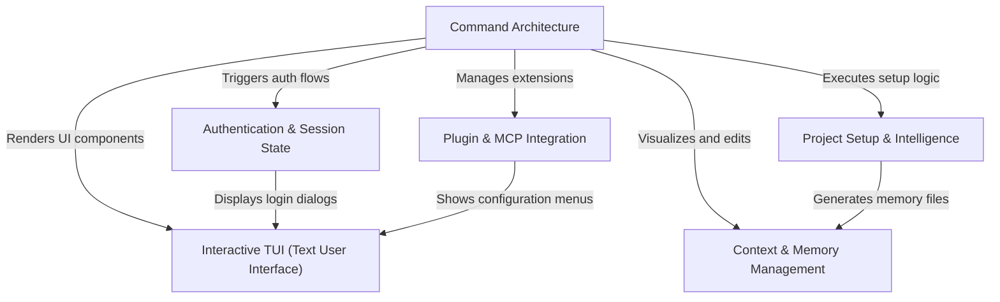

# Tutorial: commands

This project implements a sophisticated **AI coding assistant CLI** (Claude Code). It is built upon a modular **Command Architecture** where distinct features (like initialization, authentication, and context management) are encapsulated as commands. These commands leverage a React-based **Interactive TUI** to render rich user interfaces directly in the terminal. The system handles the AI's "brain" through **Context & Memory Management**, maintains secure **Authentication & Session State**, automates **Project Setup** (generating documentation and CI/CD workflows), and supports extensibility through **Plugin & MCP Integration**.

## Chapters

1. [Command Architecture](01_command_architecture.md)
2. [Interactive TUI (Text User Interface)](02_interactive_tui__text_user_interface_.md)
3. [Authentication & Session State](03_authentication___session_state.md)
4. [Context & Memory Management](04_context___memory_management.md)
5. [Project Setup & Intelligence](05_project_setup___intelligence.md)
6. [Plugin & MCP Integration](06_plugin___mcp_integration.md)

---

Generated by [Code IQ](https://github.com/adityasoni99/Code-IQ)