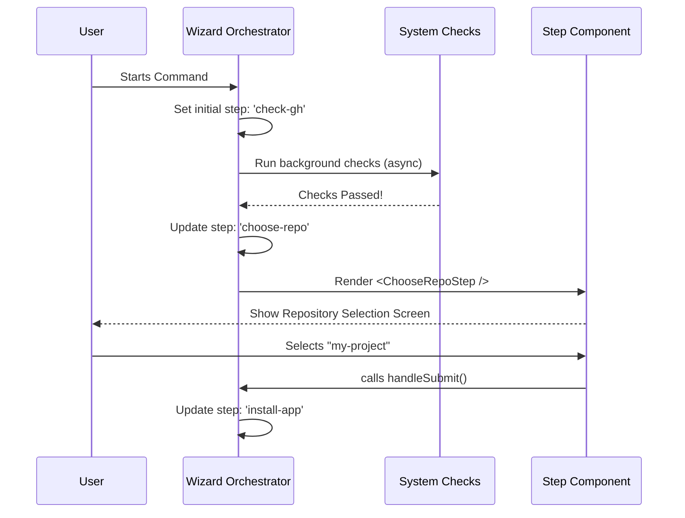

# Chapter 1: Wizard Orchestrator

Welcome to the **Wizard Orchestrator**! This is the first chapter of our journey into building a command-line installation tool.

## The Problem: Getting Lost in the Process

Imagine you are trying to install a complex piece of software. You need to:
1. Check if you have the right permissions.
2. Select a repository.
3. specific keys.
4. Pick configuration options.

If we tried to write this all in one long script, it would be a tangled mess of `if/else` statements. It would be hard to read and even harder to fix if something broke.

## The Solution: The Wizard Orchestrator

To solve this, we use a pattern often called a **State Machine**.

Think of the **Wizard Orchestrator** as a **Game Master** in a role-playing game. 
*   The Game Master knows exactly where you are in the story (the **State**).
*   Based on your actions, the Game Master decides which scene to describe next (the **Transition**).
*   The Game Master creates the world you see right now (the **View**).

In our code, the `InstallGitHubApp` component is our Game Master. It holds the "brain" of the entire installation process.

### Key Concepts

1.  **State**: A snapshot of the current situation. For example: "The user is currently choosing a repository."
2.  **Step**: A specific label in the state (e.g., `choose-repo`, `api-key`, `success`) that tells us which screen to show.
3.  **Orchestrator**: The central function that watches the State and renders the correct Step.

---

## How It Works: The "Game Loop"

Let's look at how the Orchestrator manages the flow. It uses React's `useState` to keep track of everything.

### 1. Defining the State
First, we define what the "Game Master" needs to remember. This is our `INITIAL_STATE`.

```typescript
// install-github-app.tsx
const INITIAL_STATE: State = {
  step: 'check-gh',        // We start by checking requirements
  selectedRepoName: '',    // No repo selected yet
  apiKeyOrOAuthToken: '',  // No key yet
  warnings: [],            // No warnings yet
  // ... other flags
};
```
*Explanation:* This object is the "memory" of our wizard. It starts blank, waiting for user input.

### 2. The Switchboard (The Router)
The most important job of the Orchestrator is to decide **what to show**. It uses a simple `switch` statement based on the current `step`.

```tsx
// install-github-app.tsx
switch (state.step) {
  case 'check-gh':
    return <CheckGitHubStep />;
  case 'choose-repo':
    // We pass data (props) down to the specific step
    return <ChooseRepoStep repoUrl={state.selectedRepoName} onSubmit={handleSubmit} />;
  case 'api-key':
    return <ApiKeyStep ... />; 
  case 'success':
    return <SuccessStep ... />;
}
```
*Explanation:* This is the Orchestrator acting as a traffic cop. If the state says `check-gh`, it renders the logic to check GitHub. If the state says `success`, it renders the success screen.

### 3. Transitioning Between Steps
How do we move from one room to another? We use a function (often called `handleSubmit` or `setState`) to update the "memory".

```typescript
// Inside handleSubmit function
} else if (state.step === 'choose-repo') {
  // Logic to validate the repo...
  
  // The Transition: Move to the next step!
  setState(prev => ({
    ...prev,
    selectedRepoName: repoName,
    step: 'install-app' // <--- This changes the "scene"
  }));
}
```
*Explanation:* When the user finishes picking a repo, we update the `step` variable to `install-app`. React notices this change and automatically runs the `switch` statement again to show the new screen.

---

## Internal Implementation: Under the Hood

Let's visualize the flow of the Orchestrator using a sequence diagram. This shows how the Orchestrator sits between the User and the logic.



### The Logic Flow
1.  **Initialization**: The `InstallGitHubApp` component mounts.
2.  **Effect Hooks**: `useEffect` hooks trigger immediate actions, like checking if the GitHub CLI is installed. You can learn more about these checks in [GitHub Infrastructure Logic](03_github_infrastructure_logic.md).
3.  **User Input**: The user interacts with a specific step (e.g., typing an API key). This is handled by [Interactive Wizard Steps](02_interactive_wizard_steps.md).
4.  **State Update**: The Orchestrator updates its central state.
5.  **Re-render**: The view changes to the next logical step.

### Handling "Game Over" (Errors)
Just like a game, sometimes things go wrong. The Orchestrator has a specific state for this.

```typescript
// install-github-app.tsx
if (missingScopes.length > 0) {
  setState(prev => ({
    ...prev,
    step: 'error', // The "Game Over" screen
    error: `Missing permissions: ${missingScopes.join(', ')}`,
    errorReason: 'Missing required scopes'
  }));
}
```
*Explanation:* If a critical check fails (like missing permissions), the Orchestrator immediately forces the step to `error`. This ensures the user doesn't continue down a broken path. We will cover this deeper in [Error & Warning Management](05_error___warning_management.md).

---

## Conclusion

The **Wizard Orchestrator** is the backbone of our installation tool. It doesn't know *how* to authenticate with GitHub or *how* to render a text box, but it knows **when** to do those things. By keeping the state management in one place, we make the tool predictable and easy to manage.

Now that we understand who is directing the show, let's look at the actors on the stage.

[Next Chapter: Interactive Wizard Steps](02_interactive_wizard_steps.md)

---

Generated by [Code IQ](https://github.com/adityasoni99/Code-IQ)