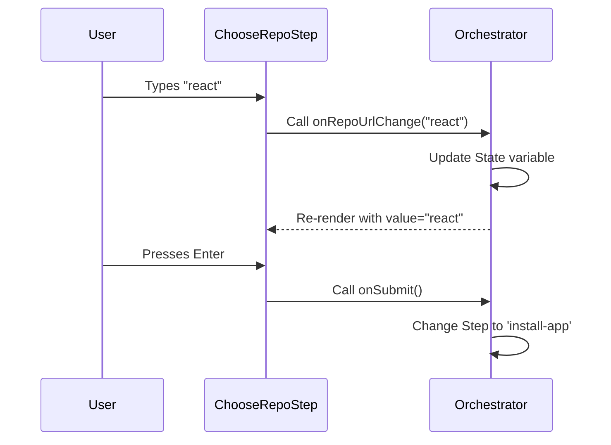

# Chapter 2: Interactive Wizard Steps

Welcome to **Interactive Wizard Steps**! 

In the previous chapter, [Wizard Orchestrator](01_wizard_orchestrator.md), we learned about the "Game Master" that controls the flow of our application. Now, we are going to look at the **Scenes** that the Game Master describes.

## The Problem: The Monolith Mess

Imagine you are building a house. You wouldn't hire one person to do the plumbing, electrical, painting, and roofing all at the exact same moment. 

If we wrote our CLI tool in one big file, we would have code for asking for a repository mixed in with code for checking API keys and code for showing success messages. It would be impossible to read.

## The Solution: Modular Steps

We solve this by creating **Step Components**. 

Think of each step as a **single page** in a setup assistant. 
1.  It shows **one** specific screen.
2.  It asks for **one** specific type of input (or just shows status).
3.  When it's done, it signals the Orchestrator to move on.

---

## How It Works: The "Props" Contract

Every step in our wizard follows a simple contract. It receives data from the parent (Orchestrator) via **Props**, and it communicates back using **Functions** (Callbacks).

### 1. The Simplest Step (Static Display)
Let's look at `CheckGitHubStep.tsx`. This step doesn't ask the user for anything; it just tells them something is happening.

```tsx
// CheckGitHubStep.tsx
import React from 'react';
import { Text } from 'ink';

export function CheckGitHubStep() {
  // Just render text. No user input required here.
  return <Text>Checking GitHub CLI installation…</Text>;
}
```
*Explanation:* This is a "dumb" component. It just renders text. The Orchestrator shows this while it runs background checks (which we will cover in [GitHub Infrastructure Logic](03_github_infrastructure_logic.md)).

### 2. The Interactive Step (User Input)
Now let's look at `ChooseRepoStep.tsx`. This is where the user types in a repository name.

This component needs two things from the Orchestrator:
1.  **`repoUrl`**: The text currently in the box.
2.  **`onRepoUrlChange`**: A function to call when the user types.

```typescript
// Define what this step needs
interface ChooseRepoStepProps {
  repoUrl: string; 
  onRepoUrlChange: (value: string) => void;
  onSubmit: () => void;
}
```

Here is how we render the input box using the `TextInput` component:

```tsx
// Inside ChooseRepoStep component
<TextInput 
  value={repoUrl} 
  onChange={(value) => {
    // Tell the Orchestrator the text changed
    onRepoUrlChange(value); 
  }}
  onSubmit={onSubmit} // Tell Orchestrator "We are done!"
  placeholder="owner/repo"
/>
```
*Explanation:* The Step doesn't strictly control the state itself. It acts as a middleman. When you type 'A', it tells the Orchestrator "The user typed A". The Orchestrator updates the state, and the Step re-renders showing 'A'.

---

## Internal Implementation: The Interaction Loop

Let's visualize how a specific step (like choosing a repository) handles user interaction.



### Handling Different Input Types

Our wizard handles different types of steps:

1.  **Text Input** (`ChooseRepoStep`): Uses a text cursor and accepts strings.
2.  **Confirmation** (`InstallAppStep`): Just waits for the user to press "Enter".
3.  **Selection** (`ExistingWorkflowStep`): Lets the user pick from a list (Update, Skip, Exit).

Let's look at how **Confirmation** works in `InstallAppStep.tsx`. It uses a custom hook for keybindings.

```tsx
// InstallAppStep.tsx
import { useKeybinding } from '../../keybindings/useKeybinding.js';

export function InstallAppStep({ onSubmit }) {
  // Listen specifically for the "Enter" key
  useKeybinding("confirm:yes", onSubmit);

  return (
    <Box>
      <Text>Press Enter once you've installed the app...</Text>
    </Box>
  );
}
```
*Explanation:* There is no text box here. We just listen for the "confirm:yes" signal (mapped to the Enter key). When detected, we run `onSubmit`, which tells the Orchestrator to proceed.

---

## Visual Polish: The Success Step

The final piece of the puzzle is giving feedback. The `SuccessStep.tsx` receives boolean flags to decide what to show.

```tsx
// SuccessStep.tsx
if (props.skipWorkflow) {
  return <Text>Your workflow file was kept unchanged.</Text>;
}

return (
  <Box>
     <Text color="success">✓ GitHub Actions workflow created!</Text>
     <Text>1. A pre-filled PR page has been created</Text>
  </Box>
);
```
*Explanation:* This logic is purely **presentational**. The Step doesn't calculate *if* the workflow was skipped; the Orchestrator passes that fact down as `props.skipWorkflow`. The Step just decides how to style it.

---

## Connecting the Pieces

By isolating these steps, we make our code modular.

*   If we need to change how the **Repository Input** looks, we only edit `ChooseRepoStep.tsx`.
*   If we need to change what happens *after* the input, we edit the Orchestrator.

However, these steps are just the "Face" of the application. They don't actually talk to GitHub, and they don't know how to authenticate.

*   The logic that checks if a repository actually exists is handled in [GitHub Infrastructure Logic](03_github_infrastructure_logic.md).
*   The logic that ensures we are allowed to access that repository is in [Authentication Strategies](04_authentication_strategies.md).

## Conclusion

In this chapter, we learned:
1.  **Steps are modular:** Each screen is its own file.
2.  **Steps are controlled:** They receive data via `props` and report actions via `callbacks`.
3.  **Steps are specialized:** Some take text input, some take key presses, and some just display static info.

Now that we have our User Interface ready, let's learn about the heavy lifting happening in the background.

[Next Chapter: GitHub Infrastructure Logic](03_github_infrastructure_logic.md)

---

Generated by [Code IQ](https://github.com/adityasoni99/Code-IQ)