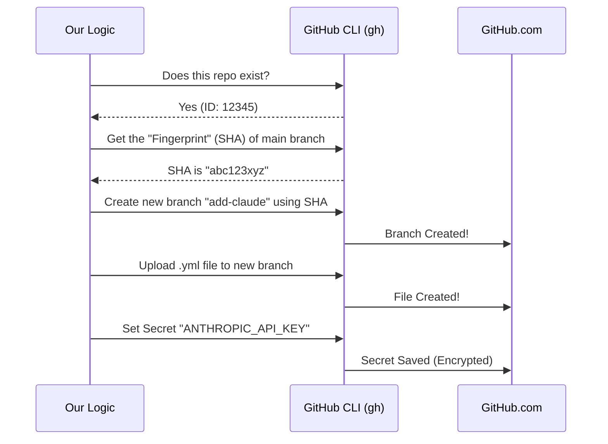

# Chapter 3: GitHub Infrastructure Logic

Welcome to **GitHub Infrastructure Logic**!

In the previous chapter, [Interactive Wizard Steps](02_interactive_wizard_steps.md), we built the beautiful interface that asks the user for information. But right now, that interface is just a pretty shell. It collects data, but it doesn't actually *change* anything on GitHub.

Now, we are going to build the "muscles" of our application.

## The Problem: The "Clicking" Nightmare

Imagine you want to set up a new tool in your GitHub repository manually. You would have to:
1.  Open your browser and navigate to the repo.
2.  Click "Settings" -> "Secrets" -> "Actions".
3.  Click "New Repository Secret", paste your key, and hit save.
4.  Go back to "Code", create a new branch.
5.  Create a `.github/workflows` folder.
6.  Create a `.yml` file and paste complex code into it.
7.  Open a Pull Request.

If you miss **one** step or make a typo, nothing works.

## The Solution: The "General Contractor"

The **GitHub Infrastructure Logic** acts like a specialized contractor. You simply give it the blueprints (the repository name and API key), and it handles the construction site for you.

It communicates directly with GitHub using the GitHub CLI (`gh`), executing a precise sequence of commands to build the infrastructure automatically.

### Key Concepts

To understand this layer, we need to understand three simple concepts:

1.  **The Wrapper (`execFileNoThrow`)**: We don't run commands directly. We use a helper that runs them safely. If a command fails, it doesn't crash our app; it just tells us what went wrong.
2.  **The SHA (Fingerprint)**: GitHub needs to know *exactly* which version of the code we are building on. The "SHA" is just a unique ID string for the current state of a branch.
3.  **The API Calls**: Instead of clicking buttons, we send specific text messages to GitHub's servers to create files or secrets.

---

## How It Works: The Master Function

The entry point for this logic is a function called `setupGitHubActions`. The [Wizard Orchestrator](01_wizard_orchestrator.md) calls this function when the user hits "Install".

### The Inputs
Think of this function as a machine that takes raw materials:
1.  **`repoName`**: The address (e.g., `facebook/react`).
2.  **`apiKey`**: The secret password we need to save.
3.  **`workflowContent`**: The text code for the GitHub Action file.

### The Logic Flow

Before looking at code, let's visualize the "Construction Plan" this function follows.



---

## Internal Implementation: Step-by-Step

Let's look at the actual code in `setupGitHubActions.ts`. We will break it down into small, digestible tasks.

### Step 1: Verification
First, we check if the repository actually exists and we can access it.

```typescript
// Check if repository exists
const repoCheckResult = await execFileNoThrow('gh', [
  'api',
  `repos/${repoName}`, // e.g., repos/my-user/my-project
  '--jq', '.id',       // Just give us the ID back
]);

if (repoCheckResult.code !== 0) {
  throw new Error(`Failed to access repository: ${repoCheckResult.stderr}`);
}
```
*Explanation:* We run `gh api repos/name`. If the "exit code" is not 0, it means the command failed (maybe the repo is private or doesn't exist). We handle these errors in detail in [Error & Warning Management](05_error___warning_management.md).

### Step 2: Getting the Foundation (SHA)
To create a new branch, we need to know where to start. We ask for the SHA of the default branch (usually `main` or `master`).

```typescript
// Get SHA of default branch (the latest commit fingerprint)
const shaResult = await execFileNoThrow('gh', [
  'api',
  `repos/${repoName}/git/ref/heads/${defaultBranch}`,
  '--jq', '.object.sha',
]);

const sha = shaResult.stdout.trim(); // e.g., "7b3f1..."
```
*Explanation:* This is like asking a builder, "Where is the current wall?" before we build an extension attached to it.

### Step 3: Creating the Branch
Now we create a safe space to work—a new branch. This ensures we don't break the user's main code.

```typescript
const branchName = `add-claude-github-actions-${Date.now()}`;

// Create new branch pointing to the SHA we found earlier
await execFileNoThrow('gh', [
  'api',
  '--method', 'POST',
  `repos/${repoName}/git/refs`,
  '-f', `ref=refs/heads/${branchName}`,
  '-f', `sha=${sha}`,
]);
```
*Explanation:* We name the branch `add-claude...` plus a timestamp so it's always unique. We tell GitHub: "Make a new reference (ref) pointing to that specific SHA."

### Step 4: The Heavy Lifting (Creating the File)
This is the most complex part. We upload the workflow file content.

```typescript
// We convert the text content to Base64 (a format safe for transfer)
const base64Content = Buffer.from(workflowContent).toString('base64');

// Upload the file via API
await execFileNoThrow('gh', [
  'api',
  '--method', 'PUT', 
  `repos/${repoName}/contents/.github/workflows/claude.yml`,
  '-f', `message="Add Claude workflow"`,
  '-f', `content=${base64Content}`,
  '-f', `branch=${branchName}`, // Put it on our new branch
]);
```
*Explanation:* We don't just "save" the file; we "PUT" it to the API. We must specify the message (like a commit message) and the branch.

### Step 5: Securing the Keys
Finally, we need to save the API key. We never commit this to a file! We use GitHub Secrets.

```typescript
if (apiKey) {
  await execFileNoThrow('gh', [
    'secret', 
    'set', 
    'ANTHROPIC_API_KEY', 
    '--body', apiKey,       // The actual secret value
    '--repo', repoName,
  ]);
}
```
*Explanation:* The `gh secret set` command securely sends the key to GitHub's encrypted vault. Even we cannot read it back once sent.

### Step 6: The Handover
We don't create the Pull Request automatically because the user might want to review it. Instead, we generate a link.

```typescript
// Create a URL that pre-fills a Pull Request
const compareUrl = `https://github.com/${repoName}/compare/${defaultBranch}...${branchName}?quick_pull=1`;

// Open the user's default browser
await openBrowser(compareUrl);
```
*Explanation:* This opens the web browser to a page saying "Compare & pull request". The user just has to click the final green button.

---

## Conclusion

The **GitHub Infrastructure Logic** is the worker bee of our application. It abstracts away the complexity of raw HTTP requests and git commands into a clean, linear process: **Check -> Branch -> Build -> Secure**.

By keeping this logic separate from the UI, we ensure that if GitHub updates their API, we only have to change this one file, not our buttons or forms.

But wait—how did we have permission to run all these `gh` commands? How did the tool know *who* we are?

[Next Chapter: Authentication Strategies](04_authentication_strategies.md)

---

Generated by [Code IQ](https://github.com/adityasoni99/Code-IQ)