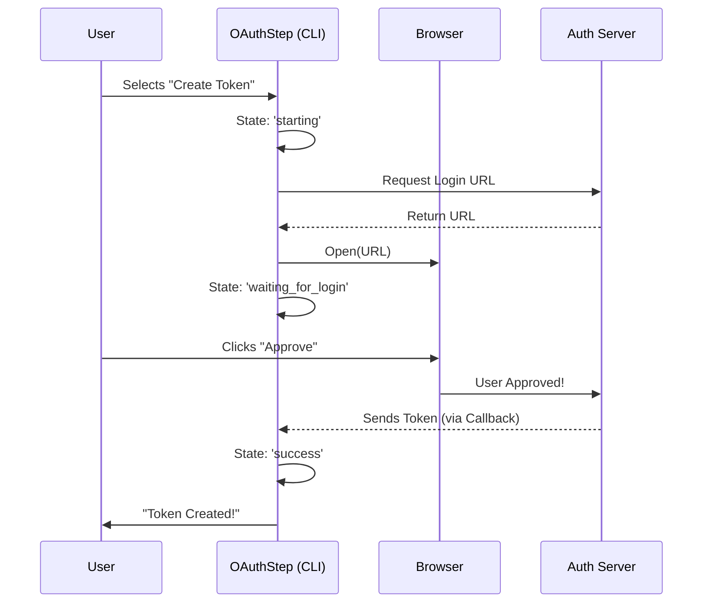

# Chapter 4: Authentication Strategies

Welcome to **Authentication Strategies**!

In the previous chapter, [GitHub Infrastructure Logic](03_github_infrastructure_logic.md), we built the heavy machinery capable of creating branches, files, and secrets. However, there is one major catch: **GitHub won't let us touch anything yet.**

Just like a construction crew can't enter a building site without a security badge, our tool can't modify a repository without a valid **Access Token**.

## The Problem: One Size Does Not Fit All

How do we get this security badge (the API Key)?

1.  **The Power User:** Already has an API key saved in a `.env` file or knows how to generate one manually. They just want to paste it in.
2.  **The Beginner:** Doesn't know what an API key is. They just want to click "Login" in their browser.

If we force the beginner to manually generate keys, they will quit. If we force the power user to go through a browser login, they will get annoyed.

## The Solution: The "Fork in the Road"

We solve this by implementing an **Authentication Strategy** pattern in our UI. We present the user with a choice, and the application adapts its behavior based on that choice.

We handle this primarily in two components:
1.  **`ApiKeyStep.tsx`**: The menu where the user chooses their method.
2.  **`OAuthFlowStep.tsx`**: A specialized component that handles the complex browser-based login.

---

## The Selection Logic (`ApiKeyStep`)

The `ApiKeyStep` is more than just a text box; it is a switchboard. It looks at what is available and offers the best path.

### 1. Determining the Options
This component accepts props to know if an "Existing Key" was found on the user's computer or if "OAuth" (browser login) is available.

```typescript
// ApiKeyStep.tsx logic (simplified)
const selectedOption = 
  props.existingApiKey ? 'existing' : // Default to existing if found
  props.onCreateOAuthToken ? 'oauth' : // Default to OAuth if available
  'new'; // Fallback to manual entry
```
*Explanation:* We automatically pick the easiest option. If we found a key, select it. If not, suggest OAuth. If neither, ask for manual input.

### 2. Rendering the Fork
We use a simple visual trick to show the user which path is active using the `color()` helper.

```tsx
// ApiKeyStep.tsx rendering
<Text>
  {selectedOption === 'oauth' ? color('success', theme)('> ') : '  '}
  Create a long-lived token with your Claude subscription
</Text>

<Text>
  {selectedOption === 'new' ? color('success', theme)('> ') : '  '}
  Enter a new API key
</Text>
```
*Explanation:* We render a list. The active option gets a green arrow (`>`). The user uses Up/Down arrow keys to change the `selectedOption` state.

### 3. acting on the Decision
When the user presses Enter, we check which path they chose.

```typescript
// Inside handleConfirm function
if (selectedOption === 'oauth' && onCreateOAuthToken) {
  // Path A: Trigger the browser flow
  onCreateOAuthToken(); 
} else {
  // Path B: Submit the text key
  onSubmit();
}
```
*Explanation:* If they picked OAuth, we signal the [Wizard Orchestrator](01_wizard_orchestrator.md) to switch scenes to the OAuth flow. If they picked manual, we submit the key they typed.

---

## The OAuth Workflow (`OAuthFlowStep`)

If the user chooses the browser login, we enter the most complex part of our tool. The `OAuthFlowStep.tsx` component is actually a mini-application with its own internal state machine.

### The Concept: The "Valet Key"
OAuth is like giving a valet key to your car. You (the User) tell the parking garage (GitHub/Claude) that this specific valet (Our App) is allowed to drive your car (Modify Code), but only for a limited time.

### Internal Implementation: The Handshake

Let's visualize the "dance" required to get the key without the user copying and pasting it manually.



### Code Deep Dive

Let's look at how `OAuthFlowStep.tsx` manages this complexity.

#### 1. The Internal State
Unlike simple steps, this step needs to track the progress of the network request.

```typescript
type OAuthStatus = 
  | { state: 'starting' }
  | { state: 'waiting_for_login'; url: string }
  | { state: 'processing' }
  | { state: 'success'; token: string }
  | { state: 'error'; message: string };
```
*Explanation:* We define every possible situation the user can be in. This prevents bugs like showing a "Success" message while we are still loading.

#### 2. Starting the Flow
When the component mounts, we immediately trigger the service.

```typescript
// OAuthFlowStep.tsx
useEffect(() => {
  if (oauthStatus.state === 'starting') {
    // Start the process
    startOAuth();
  }
}, [oauthStatus.state]);
```
*Explanation:* As soon as this screen appears, we kick off the logic. The user doesn't need to press anything else.

#### 3. Handling the Async Result
The `startOAuth` function does the heavy lifting. It waits for the browser interaction to finish.

```typescript
// Inside startOAuth
const result = await oauthService.startOAuthFlow(async (url) => {
  // When we get the URL, update UI to tell user to look at browser
  setOAuthStatus({ state: 'waiting_for_login', url });
});

// Once the 'await' finishes, we have the token!
setOAuthStatus({ state: 'success', token: result.accessToken });
```
*Explanation:* The `oauthService` (a helper class) pauses execution here until the user finishes logging in on the web. Once they do, the promise resolves, and we get the `accessToken`.

### 4. Handling "Browser Didn't Open"
Sometimes, CLI tools can't open the browser automatically (e.g., inside a remote server). We handle this gracefully.

```tsx
// Inside renderStatusMessage()
{showPastePrompt && (
  <Box>
    <Text>Paste code here if prompted ></Text>
    <TextInput onChange={handleSubmitCode} ... />
  </Box>
)}
```
*Explanation:* If the process takes too long, we assume the browser might not have opened. We show the URL on screen and provide a text box as a fallback plan.

---

## Conclusion

In this chapter, we learned how to implement **Authentication Strategies**. 

We didn't force a single method on the user. Instead:
1.  We created a **Selection Step** (`ApiKeyStep`) to let the user choose between Manual Entry or OAuth.
2.  We built a **Stateful Step** (`OAuthFlowStep`) to handle the complex asynchronous nature of browser-based logins.
3.  We provided **Fallbacks** (manual paste) for when automation fails.

Now we have the infrastructure ready, and we have the keys to access it. But what happens if the keys are wrong? Or if the internet goes down?

[Next Chapter: Error & Warning Management](05_error___warning_management.md)

---

Generated by [Code IQ](https://github.com/adityasoni99/Code-IQ)