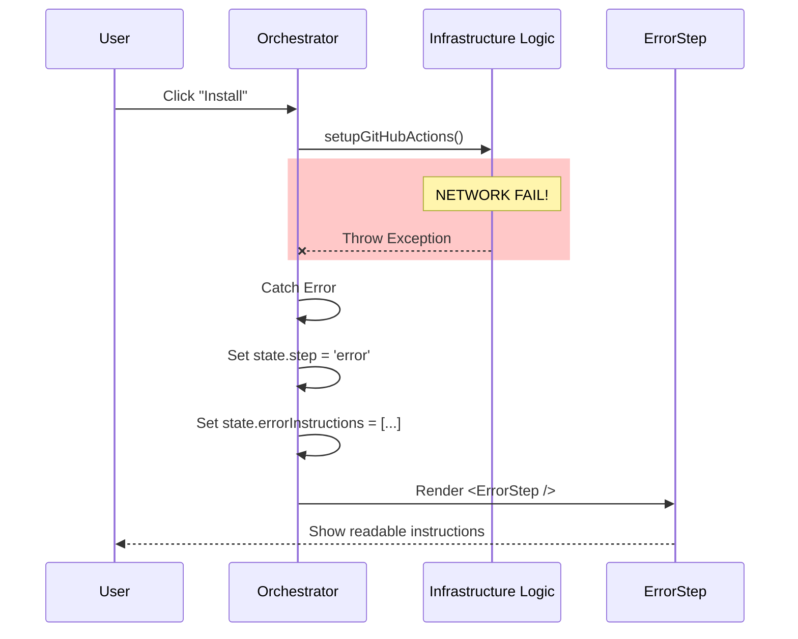

# Chapter 5: Error & Warning Management

Welcome to **Error & Warning Management**! This is the final chapter of our tutorial series.

In the previous chapter, [Authentication Strategies](04_authentication_strategies.md), we learned how to get the keys to the castle. But even with the right keys, sometimes the lock is jammed, or the door is already open.

## The Problem: The "Crash" Nightmare

Imagine a user runs your tool. They type in a repository name, press Enter, and suddenly:

```text
Error: 404 Not Found
    at Object.call (node_modules/...)
    at processTicksAndRejections (node:internal/...)
```

The program crashes. The user sees a scary stack trace. They don't know if they broke something, if GitHub is down, or if they just made a typo. **This is a bad user experience.**

## The Solution: The Safety Net

We solve this by treating errors as **First-Class Citizens** in our UI. 

Instead of crashing, we catch the problem and transition the [Wizard Orchestrator](01_wizard_orchestrator.md) to a dedicated "Safety State".

We have two levels of safety:
1.  **Errors (Red Light):** Something failed. We cannot proceed. (e.g., "Repository not found").
2.  **Warnings (Yellow Light):** Something looks weird, but the user might know better. We allow a **Manual Override**. (e.g., "This file already exists. Overwrite it?").

---

## Concept 1: The Fatal Error (`ErrorStep`)

When a critical failure happens (like a network error or missing permissions), we render the `ErrorStep`. This component doesn't just say "Error"; it explains **Why** and **How to Fix It**.

### The Data Structure
An error isn't just a string. In our Orchestrator state, we track three distinct pieces of information:

```typescript
// Inside the State object
error: "Repo not found",           // The headline
errorReason: "404 from GitHub",    // The technical detail
errorInstructions: [               // The solution
  "Check your spelling",
  "Ensure you have admin rights"
]
```

### Catching the Error
In [GitHub Infrastructure Logic](03_github_infrastructure_logic.md), we perform risky actions like network requests. We wrap these in a safety block within the Orchestrator.

```typescript
try {
  // Try to setup the actions
  await setupGitHubActions(repo, key);
  setStep('success'); // If it works, great!
} catch (e) {
  // If it explodes, catch it!
  setStep('error');
  setError(e.message);
  setInstructions(["Check your internet connection"]);
}
```
*Explanation:* If `setupGitHubActions` fails, the code jumps immediately to the `catch` block. The user never sees a crash; they see the `error` step.

### Displaying the Error
Let's look at `ErrorStep.tsx`. It takes the data we captured and displays it cleanly.

```tsx
// ErrorStep.tsx
export function ErrorStep({ error, errorInstructions }) {
  return (
    <Box flexDirection="column" borderStyle="round">
      <Text color="error">Error: {error}</Text>
      
      {/* Loop through instructions if we have them */}
      {errorInstructions.map(instr => (
        <Text>• {instr}</Text>
      ))}
    </Box>
  );
}
```
*Explanation:* We map over the instructions array to create a bulleted list. This turns a confusing error into a To-Do list for the user.

---

## Concept 2: The Warning System (`WarningsStep`)

Sometimes, the tool isn't sure. 

*   *Scenario:* The user is trying to install the GitHub App, but we detect they might already have a workflow file. 
*   *Action:* We shouldn't crash. But we shouldn't silently overwrite their work either.
*   *Solution:* We show a **Warning** and ask for confirmation.

### The Warning Object
We define a specific shape for warnings.

```typescript
// types.ts
export interface Warning {
  title: string;        // e.g. "File already exists"
  message: string;      // e.g. "We will overwrite clauge.yml"
  instructions: string[];
}
```

### The Manual Override (The "Yellow Light")
The `WarningsStep` is interactive. It uses the `useKeybinding` hook (which we learned about in [Interactive Wizard Steps](02_interactive_wizard_steps.md)) to listen for a confirmation.

```tsx
// WarningsStep.tsx
export function WarningsStep({ warnings, onContinue }) {
  // Allow user to bypass the warning
  useKeybinding("confirm:yes", onContinue);

  return (
    <Box>
      <Text color="warning">⚠️ Setup Warnings</Text>
      <Text>Press Enter to continue anyway</Text>
      {/* ... render warnings list ... */}
    </Box>
  );
}
```
*Explanation:* The crucial part here is `onContinue`. Unlike the Error step (which is a dead end), the Warning step has a door: "Press Enter to continue anyway."

---

## Internal Implementation: The Flow of Failure

Let's visualize how an error bubbles up from the logic layer to the user's eyes.



---

## Putting it All Together: The Complete Safety Loop

Now, let's look at how we combine everything in the main application loop. 

We check for "Blockers" (Errors) and "Hazards" (Warnings) before we even attempt the installation.

```typescript
// install-github-app.tsx (Simplified Logic)

// 1. Check for Warnings
if (existingWorkflowFile) {
  setWarnings([{
    title: "Workflow exists",
    message: "This will overwrite your file."
  }]);
  setStep('warnings'); // Pause here!
  return;
}

// 2. If User Overrides (Presses Enter on Warning Step)
const handleWarningContinue = () => {
  setStep('installing'); // Proceed despite hazards
  runInstallation();
};
```

This logic ensures that:
1.  **Safety First:** We check for issues before acting.
2.  **User Control:** The user decides if a warning is a dealbreaker.
3.  **Clarity:** If we stop, we explain why.

---

## Conclusion

Congratulations! You have completed the **Install GitHub App** tutorial series.

In this chapter, we learned that **Error Management is User Experience**. 
*   We replaced crashes with the `ErrorStep`.
*   We replaced assumptions with the `WarningsStep`.
*   We gave the user clear instructions on how to recover.

### Series Recap

1.  **[Wizard Orchestrator](01_wizard_orchestrator.md):** We built the brain that manages the state.
2.  **[Interactive Wizard Steps](02_interactive_wizard_steps.md):** We created modular UI components for each screen.
3.  **[GitHub Infrastructure Logic](03_github_infrastructure_logic.md):** We implemented the heavy lifting of API calls.
4.  **[Authentication Strategies](04_authentication_strategies.md):** We handled different ways of logging in.
5.  **Error & Warning Management:** We added the safety net.

You now have a fully functional, professional-grade CLI tool that guides users through a complex installation process with grace and clarity. Happy coding!

---

Generated by [Code IQ](https://github.com/adityasoni99/Code-IQ)