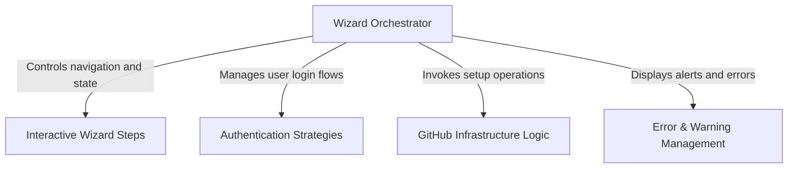

# Tutorial: install-github-app

This project implements an **interactive CLI wizard** that sets up Claude's integration with GitHub repositories. It orchestrates a step-by-step process to authenticate the user, select a repository, and automatically configure the necessary **GitHub Actions workflows** and **secrets**, abstracting away the complex infrastructure setup.

## Chapters

1. [Wizard Orchestrator](01_wizard_orchestrator.md)
2. [Interactive Wizard Steps](02_interactive_wizard_steps.md)
3. [GitHub Infrastructure Logic](03_github_infrastructure_logic.md)
4. [Authentication Strategies](04_authentication_strategies.md)
5. [Error & Warning Management](05_error___warning_management.md)

---

Generated by [Code IQ](https://github.com/adityasoni99/Code-IQ)