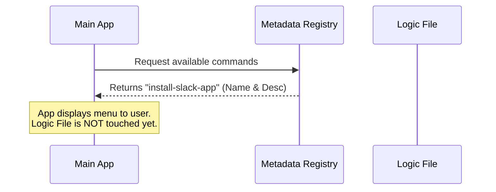

# Chapter 1: Command Metadata Registration

Welcome to the first chapter of our journey into building the `install-slack-app` tool! 

Before we write any complex logic or heavy code, we need to introduce our tool to the system. We do this through a concept called **Command Metadata Registration**.

## Why do we need this?

Imagine you walk into a restaurant. You sit down, and the waiter hands you a menu.

The menu tells you:
1.  **The Name:** "Spaghetti Carbonara"
2.  **The Description:** "Pasta with eggs, cheese, and bacon."
3.  **Availability:** "Lunch and Dinner only."

Crucially, the menu **does not** contain the chef, the pots, the pans, or the actual cooking process. It is just a lightweight list. If the menu contained the actual cooking process for every dish, the restaurant would be too chaotic to open!

In our software, **Command Metadata** is that menu. It allows our main application to know what tools are available (like `install-slack-app`) without having to load the heavy "cooking instructions" (the code) immediately. This keeps our application startup fast and snappy.

## Use Case: The System Startup

Let's look at our central use case. When our AI assistant or CLI tool starts up, it needs to answer the question: **"What capabilities do I have?"**

It needs to scan a list of tools and say, *"I can install the Slack app,"* without actually running the installer or loading the heavy libraries required to do so.

## The Solution: The Metadata Object

To solve this, we create a small, lightweight object that acts as the ID card for our command.

We are working in the file `index.ts`. Here is how we define the basic identity of our tool:

```typescript
// Define the basic identity of the command
const installSlackApp = {
  type: 'local',
  name: 'install-slack-app',
  description: 'Install the Claude Slack app',
}
```

**Explanation:**
*   `type`: Tells the system where this runs (locally on your machine).
*   `name`: The unique ID used to call this command.
*   `description`: A human-readable explanation of what this tool does.

### Adding Conditions and Loading

The menu entry needs two more things: when is it available, and where is the "kitchen" (the logic)?

```typescript
// Add availability and the logic pointer
const installSlackApp = {
  // ... previous properties
  availability: ['claude-ai'],
  supportsNonInteractive: false,
  load: () => import('./install-slack-app.js'),
}
```

**Explanation:**
*   `availability`: This tool only appears if the environment is `claude-ai`.
*   `load`: This is the most important part! Notice it is a function `() => ...`. It points to the file where the real code lives, but it **doesn't run it yet**.

## Under the Hood: How it Works

When the application starts, it reads this metadata file. It does **not** read the actual logic file (`install-slack-app.js`) yet.

Here is a simple sequence of what happens when the application starts up:



The `Logic File` (the heavy code) stays asleep. The Main App only talks to the Registry.

## Implementation Deep Dive

Now, let's look at the complete code snippet for `index.ts`. You will notice we use TypeScript specific syntax `satisfies Command` to ensure our "menu entry" follows the strict rules of the restaurant.

### File: `index.ts`

```typescript
import type { Command } from '../../commands.js'

const installSlackApp = {
  type: 'local',
  name: 'install-slack-app',
  description: 'Install the Claude Slack app',
  availability: ['claude-ai'],
  supportsNonInteractive: false,
  // This points to the logic, but doesn't run it
  load: () => import('./install-slack-app.js'),
} satisfies Command

export default installSlackApp
```

**Key Takeaways:**
1.  **`satisfies Command`**: This checks our work. If we forget the `description` or `name`, the code will show an error (red squiggly line). It ensures our menu entry is valid.
2.  **`export default`**: We package this object up so the main system can import it and read the name and description.
3.  **`import('./install-slack-app.js')`**: This line is the bridge to the next step. It tells the system, *"If the user chooses this item, go look in that file."*

## Conclusion

We have successfully registered our command! The system now knows:
1.  The command is named `install-slack-app`.
2.  It describes itself as "Install the Claude Slack app".
3.  It knows *where* to find the code when the time comes.

But what actually happens when we trigger that `load` function? How do we handle fetching the heavy code only when we need it?

We will explore this optimization in the next chapter: [Lazy Module Loading](02_lazy_module_loading.md).

---

Generated by [Code IQ](https://github.com/adityasoni99/Code-IQ)