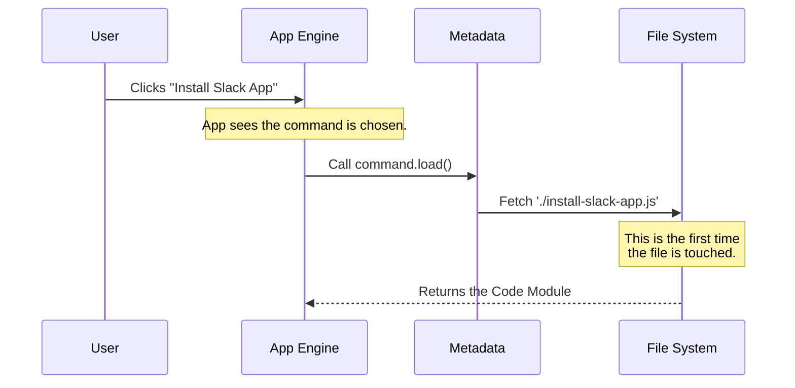

# Chapter 2: Lazy Module Loading

Welcome back! In the previous chapter, [Command Metadata Registration](01_command_metadata_registration.md), we created the "menu" for our application. We registered the name (`install-slack-app`) and description so the system knows the command exists.

However, we carefully avoided loading the actual code (the "cooking instructions") during that step. Now, we are going to learn how to fetch that code exactly when we need it. This concept is called **Lazy Module Loading**.

## The Motivation: The "Heavy Backpack" Problem

Imagine you are going to school. You have 8 different classes today: Math, History, Science, Art, etc.

*   **The "Eager" Way:** You put the textbooks for *all 8 classes* in your backpack before you leave the house. Your bag is incredibly heavy, you walk slowly, and you get tired before you even arrive.
*   **The "Lazy" Way:** You only carry a notepad. When it's time for Math class, you go to your locker and grab *only* the Math book. When Math is over, you swap it for the History book.

In software, loading code takes memory and time. If our application has 50 different commands, and we load the code for all of them at startup (the "Eager" way), the application will be slow and sluggish.

**Lazy Loading** allows our app to start instantly. It only fetches the heavy code for `install-slack-app` when the user actually types that command.

## Use Case: Triggering the Command

Let's say the user has just selected `install-slack-app` from the menu.

The system currently holds the **Metadata Object** we created in Chapter 1. It looks like this:

```typescript
const command = {
  name: 'install-slack-app',
  // ... other details
  load: () => import('./install-slack-app.js'), // The magic happens here
}
```

The system needs to use that `load` property to transform the "Menu Item" into running code.

## The Solution: Dynamic Imports

The secret ingredient here is the **Dynamic Import**.

In standard programming, you usually see imports at the top of a file:
`import { something } from './somewhere.js'`
This loads the code immediately.

However, inside our `load` function, we use `import(...)` as a function call. This tells JavaScript: *"Do not load this file yet. Wait until I run this specific line of code."*

### The Load Function Definition

Let's look at that specific line from our `index.ts` file again.

```typescript
// inside index.ts
{
  // ... name and description ...
  
  // This is a function that returns a Promise
  load: () => import('./install-slack-app.js'),
}
```

**Explanation:**
1.  **`() => ...`**: This is an arrow function. It wraps the command. It acts like a "Wait" button.
2.  **`import('./install-slack-app.js')`**: This is the instruction to go find the file on the disk and read it into memory.
3.  Because it is wrapped in the arrow function, the import doesn't happen until someone calls `.load()`.

## Under the Hood: The Sequence

What happens when the user actually runs the command? Here is the flow of data:



Until the user clicks, the `File System` is never bothered, and the computer's memory remains free.

## Implementation: Consuming the Lazy Module

Now, let's look at how the **App Engine** (the code running our tool) actually uses this. You won't write this part in `index.ts`, but understanding how your code is consumed is vital.

The `import()` function returns a **Promise**. In programming, a Promise is like a buzzer at a restaurant. It means: *"I don't have your food (code) right now, but hold this buzzer, and I will alert you when it's ready."*

Here is how the system handles that "buzzer":

```typescript
// Imagine this code runs when the user presses Enter
async function onUserTrigger(commandMetadata) {
  console.log("Loading code...");

  // 1. Trigger the dynamic import
  // The 'await' keyword pauses here until the file is fully loaded
  const loadedModule = await commandMetadata.load();

  console.log("Code loaded! Ready to run.");
  return loadedModule;
}
```

**Explanation:**
*   **`async / await`**: These keywords handle the "waiting" part. The application pauses execution for a tiny fraction of a second while it reads the file from the hard drive.
*   **`loadedModule`**: Once the wait is over, this variable holds the actual code found inside `install-slack-app.js`.

## What gets loaded?

When the file is finally loaded, `loadedModule` will contain whatever we exported from our implementation file.

Usually, it looks something like this (we will write this file in the next chapter):

```typescript
// This is what 'loadedModule' essentially becomes:
{
  default: {
    handler: (context) => { /* The actual installation logic */ }
  }
}
```

By using Lazy Module Loading, we ensure that if the user *never* chooses to install the Slack app, we *never* spend resources reading that logic file.

## Conclusion

We have successfully optimized our application!
1.  We defined a `load` function in our metadata.
2.  We used `import()` to fetch code only when requested.
3.  We saved memory and made the application startup faster.

Now the system has fetched the file. It has the heavy book in its hands. But how does it actually **read** the book and follow the instructions?

We will cover how to run the code we just loaded in the next chapter: [Command Execution Handler](03_command_execution_handler.md).

---

Generated by [Code IQ](https://github.com/adityasoni99/Code-IQ)