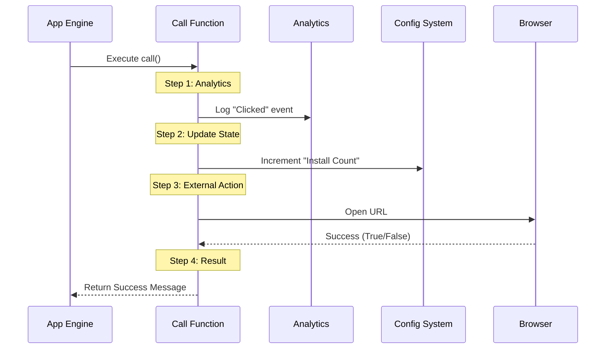

# Chapter 3: Command Execution Handler

Welcome to Chapter 3!

In the previous chapter, [Lazy Module Loading](02_lazy_module_loading.md), we learned how to efficiently fetch the heavy code file from the disk only when we need it.

Now, we have the code loaded into memory. We have the "Chef" in the kitchen. But the Chef is just standing there! We need to give the order to start cooking.

In this chapter, we will build the **Command Execution Handler**. This is the specific set of instructions that runs when the command is actually triggered.

## The Motivation: The "Go" Button

Imagine you have a remote control for a toy robot. You have defined what the "Dance" button looks like (Metadata), and you have put batteries in the robot (Lazy Loading).

However, you still need to wire the internal circuitry so that **when** the button is pressed, the robot actually moves its arms and legs.

In our application, simply loading the file isn't enough. We need a standardized entry point—a specific function that the system knows to look for and execute to make things happen. We call this function `call()`.

## Use Case: Clicking "Install"

Let's look at our specific goal for the `install-slack-app` command. When the user selects this option, we need to do three specific things in a specific order:

1.  **Record Data:** Note down that someone clicked the button (for analytics).
2.  **Update Memory:** Remember that the user has performed this action (so we don't nag them again).
3.  **Perform Action:** Actually open the web browser to the installation page.

## The Solution: The `call` Function

We implement this logic inside a function named `call`. This is our "Main Event."

We are working in the file `install-slack-app.ts`. Let's build this function step-by-step.

### Step 1: Defining the Function

First, we export a function named `call`. It must be `async` because opening a browser or saving settings takes a tiny bit of time.

```typescript
import type { LocalCommandResult } from '../../commands.js'

// The system looks specifically for a function named 'call'
export async function call(): Promise<LocalCommandResult> {
  // Logic goes here...
}
```

**Explanation:**
*   `export`: This makes the function available to the main application (the one that loaded this module in Chapter 2).
*   `async`: Allows us to pause and wait for actions (like opening a browser) to finish.

### Step 2: Logging and State Updates

Before we open the browser, we want to do our bookkeeping.

```typescript
import { logEvent } from '../../services/analytics/index.js'
import { saveGlobalConfig } from '../../utils/config.js'

// Inside the call function:
logEvent('tengu_install_slack_app_clicked', {})

// Update the configuration to remember this happened
saveGlobalConfig(current => ({
  ...current,
  slackAppInstallCount: (current.slackAppInstallCount ?? 0) + 1,
}))
```

**Explanation:**
*   `logEvent`: Sends a signal to our analytics saying "The user clicked the button."
*   `saveGlobalConfig`: This is a crucial helper. It increases a counter. We will learn exactly how this persistence works in [Persistent State Management](04_persistent_state_management.md).

### Step 3: The External Action

Now, we perform the main task: opening the URL.

```typescript
import { openBrowser } from '../../utils/browser.js'

const SLACK_APP_URL = 'https://slack.com/marketplace/A08SF47R6P4-claude'

// Inside the call function:
// We 'await' the result to see if it opened successfully
const success = await openBrowser(SLACK_APP_URL)
```

**Explanation:**
*   `await`: The code pauses here until the browser reports back.
*   `success`: This will be `true` if the browser opened, or `false` if it failed.

### Step 4: Returning the Result

Finally, the Chef needs to send the dish out to the table. Our function must return a message to the user interface telling it what happened.

```typescript
// Inside the call function:
if (success) {
  return {
    type: 'text',
    value: 'Opening Slack app installation page in browser…',
  }
} else {
  return {
    type: 'text', // Standardized result type
    value: `Couldn't open browser. Visit: ${SLACK_APP_URL}`,
  }
}
```

**Explanation:**
*   We return a simple object containing text.
*   The main application receives this and displays it to the user in the chat window or terminal.

## Under the Hood: The Execution Flow

When the `call()` function runs, it orchestrates several different parts of the system. It acts as a conductor.

Here is what happens when the function runs:



The `Handler` (our `call` function) doesn't do the heavy lifting itself; it delegates tasks to the Analytics, Config, and Browser systems, ensuring they happen in the right order.

## Implementation Deep Dive

Now, let's look at the complete file `install-slack-app.ts` to see how it all fits together.

```typescript
import type { LocalCommandResult } from '../../commands.js'
import { logEvent } from '../../services/analytics/index.js'
import { openBrowser } from '../../utils/browser.js'
import { saveGlobalConfig } from '../../utils/config.js'

const SLACK_APP_URL = 'https://slack.com/marketplace/A08SF47R6P4-claude'

export async function call(): Promise<LocalCommandResult> {
  // 1. Log the event
  logEvent('tengu_install_slack_app_clicked', {})

  // 2. Update the persistent configuration
  saveGlobalConfig(current => ({
    ...current,
    slackAppInstallCount: (current.slackAppInstallCount ?? 0) + 1,
  }))

  // 3. Trigger the browser action
  const success = await openBrowser(SLACK_APP_URL)

  // 4. Return the result object
  if (success) {
    return { type: 'text', value: 'Opening Slack app installation page…' }
  } else {
    return { type: 'text', value: `Visit: ${SLACK_APP_URL}` }
  }
}
```

**Why is this structure powerful?**
It separates the **definition** of the command (Chapter 1) from the **execution** of the command (Chapter 3). If we want to change the URL or change the analytics event later, we only have to touch this file. We don't need to change the menu system.

## Conclusion

We have successfully implemented the logic for our command!
1.  We created a `call` function as the standard entry point.
2.  We orchestrated analytics, configuration updates, and browser actions.
3.  We returned a response to the user.

You noticed we used `saveGlobalConfig` to remember how many times the user installed the app. But where does that data go? Does it vanish when we turn off the computer?

In the next chapter, we will explore how we save this information permanently using [Persistent State Management](04_persistent_state_management.md).

---

Generated by [Code IQ](https://github.com/adityasoni99/Code-IQ)