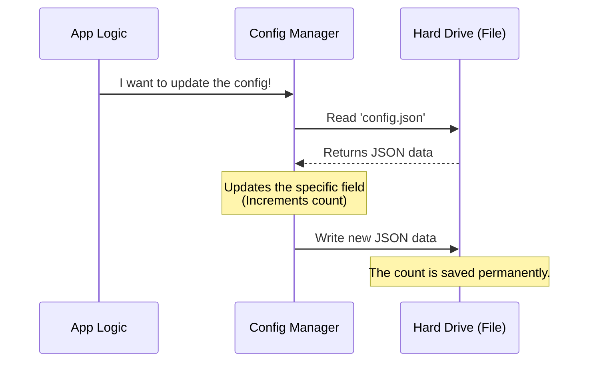

# Chapter 4: Persistent State Management

Welcome to Chapter 4!

In the previous chapter, [Command Execution Handler](03_command_execution_handler.md), we wrote the logic to execute our command. We successfully opened a browser window and logged an analytics event.

We also included a mysterious line of code: `saveGlobalConfig(...)`. We used it to count how many times the user installed the app, but we didn't explain *how* the application remembers that number.

In this chapter, we will explore **Persistent State Management**. This is how we give our application "Long-Term Memory."

## The Motivation: The "Amnesia" Problem

Imagine you have a helpful robot assistant. You tell it, "I like my coffee with two sugars." The robot makes the coffee perfectly.

However, if you turn the robot off and turn it back on, it asks, "How do you take your coffee?"

This is how computer programs work by default. Variables (like `let counter = 0`) live in the computer's **RAM** (Random Access Memory). RAM is volatile. When the program stops or the computer restarts, that memory is wiped clean.

**The Solution:**
To make our application "smart," we need to write important information into a file on the hard drive (like a `.json` file). This file acts like a **journal**. Even if the robot shuts down, when it wakes up, it can read the journal and remember: "Oh right, two sugars."

## Use Case: The Installation Counter

In our `install-slack-app` tool, we want to track a specific piece of data: `slackAppInstallCount`.

Why?
1.  **Analytics:** To know how often this feature is used.
2.  **User Experience:** If a user clicks "Install" for the 5th time, maybe we want to show a different message (like "Having trouble?").

To do this, we need a system that reads the current count from the hard drive, adds 1, and saves it back.

## The Solution: The `saveGlobalConfig` Function

We solve this using a helper function called `saveGlobalConfig`.

This function abstracts away the complex work of finding the file on the disk, opening it, parsing it, and writing to it. It provides a simple way to update our "Journal."

### Concept: The Updater Pattern

Instead of just saying "Set value to 5", we use a safer pattern: "Take the **current** value, and change it."

Here is how we use it in our code:

```typescript
import { saveGlobalConfig } from '../../utils/config.js'

// The function receives the 'current' state of the world
saveGlobalConfig(current => ({
  ...current, // Keep everything else exactly the same
  slackAppInstallCount: (current.slackAppInstallCount ?? 0) + 1,
}))
```

**Explanation of the Syntax:**
1.  **`current => ...`**: We pass a function. We are asking the system, "Give me the current state of the config."
2.  **`...current`**: This is the **Spread Operator**. It means "Copy all existing settings." If we forget this, we might accidentally erase the user's other settings (like their theme or username)!
3.  **`slackAppInstallCount: ... + 1`**: We overwrite *only* this specific property with the new value.

## Under the Hood: How it Works

What actually happens when we call this function? It involves a round-trip to the file system.

Here is the flow of data:



1.  **Read:** The system opens the "Journal" (the JSON file).
2.  **Modify:** The system changes the number in memory.
3.  **Write:** The system overwrites the "Journal" with the new data.

## Implementation Deep Dive

Let's peek inside `utils/config.ts` to see a simplified version of how this is implemented. You don't need to write this, but understanding it helps demystify the magic.

### Reading the File

First, the system needs to get the current state.

```typescript
import fs from 'fs' // The File System library

function readConfig() {
  // If the file exists, read it. If not, return an empty object.
  if (fs.existsSync('./config.json')) {
    const fileContent = fs.readFileSync('./config.json', 'utf-8')
    return JSON.parse(fileContent)
  }
  return {}
}
```

**Explanation:**
*   `fs.readFileSync`: Opens the file on your computer.
*   `JSON.parse`: Converts the text string `"{ "count": 1 }"` into a real JavaScript object.

### Writing the File

The `saveGlobalConfig` function combines reading and writing.

```typescript
export function saveGlobalConfig(updateFn) {
  // 1. Get the Old State
  const oldConfig = readConfig()

  // 2. Calculate New State using the instructions provided
  const newConfig = updateFn(oldConfig)

  // 3. Save it to the disk
  const textContent = JSON.stringify(newConfig, null, 2)
  fs.writeFileSync('./config.json', textContent)
}
```

**Explanation:**
*   `updateFn(oldConfig)`: This runs the arrow function we wrote earlier (`current => ...`). It merges the old data with our new count.
*   `JSON.stringify`: Converts the JavaScript object back into text.
*   `fs.writeFileSync`: Saves the text to the hard drive.

## Conclusion

We have now given our application the power of memory!
1.  We learned that variables in memory are temporary.
2.  We used `saveGlobalConfig` to modify a persistent file.
3.  We ensured we didn't delete other settings by using the spread operator (`...current`).

Our application is now smart. It has:
*   **Metadata** to introduce itself.
*   **Lazy Loading** to start fast.
*   **Execution Logic** to do the work.
*   **Persistence** to remember the work.

Finally, after all this work, our command returns a result object (like `{ type: 'text', value: '...' }`). But who catches that object? How do we ensure every command speaks the same language so the UI understands it?

We will finalize our journey in the next chapter: [Standardized Result Protocol](05_standardized_result_protocol.md).

---

Generated by [Code IQ](https://github.com/adityasoni99/Code-IQ)