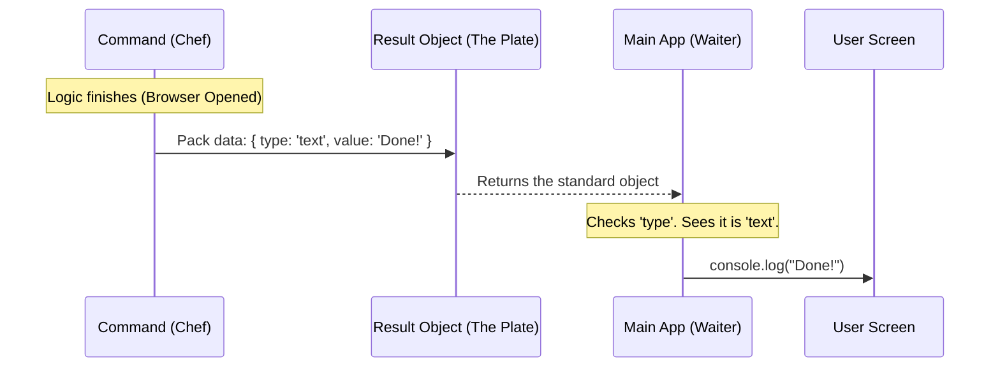

# Chapter 5: Standardized Result Protocol

Welcome to the final chapter of our series!

In the previous chapter, [Persistent State Management](04_persistent_state_management.md), we gave our application a long-term memory. We successfully counted how many times the user installed the app and saved it to the disk.

Now, we face one final challenge. The code has run, the browser has opened, and the data is saved. But how does the command tell the main system (and the user) that it is finished? Does it return `true`? Does it return a string like "Done"? Does it return a number `1`?

If every command returned a different type of answer, our main system would be a mess of confusion. To fix this, we use the **Standardized Result Protocol**.

## The Motivation: The "Universal Form"

Imagine a large office building.
*   The Accounting department sends reports on **Blue Paper**.
*   The HR department sends reports on **Red Post-it Notes**.
*   The IT department shouts their reports across the room.

The manager (our Main System) would go crazy trying to organize this.

To restore order, the manager issues a rule: **"All departments must submit their results on Standard Form 101."** This form has two specific boxes:
1.  **Type:** What kind of news is this? (e.g., "Success", "Error", "Info")
2.  **Content:** The actual message.

In our software, this "Standard Form" ensures that no matter what crazy logic happens inside a command, the output always looks exactly the same to the main system.

## Use Case: Success vs. Failure

Let's look at our `install-slack-app` command. It tries to open a web browser.
1.  **Scenario A (Success):** The browser opens successfully. We want to tell the user, "Opening page..."
2.  **Scenario B (Failure):** The computer blocks the browser. We want to tell the user, "Please visit this URL manually."

We need a standard way to wrap both of these very different outcomes so the user interface knows how to print them.

## The Solution: The `LocalCommandResult`

We define a contract (an Interface in TypeScript) called `LocalCommandResult`.

It looks simply like this:

```typescript
// The contract every command must obey
interface LocalCommandResult {
  type: 'text'; // We might add 'image' or 'json' later
  value: string; // The message to show the user
}
```

### Implementing the Success Case

In our `install-slack-app.ts` file, when everything goes right, we fill out the form like this:

```typescript
// ... inside the call() function
if (success) {
  return {
    type: 'text',
    value: 'Opening Slack app installation page in browser…',
  }
}
```

**Explanation:**
*   **`type: 'text'`**: We tell the system, "Treat this result as plain text."
*   **`value`**: This is the string that will appear in the user's terminal.

### Implementing the Fallback Case

If the browser fails to open, we don't crash the program. We just fill out the form differently:

```typescript
// ... inside the call() function
else {
  return {
    type: 'text', 
    value: `Couldn't open browser. Visit: ${SLACK_APP_URL}`,
  }
}
```

Notice that the **structure** of the object is identical to the success case. This is the power of the protocol. The main system doesn't need to know *why* it failed; it just sees a result object and displays it.

## Under the Hood: The Handoff

How does the main system actually use this object? It acts like a relay race.

1.  The **Command** runs its logic.
2.  The **Command** packages the outcome into the Result Object.
3.  The **Main App** receives the object.
4.  The **Main App** decides how to print it (green text, red text, plain text) based on the object.

Here is the sequence:



## Implementation Deep Dive

Let's look at a simplified version of the code that *receives* our command's output. This code lives in the core of the application (e.g., `cli.ts` or `main.ts`).

### Consuming the Protocol

```typescript
// This function runs the command and handles the output
async function runCommand(command) {
  // 1. Run the logic we wrote in Chapter 3
  const result = await command.call()

  // 2. The Protocol in action: Check the 'type'
  if (result.type === 'text') {
    console.log(result.value)
  } 
  // Future proofing:
  else if (result.type === 'error') {
    console.error(result.value)
  }
}
```

**Explanation:**
*   **`await command.call()`**: This triggers our `install-slack-app.ts` file.
*   **`result`**: This variable now holds the object `{ type: 'text', value: '...' }`.
*   **`if (result.type === 'text')`**: The system now knows exactly what to do. It prints the value to the console.

If we didn't have this protocol, and our command just returned `true`, the `runCommand` function wouldn't know what message to show the user!

## Putting it All Together

Let's review the full flow of our `install-slack-app` project across all 5 chapters.

1.  **Registration ([Chapter 1](01_command_metadata_registration.md)):** The app starts. It sees `install-slack-app` on the menu (Metadata) but doesn't load the code.
2.  **Lazy Loading ([Chapter 2](02_lazy_module_loading.md)):** The user types "install-slack-app". The system wakes up and fetches the file `install-slack-app.ts` from the disk.
3.  **Execution ([Chapter 3](03_command_execution_handler.md)):** The system calls the `call()` function. The browser opens.
4.  **Persistence ([Chapter 4](04_persistent_state_management.md)):** Before finishing, the command secretly writes "Count: 1" to a file on the hard drive.
5.  **Result ([Chapter 5]):** The command returns a `{ type: 'text' }` object. The system receives it and prints "Opening Slack app..." to the user.

## Conclusion

Congratulations! You have built a fully functional, professional-grade command for a CLI application.

By adhering to the **Standardized Result Protocol**, you ensured that your specific command (`install-slack-app`) behaves like a good citizen within the larger system. It speaks the same language as every other command, making the application stable, predictable, and easy to maintain.

You now understand the lifecycle of a modern command-line tool command:
*   **Define it.**
*   **Load it.**
*   **Run it.**
*   **Save it.**
*   **Report it.**

Happy coding!

---

Generated by [Code IQ](https://github.com/adityasoni99/Code-IQ)