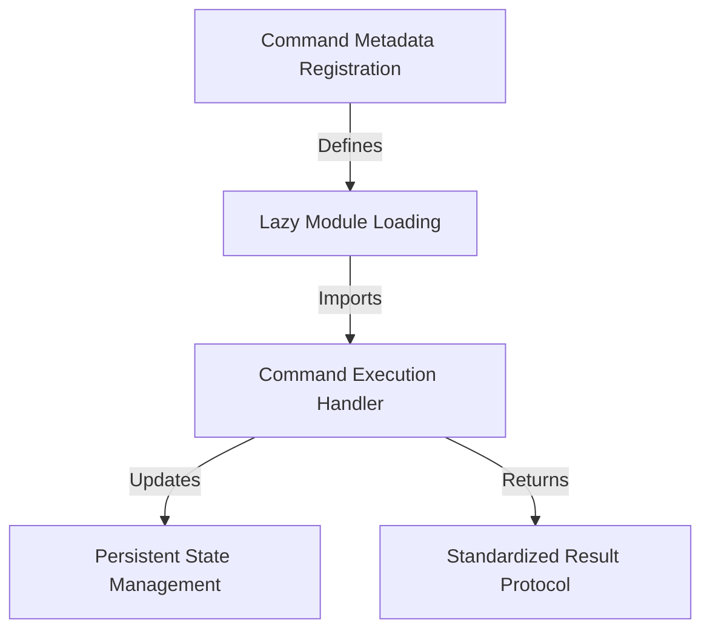

# Tutorial: install-slack-app

This project creates a specific **command** that allows users to easily *install* the Claude Slack app. It uses a smart registration system to list the feature on a "menu" without loading the heavy code until needed. When clicked, it updates the system's **memory** to track usage and attempts to open the installation page in a *web browser*.

## Chapters

1. [Command Metadata Registration](01_command_metadata_registration.md)
2. [Lazy Module Loading](02_lazy_module_loading.md)
3. [Command Execution Handler](03_command_execution_handler.md)
4. [Persistent State Management](04_persistent_state_management.md)
5. [Standardized Result Protocol](05_standardized_result_protocol.md)

---

Generated by [Code IQ](https://github.com/adityasoni99/Code-IQ)