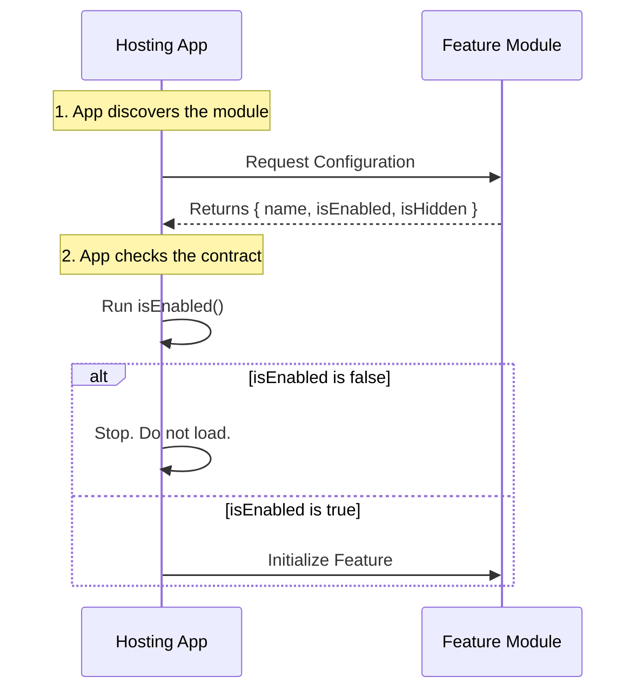

# Chapter 1: Feature Configuration Interface

Welcome to the **issue** project! If you are just starting out, you might be wondering: "How do we plug new features into an application without breaking everything?"

In this first chapter, we are going to explore the **Feature Configuration Interface**.

### The Motivation: The "Universal Socket"

Imagine you are building a house. You put electrical outlets on the walls. You don't know yet if you are going to plug in a lamp, a toaster, or a TV. You just know that whatever you plug in must fit that standard three-prong socket.

In software, the **Feature Configuration Interface** is that socket.

**The Use Case:**
Let's say our application is a dashboard. We want to add a new "Dark Mode" feature. We don't want the core dashboard to know *how* Dark Mode works (the colors, the CSS, etc.). We just want the dashboard to know:
1.  What is your name?
2.  Are you turned on?
3.  Should I show you in the menu?

By using a standard interface, we can add or remove features easily.

### Key Concepts

This interface acts like an **ID Card** for your feature. It answers three simple questions:

1.  **Identity (`name`)**: This is the unique tag for the feature (e.g., 'dark-mode').
2.  **Status (`isEnabled`)**: A logic check. Is this feature allowed to run right now? (e.g., maybe it only runs for Admin users).
3.  **Visibility (`isHidden`)**: Should this be hidden from the UI lists? (e.g., a background analytics tool doesn't need a menu button).

### The Code: Your First ID Card

Here is what this interface looks like in code. This comes from the file `index.js`.

```javascript
// --- File: index.js ---
export default { 
  isEnabled: () => false, 
  isHidden: true, 
  name: 'stub' 
};
```

**What is happening here?**
*   **Input:** The main application imports this object.
*   **Output:** The application reads the properties. In this specific case:
    *   `isEnabled` returns `false`, so the app will likely **ignore** this feature.
    *   `isHidden` is `true`, so it won't appear in any menus.
    *   The name is simply `'stub'`.

### Internal Implementation: Under the Hood

How does the core system use this? Imagine the core system is a **Security Guard** at a club, and the Feature is a guest trying to enter.

1.  The Guard asks for the ID.
2.  The Feature shows the Configuration Interface.
3.  The Guard checks `isEnabled`. If it says "false", access is denied.

Here is a diagram of that conversation:



### Deep Dive: Processing the Interface

Let's look at how the "Hosting App" typically processes this code. Even though `index.js` defines the feature, some other code must consume it.

Here is a simplified example of how the App reads the interface:

```javascript
import feature from './index.js';

// 1. Check the Identity
console.log(`Checking feature: ${feature.name}`);

// Output: Checking feature: stub
```

The app identifies the feature by reading the `name` string.

Next, the app decides whether to run the feature:

```javascript
// 2. Check the Logic
const shouldRun = feature.isEnabled();

if (shouldRun) {
  console.log("Feature is starting...");
} else {
  console.log("Feature is disabled.");
}

// Output: Feature is disabled.
```

Because `isEnabled` is a function `() => false`, the app executes it, receives `false`, and decides **not** to initialize the rest of the feature code. This saves memory and prevents errors.

Finally, the app decides if it should show up in the user interface:

```javascript
// 3. Check Visibility
if (!feature.isHidden) {
  console.log("Adding to Navigation Menu...");
}

// (No Output, because isHidden is true)
```

### Summary

In this chapter, we learned that the **Feature Configuration Interface** is a simple contract. It allows the main application to treat different features (stubs, full tools, beta tests) exactly the same way during the startup phase.

We specifically looked at:
*   `name`: The ID.
*   `isEnabled`: The on/off switch.
*   `isHidden`: The visibility toggle.

Currently, our code is just a "stub"—a placeholder that is turned off. In the next chapter, we will look closer at what this stub represents and how to expand upon it.

[Next Chapter: Feature Stub](02_feature_stub.md)

---

Generated by [Code IQ](https://github.com/adityasoni99/Code-IQ)