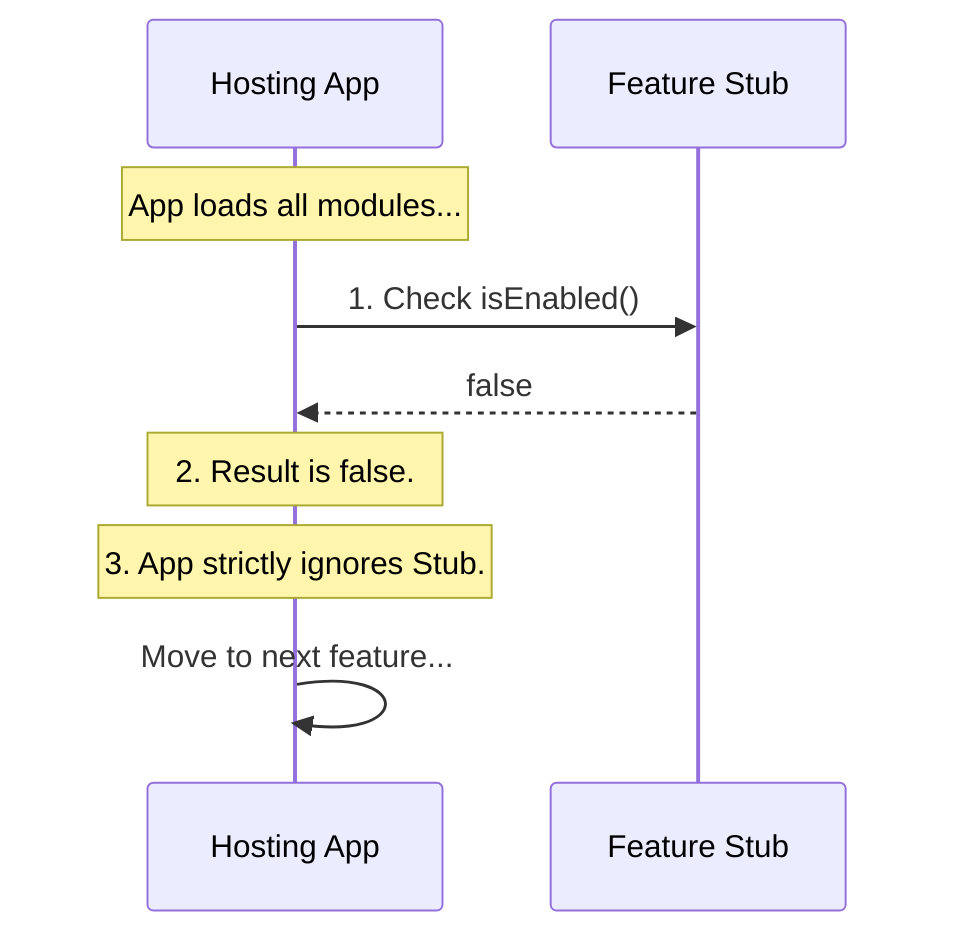

# Chapter 2: Feature Stub

Welcome back! In the previous chapter, [Feature Configuration Interface](01_feature_configuration_interface.md), we learned that every feature needs an "ID Card" so the application knows who it is and if it should be turned on.

Now, we are going to look at the most basic version of a feature: the **Feature Stub**.

### The Motivation: The "Coming Soon" Sign

Imagine you are walking through a shopping mall. You see a storefront that is under construction. The windows are papered over, and there is a sign that says "Opening Soon."

Does the mall manager need to demolish that part of the building just because the shop isn't ready? No. The space (the "slot") is there, but it is currently inactive.

**The Use Case:**
You are a developer working on a complex new tool, let's say a "Chat Module." It is currently buggy and crashes the app. However, you need to push updates for the rest of the app today. You can't just delete your files.

Instead, you convert your feature into a **Feature Stub**. This keeps the files in the project but ensures the feature is:
1.  **Inactive:** It consumes no processing power.
2.  **Invisible:** Users cannot see or click it.

### The Code: Creating a Stub

Let's look at the implementation of a Feature Stub. This is arguably the safest piece of code you can write because its job is to do nothing.

This code resides in `index.js`:

```javascript
// --- File: index.js ---
export default { 
  isEnabled: () => false, 
  isHidden: true, 
  name: 'stub' 
};
```

**Breaking it down:**

1.  **`isEnabled: () => false`**: This is the most critical line. It is a "hard-coded" switch. By returning `false` immediately, we guarantee this feature never starts up.
2.  **`isHidden: true`**: This tells the User Interface (UI) renderer to skip this item when drawing menus or lists.
3.  **`name: 'stub'`**: We give it a generic name so the system can log that a placeholder exists here.

### Internal Implementation: How the App Skips It

How does the main application handle a stub? It treats it like a dummy switch on a dashboard. It touches it, realizes it does nothing, and moves on.

Here is a diagram showing how the Application (App) interacts with a Stub compared to a Real Feature:



#### Step-by-Step Code Walkthrough

Let's look at the "Hosting App" code that processes this stub.

**Step 1: Importing the Feature**
First, the app imports the file. Even though it's a stub, it is a valid JavaScript module.

```javascript
import myFeature from './index.js';

// The app now holds the "ID Card"
// { name: 'stub', isEnabled: ... }
```

**Step 2: The Safety Check**
Before the app allocates memory for buttons, routes, or logic, it runs the check.

```javascript
// The Guard Clause
if (myFeature.isEnabled() === false) {
  console.log("Skipping disabled feature.");
  
  // CRITICAL: We return early!
  // No further code runs for this feature.
  return; 
}
```

**Output:**
```text
Skipping disabled feature.
```

Because of that `return` statement, the stub is effectively "neutralized."

**Step 3: The Visibility Check**
Separately, if the menu system tries to list all available tools, it checks the visibility flag.

```javascript
const menuItems = [];

// Only add to menu if NOT hidden
if (!myFeature.isHidden) {
  menuItems.push(myFeature.name);
}

console.log(menuItems); 
// Output: [] (Empty array)
```

### Why is this useful?

You might ask: "Why not just delete the file?"

1.  **Placeholder:** It reserves the directory structure for future work.
2.  **Stability:** It allows you to disable a buggy feature remotely (if you connect `isEnabled` to a server later) without changing the code structure.
3.  **Standardization:** Every folder in your project behaves exactly the same way (exporting this interface), whether it is a massive application or a tiny stub. This consistency makes the codebase very clean.

### Conclusion

In this chapter, we explored the **Feature Stub**. We learned that a stub is a valid feature configured to be ignored. It utilizes the [Feature Configuration Interface](01_feature_configuration_interface.md) to explicitly tell the system: "I am here, but do not turn me on."

This concludes the foundational chapters on the Feature system. You now understand the interface contract and the default "null" state. You are ready to start building active features!

---

Generated by [Code IQ](https://github.com/adityasoni99/Code-IQ)