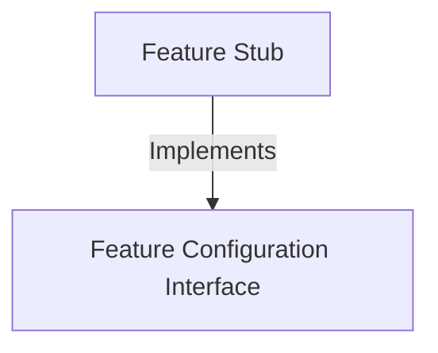

# Tutorial: issue

This project defines a **placeholder** mechanism for software features that are currently inactive or under development. It creates a *stub*—a dummy component—that strictly follows a standard configuration layout, ensuring the system can recognize the feature exists while keeping it **disabled** and **hidden** from the user interface.

## Chapters

1. [Feature Configuration Interface](01_feature_configuration_interface.md)
2. [Feature Stub](02_feature_stub.md)

---

Generated by [Code IQ](https://github.com/adityasoni99/Code-IQ)