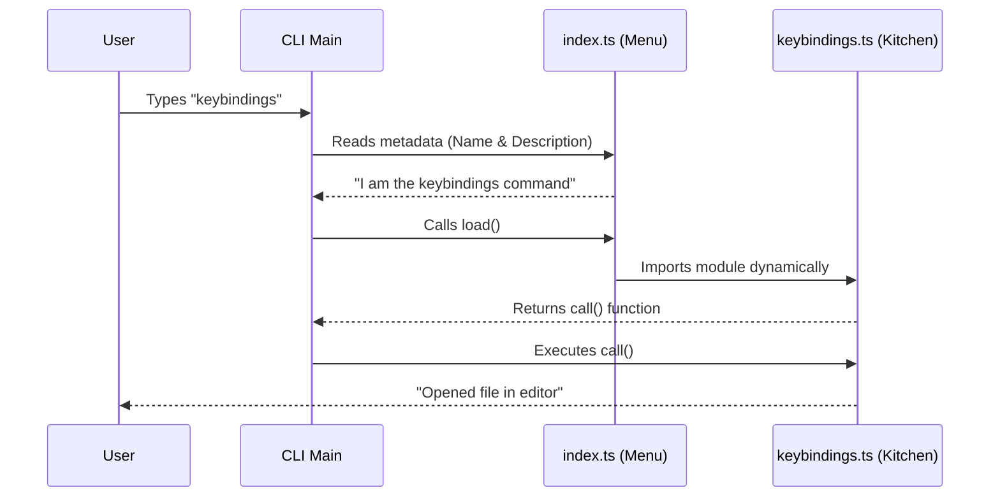

# Chapter 1: Command Module Structure

Welcome to the **Keybindings** project! In this tutorial series, we are going to explore how to build robust Command Line Interface (CLI) tools.

We are starting with the most fundamental concept: **Command Module Structure**.

## The Restaurant Analogy

Imagine a busy restaurant. To run it smoothly, you separate the **Menu** from the **Kitchen**.

1.  **The Menu (`index.ts`)**: This is what the customer sees. It has the name of the dish ("Steak") and a description ("Grilled to order"). It tells the waiter (the CLI framework) what is available to order.
2.  **The Kitchen (`keybindings.ts`)**: This is where the work happens. It contains the recipe and the chef. The customer doesn't see this part; they just see the result.

In our project, every command is split into these two files. This keeps our code organized and easy to read.

### The Use Case

We want to build a command called `keybindings`.
*   **Goal:** It should check if a configuration file exists. If not, it creates one. Then, it opens that file in the user's text editor.

Let's look at how we split this into our two files.

---

## Part 1: The Menu (`index.ts`)

The `index.ts` file acts as the definition. It contains metadata—data *about* the command—but no heavy logic.

### Defining the Command
Here is how we define the command's identity:

```typescript
// --- File: index.ts ---
const keybindings = {
  name: 'keybindings',
  description: 'Open or create your keybindings configuration file',
  type: 'local',
  // ... more settings below
} satisfies Command
```

**Explanation:**
*   `name`: This is what the user types in the terminal (e.g., `my-cli keybindings`).
*   `description`: This shows up when the user runs the `--help` command.

### Connecting to the Logic
How does the Menu tell the Kitchen what to do?

```typescript
// --- File: index.ts ---
const keybindings = {
  // ... previous settings
  isEnabled: () => isKeybindingCustomizationEnabled(),
  supportsNonInteractive: false,
  load: () => import('./keybindings.js'),
} satisfies Command

export default keybindings
```

**Explanation:**
*   `isEnabled`: Checks if this command is allowed to run. We will cover this in [Feature Gating](02_feature_gating.md).
*   `load`: This is the magic link. It points to the actual execution file (`keybindings.js`).

---

## Part 2: The Kitchen (`keybindings.ts`)

The `keybindings.ts` file contains the actual "recipe." It exports a function called `call` that does the heavy lifting.

### Step A: The Entry Point
First, we define the main function and perform safety checks.

```typescript
// --- File: keybindings.ts ---
export async function call(): Promise<{ type: 'text'; value: string }> {
  // Check if we are allowed to be here
  if (!isKeybindingCustomizationEnabled()) {
    return {
      type: 'text',
      value: 'Keybinding customization is not enabled.',
    }
  }
  // ...
```

**Explanation:**
*   `export async function call()`: This is the standard entry point. The CLI framework looks for this exact function name to start execution.

### Step B: Creating the File
Next, the code attempts to create the configuration file safely.

```typescript
  // ... inside call() ...
  const keybindingsPath = getKeybindingsPath()
  let fileExists = false
  
  // Ensure the folder exists first
  await mkdir(dirname(keybindingsPath), { recursive: true })

  try {
    // Try to write the file (fails if it already exists)
    await writeFile(keybindingsPath, generateKeybindingsTemplate(), {
      flag: 'wx', 
    })
  } catch (e: unknown) { /* handle error */ }
```

**Explanation:**
*   It tries to write the file using a safe method. We will explore why we do it this specific way in [Safe Resource Initialization](03_safe_resource_initialization.md).

### Step C: Opening the Editor
Finally, once the file is ready, we open it for the user.

```typescript
  // ... inside call() ...
  // Open the file in the user's default editor (vim, code, nano, etc.)
  const result = await editFileInEditor(keybindingsPath)

  if (result.error) {
    return { type: 'text', value: `Error: ${result.error}` }
  }
  
  return {
    type: 'text',
    value: `Opened ${keybindingsPath} in your editor.`,
  }
}
```

**Explanation:**
*   This hands off control to an external program. We detail this in [External Editor Delegation](04_external_editor_delegation.md).

---

## Under the Hood: How It Execution Works

When a user runs a command, the system does not load every single file immediately. It follows a specific sequence to save memory and time.

Here is a simple flow of what happens when you type `keybindings`:



### Deep Dive Implementation

The separation relies on the `load` property in `index.ts`.

1.  **Lightweight Start:** When the CLI starts, it reads `index.ts`. This file is tiny. It allows the CLI to build its help menu instantly without reading the heavy code in `keybindings.ts`.
2.  **Dynamic Import:**
    ```typescript
    load: () => import('./keybindings.js')
    ```
    This line uses a JavaScript concept called a "Dynamic Import." It tells the computer: *"Don't read the keybindings.js file yet. Only read it when the user actually asks for it."*
    This is the core of [Lazy Module Loading](05_lazy_module_loading.md), which makes your application start much faster.

## Conclusion

In this chapter, we learned that a **Command Module** is split into two parts:
1.  **Metadata (`index.ts`)**: The menu definition.
2.  **Execution (`keybindings.ts`)**: The logic recipe.

This structure allows us to keep our application organized and performant.

Now that we have the structure, how do we prevent users from running commands that aren't ready yet?

[Next Chapter: Feature Gating](02_feature_gating.md)

---

Generated by [Code IQ](https://github.com/adityasoni99/Code-IQ)