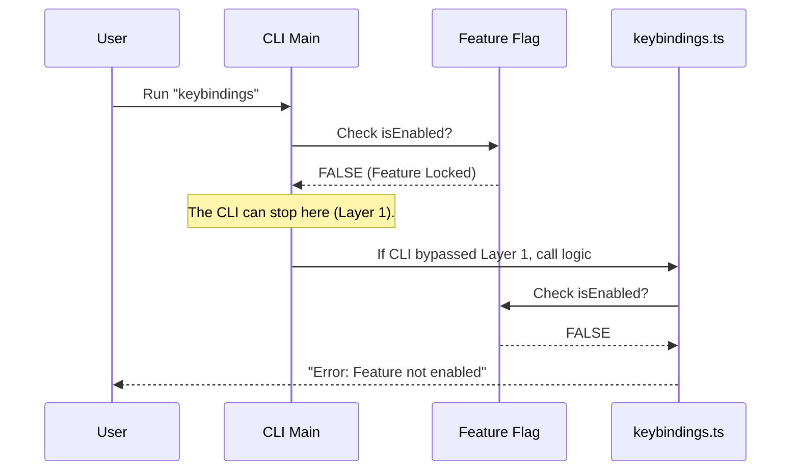

# Chapter 2: Feature Gating

In the previous chapter, [Command Module Structure](01_command_module_structure.md), we learned how to organize our code by splitting the "Menu" (`index.ts`) from the "Kitchen" (`keybindings.ts`).

Now, imagine we are still renovating the kitchen. We don't want customers ordering the special "Keybindings Steak" until the stove is actually working. We need a way to **hide** or **block** this feature until it is ready.

This concept is called **Feature Gating**.

## The VIP Rope Analogy

Think of your CLI tool as an exclusive nightclub.
1.  **The Feature Flag (`isKeybindingCustomizationEnabled`)**: This is the Guest List. It decides who gets in.
2.  **The Menu Check (`index.ts`)**: This is the promoter outside. If your name isn't on the list, they don't even tell you where the club is.
3.  **The Bouncer Check (`keybindings.ts`)**: This is the security guard at the door. Even if you found the door, if you aren't on the list, they politely ask you to leave.

### The Use Case

We are building the `keybindings` command. However, this feature is currently experimental.
*   **Goal:** If a user has not explicitly enabled "customization" in their settings, the `keybindings` command should not appear in the help menu, and it definitely shouldn't run.

---

## Layer 1: Hiding the Command (`index.ts`)

The first line of defense happens in our definition file. We don't want to clutter the user's screen with commands they can't use.

We use the `isEnabled` property in our metadata.

```typescript
// --- File: index.ts ---
import { isKeybindingCustomizationEnabled } from '../../keybindings/loadUserBindings.js'

const keybindings = {
  name: 'keybindings',
  // Checks the "Guest List" before showing the command
  isEnabled: () => isKeybindingCustomizationEnabled(), 
  type: 'local',
  load: () => import('./keybindings.js'),
} satisfies Command
```

**Explanation:**
*   `isEnabled`: This function runs *before* the command is shown in the `--help` list.
*   If it returns `false`, the CLI acts like this command doesn't exist at all.

---

## Layer 2: The Safety Check (`keybindings.ts`)

Sometimes, a user might try to run a command even if it is hidden (perhaps they guessed the name, or they are using an old script). We need a "Bouncer" inside the logic file to stop them.

This happens at the very top of our execution function.

```typescript
// --- File: keybindings.ts ---
export async function call(): Promise<{ type: 'text'; value: string }> {
  // The Bouncer Check
  if (!isKeybindingCustomizationEnabled()) {
    return {
      type: 'text',
      value: 'Keybinding customization is not enabled.',
    }
  }
  
  // The rest of the code happens only if we pass the check...
```

**Explanation:**
*   **The Guard Clause**: The `if` statement checks the configuration immediately.
*   **Early Return**: If the feature is disabled, we return a message instantly. We do **not** run any other code. We don't create files, and we don't open editors.

---

## Under the Hood: The Flow

How does the system decide whether to run your code or reject it? Let's look at the flow when a user tries to run a feature that is **disabled**.



### Why two checks?

You might wonder: *If `index.ts` hides the command, why do we need to check again in `keybindings.ts`?*

This is a security best practice called **Defense in Depth**.
1.  **UI Level (`index.ts`)**: Improves user experience (hides clutter).
2.  **Logic Level (`keybindings.ts`)**: Improves security and safety. It ensures that even if someone accidentally calls this function from another part of the code, it won't execute unfinished logic.

### Deep Dive Implementation

Let's look at the helper function that powers this gate. While we don't need to write this today, understanding it helps.

It is usually a simple function that checks an environment variable or a configuration file.

```typescript
// --- Hypothetical implementation of the check ---
export function isKeybindingCustomizationEnabled(): boolean {
  // It might check an environment variable
  if (process.env.ENABLE_CUSTOM_BINDINGS === 'true') {
    return true
  }
  // Or return false by default
  return false
}
```

By abstracting this logic into a single function (`isKeybindingCustomizationEnabled`), we can turn the feature on or off for the entire application just by changing one line of code or one setting.

## Conclusion

In this chapter, we learned how to use **Feature Gating** to safely manage our commands.
1.  We used `index.ts` to hide the command from the menu.
2.  We used `keybindings.ts` to block execution if the feature is disabled.

Now that we have successfully passed the Bouncer and entered the Kitchen, we need to actually create the configuration file. But writing files to a disk can be dangerous—what if we accidentally overwrite the user's existing work?

In the next chapter, we will learn how to handle this safely.

[Next Chapter: Safe Resource Initialization](03_safe_resource_initialization.md)

---

Generated by [Code IQ](https://github.com/adityasoni99/Code-IQ)