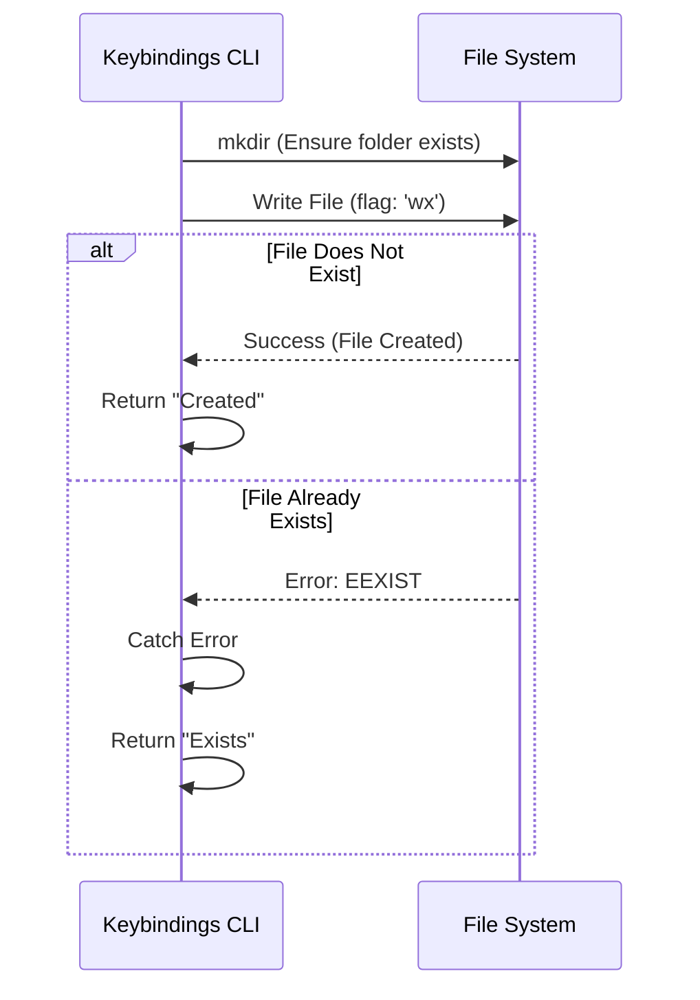

# Chapter 3: Safe Resource Initialization

In the previous chapter, [Feature Gating](02_feature_gating.md), we learned how to stop unauthorized users from running our command.

Now that the user is allowed in, we face a new challenge. We want to give them a configuration file so they can start customizing their settings. But what if they **already** have one?

If we blindly create a new file, we might overwrite their existing work. That would be a disaster!

In this chapter, we will learn about **Safe Resource Initialization**: a strategy to create files only when it is safe to do so.

## The Problem: The Blind Write

Imagine you are at a crowded movie theater. You have a ticket for a specific seat.

1.  **The Dangerous Way:** You walk in blindfolded and sit down. If the seat is empty, great. If someone is already sitting there, you end up sitting on their lap. This is awkward and annoying.
2.  **The Safe Way:** You look at the seat first. If it is occupied, you acknowledge it and stand back. If it is empty, you claim it.

In programming, writing a file is usually like the "Blindfolded" approach. By default, `writeFile` will delete whatever is currently at that path and replace it with your new data.

### The Use Case

We are building the logic for the `keybindings` command.
*   **Goal:** Create a default configuration file (`keybindings.json`).
*   **Constraint:** If the user already has this file, **do not touch it**. Just open it.
*   **Safety:** We must ensure we never accidentally delete user data.

---

## The Solution: The "Check-and-Set" Strategy

To solve this, we use a special "flag" when interacting with the file system. In Node.js, this is the `wx` flag.

*   `w`: Write mode.
*   `x`: Exclusive mode (Fail if the path already exists).

Think of `wx` as a reservation system. It attempts to book the seat. If the seat is taken, the system throws an error immediately instead of letting you sit down.

### Step 1: Preparing the Space

Before we can write a file, we must ensure the folder (directory) exists. If the folder is missing, the write operation will fail.

```typescript
import { mkdir } from 'fs/promises'
import { dirname } from 'path'

const filePath = '/user/config/keybindings.json'

// Make sure the folder '/user/config' exists
// { recursive: true } means create parent folders if needed
await mkdir(dirname(filePath), { recursive: true })
```

**Explanation:**
*   This is like building the house before trying to put furniture in the bedroom.

### Step 2: The Safe Write

Now we attempt to write the file using the safety flag.

```typescript
import { writeFile } from 'fs/promises'

// The content we want to write
const template = '{ "setting": "default" }'

try {
  // flag: 'wx' is the magic safety switch
  await writeFile(filePath, template, { flag: 'wx' })
  console.log('Success: Created a new file!')
} catch (error) {
  // If it fails, we catch the error here
}
```

**Explanation:**
*   We wrap the code in a `try...catch` block.
*   Because we used `flag: 'wx'`, the computer will throw an error if the file exists. This is exactly what we want!

### Step 3: Handling the "Error"

When `wx` fails, it's not really a crash—it's information. It tells us, "Hey, this file is already here." We need to check the error code.

```typescript
// ... inside the catch block ...
catch (e: any) {
  // EEXIST stands for "Error: EXISTs"
  if (e.code === 'EEXIST') {
    console.log('Notice: File already exists. Keeping old version.')
    // This is fine! We just proceed to open the existing file.
  } else {
    // If it's a different error (like permission denied), we crash
    throw e 
  }
}
```

**Explanation:**
*   We specifically look for `EEXIST`.
*   If we see that code, we treat it as a success: the file is there, safe and sound.

---

## Under the Hood: How Execution Works

Why do we use this specific flag instead of checking if the file exists using `fs.exists`?

It prevents a rare bug called a **Race Condition**.

Imagine you check if a seat is empty. It is. But in the split second before you sit down, someone else slides in. You still end up sitting on them.
Using the `wx` flag makes the "Check" and the "Sit" happen at the exact same instant (atomically).

Here is the flow of our safety logic:



### Deep Dive Implementation

Let's look at how this is implemented in our actual project file `keybindings.ts`.

We track a variable called `fileExists` to know which message to show the user later.

```typescript
// --- File: keybindings.ts ---
  const keybindingsPath = getKeybindingsPath()
  let fileExists = false // Default assumption

  // 1. Ensure directory
  await mkdir(dirname(keybindingsPath), { recursive: true })

  try {
    // 2. Try to write exclusively
    await writeFile(keybindingsPath, generateKeybindingsTemplate(), {
      encoding: 'utf-8',
      flag: 'wx', 
    })
  } catch (e: unknown) {
     // ... see next block ...
  }
```

If the write fails because the file exists, we simply flip our switch:

```typescript
// ... inside catch ...
    if (getErrnoCode(e) === 'EEXIST') {
      // 3. Acknowledge it exists, don't panic
      fileExists = true
    } else {
      // Real error? Panic.
      throw e
    }
```

Finally, we use that boolean to tell the user what happened:

```typescript
  // ... later in the function ...
  return {
    type: 'text',
    value: fileExists
      ? `Opened ${keybindingsPath}.` // We didn't touch it
      : `Created ${keybindingsPath}.` // We made a new one
  }
```

## Conclusion

In this chapter, we learned about **Safe Resource Initialization**.

1.  We learned that writing files blindly is dangerous.
2.  We used the `wx` flag to perform an "Exclusive Create."
3.  We handled the `EEXIST` error to gracefully respect existing user data.

Now we have a file! Either we just made it, or it was already there. The next step is to let the user actually see and edit this file. But we don't want to build a text editor inside our CLI.

How do we open the file in the user's favorite tool (like VS Code or Vim)?

[Next Chapter: External Editor Delegation](04_external_editor_delegation.md)

---

Generated by [Code IQ](https://github.com/adityasoni99/Code-IQ)