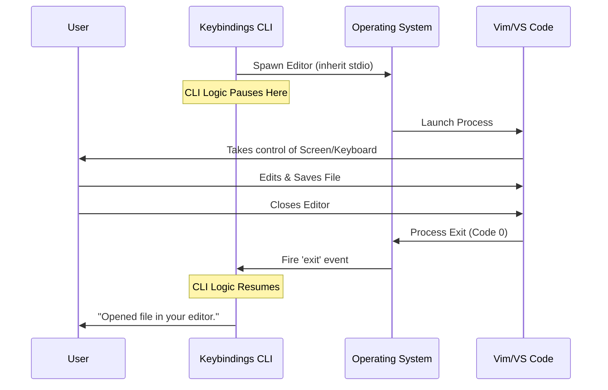

# Chapter 4: External Editor Delegation

In the previous chapter, [Safe Resource Initialization](03_safe_resource_initialization.md), we learned how to safely create the `keybindings.json` file without overwriting existing user data.

So, we have a file. Now, we want the user to edit it.

We could try to build a text editor inside our CLI, but that is incredibly hard. Instead, we are going to use a technique called **External Editor Delegation**.

## The General Contractor Analogy

Think of your CLI as a **General Contractor** building a house. The contractor knows how to manage the project, frame the walls, and pour the concrete.

However, when it comes time to do the complex electrical wiring, the Contractor doesn't try to do it themselves. They:
1.  **Call a Specialist:** They bring in a professional Electrician (the user's preferred editor, like VS Code or Vim).
2.  **Step Back:** The Contractor stops working and waits.
3.  **Resume:** Once the Electrician says, "I'm done," the Contractor picks up the clipboard and marks the job as finished.

This approach allows your CLI to focus on its job (managing tasks) while letting specialized tools handle text editing.

### The Use Case

*   **Goal:** When the user runs the `keybindings` command, we want to pause our program and open `keybindings.json` in Vim, Nano, or VS Code.
*   **Action:** The user edits the file and saves it.
*   **Result:** When they close the editor, our CLI wakes up and displays a success message.

---

## Concept 1: Finding the Specialist

First, our CLI needs to know which "Electrician" to call. Not everyone uses the same text editor.

In Unix-based systems (Linux/macOS), users set their preferred editor using an **Environment Variable** called `EDITOR` or `VISUAL`.

```typescript
// A simple way to decide which editor to use
function getEditor() {
  // Check the user's preference first
  return process.env.VISUAL || process.env.EDITOR || 'vi'; 
}
```

**Explanation:**
*   We check `VISUAL` first (usually for advanced visual editors).
*   Then we check `EDITOR` (standard text editors).
*   If neither is set, we fall back to `vi`, which exists on almost every computer.

---

## Concept 2: The Handoff (Inheriting Stdio)

This is the most critical part of this chapter.

Usually, a CLI runs in the background or output text to the screen. To let an editor like Vim take over the *entire* terminal screen and read keyboard inputs, we need to connect the editor's "cables" to the user's terminal.

We do this using `stdio: 'inherit'`.

```typescript
import { spawn } from 'child_process';

const editor = 'vim';
const file = 'keybindings.json';

// Start the external process
const child = spawn(editor, [file], { 
  stdio: 'inherit' 
});
```

**Explanation:**
*   `spawn`: This Node.js command starts a new process.
*   `stdio: 'inherit'`: This tells the new process: *"Don't create your own screen. Use the exact same keyboard and monitor that the main CLI is using."*
*   Without `inherit`, the editor would open in the background, invisible to the user.

---

## Concept 3: Waiting for Completion

Because the editor is a separate program, our CLI doesn't know when it's finished unless we listen for a specific event. We need to "pause" our code until the editor closes.

We wrap this logic in a Promise so we can use `await`.

```typescript
await new Promise((resolve, reject) => {
  // Listen for the editor to close
  child.on('exit', (code) => {
    if (code === 0) {
      resolve('Success'); // Editor closed normally
    } else {
      reject('Editor crashed'); // Something went wrong
    }
  });
});
```

**Explanation:**
*   `child.on('exit')`: This event fires when the user closes the editor (e.g., types `:wq` in Vim).
*   `code === 0`: In programming, an exit code of `0` means "Everything went fine."

---

## Under the Hood: The Sequence

Let's visualize exactly what happens when the `keybindings` command reaches the editing step.



### Deep Dive Implementation

In our project, we abstract this complex logic into a utility function called `editFileInEditor`. This keeps our main Kitchen file (`keybindings.ts`) clean and readable.

Here is how we use it in the main logic file:

```typescript
// --- File: keybindings.ts ---
import { editFileInEditor } from '../../utils/promptEditor.js'

// ... inside the call() function ...

// 1. Delegate the task to the external editor
const result = await editFileInEditor(keybindingsPath)

// 2. Check if the contractor (CLI) received an error report
if (result.error) {
  return { type: 'text', value: `Error: ${result.error}` }
}

// 3. Success!
return {
  type: 'text',
  value: `Opened ${keybindingsPath} in your editor.`,
}
```

**Explanation:**
*   Notice how simple `keybindings.ts` looks? It doesn't care *how* the editor opens, only that it *does*.
*   We `await` the result. This ensures the "Success" message doesn't print until the user actually closes the editor.

### The Utility Implementation

While you don't need to memorize this, here is a simplified look at what `editFileInEditor` (the utility helper) looks like internally:

```typescript
// --- File: utils/promptEditor.ts (Simplified) ---
import { spawn } from 'child_process'

export async function editFileInEditor(path: string) {
  const editor = process.env.VISUAL || process.env.EDITOR || 'vi'
  
  return new Promise((resolve) => {
    // Pass the microphone (stdio) to the editor
    const child = spawn(editor, [path], { stdio: 'inherit' })
    
    child.on('exit', (code) => {
      // Tell the main CLI we are done
      resolve({ success: code === 0 })
    })
  })
}
```

## Conclusion

In this chapter, we learned about **External Editor Delegation**.

1.  We learned that CLIs shouldn't try to be text editors.
2.  We used `spawn` with `stdio: 'inherit'` to hand off control of the screen and keyboard.
3.  We paused our CLI execution to wait for the user to finish their work.

At this point, we have a fully functional command! It checks permissions, creates files safely, and lets the user edit them.

However, as our CLI grows and we add 50 more commands, loading all these files at once will make the CLI start very slowly. How do we keep our tool fast even as it gets big?

[Next Chapter: Lazy Module Loading](05_lazy_module_loading.md)

---

Generated by [Code IQ](https://github.com/adityasoni99/Code-IQ)