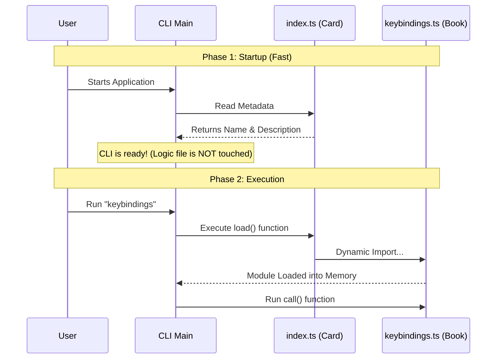

# Chapter 5: Lazy Module Loading

In the previous chapter, [External Editor Delegation](04_external_editor_delegation.md), we learned how to pause our CLI to let the user edit files in their favorite text editor.

We have built a robust command. However, imagine if our CLI tool grew from having just 1 command to having 100 commands. If we loaded the code for all 100 commands every time the user typed a single letter, our application would be incredibly slow to start.

In this final chapter, we will explore **Lazy Module Loading**. This is a performance pattern that keeps your application fast, no matter how big it grows.

## The Librarian Analogy

Imagine a library with thousands of books.

1.  **The Eager Librarian (Bad):** When you walk in, the librarian tries to carry **every single book** in their arms, just in case you ask for one. They move slowly, stumble, and are exhausted before you even speak.
2.  **The Lazy Librarian (Good):** The librarian sits at a desk with a small box of **Index Cards**.
    *   You ask: "Can I have the Keybindings book?"
    *   The librarian checks the card: "Yes, that is on Shelf B."
    *   Only *then* do they walk to the shelf, pick up that **one specific book**, and bring it to you.

In our code:
*   **The Index Card** is `index.ts` (Metadata).
*   **The Heavy Book** is `keybindings.ts` (The Logic).
*   **Lazy Loading** is the act of walking to the shelf only when asked.

### The Use Case

We want the CLI to start instantly.
*   **Goal:** The CLI should know *about* the `keybindings` command (its name and description) immediately.
*   **Constraint:** It should NOT read or load the code inside `keybindings.ts` into memory until the user actually types `my-cli keybindings`.

---

## Concept: Dynamic Imports

In JavaScript/TypeScript, there are two ways to import code.

### 1. Static Import (The "Carry Everything" approach)
This happens at the very top of a file. The computer loads this file immediately when the program starts.

```typescript
// ❌ Don't do this for heavy commands
import { call } from './keybindings.js' 
```

### 2. Dynamic Import (The "Fetch Later" approach)
This is a function that you call later. It tells the computer: *"Please go get this file now."*

```typescript
// ✅ Do this inside a function
const loadCommand = () => import('./keybindings.js')
```

---

## Implementation: The `load` Property

Let's look at our menu file, `index.ts`. This is the only place we need to change to enable Lazy Loading.

We use a specific property called `load`.

```typescript
// --- File: index.ts ---
const keybindings = {
  name: 'keybindings',
  description: 'Open configuration file',
  
  // The Lazy Load Magic:
  load: () => import('./keybindings.js'), 
  
} satisfies Command
```

**Explanation:**
*   `load`: This is a function definition.
*   `() => ...`: This represents an arrow function. It is **not** executed yet. It is just sitting there, waiting to be called.
*   `import(...)`: This command will trigger the actual reading of the file from the hard drive.

### Why is this faster?

When the CLI starts up:
1.  It reads `index.ts`.
2.  It sees the `load` function, but it **does not run it**.
3.  It skips over the heavy `keybindings.js` file entirely.
4.  The CLI is ready to accept input in milliseconds.

---

## Under the Hood: The Sequence

Let's visualize the difference between the startup phase and the execution phase.



### Deep Dive: How the Framework uses it

You might be wondering: *How does the main CLI know how to use this?*

While we don't write the framework code in this tutorial, here is a simplified example of what the CLI framework does behind the scenes when a user types a command.

```typescript
// --- Pseudo-code for the Main CLI Runner ---

async function runCommand(commandName: string) {
  // 1. Find the command definition (The Index Card)
  const commandDef = allCommands.find(c => c.name === commandName)

  // 2. NOW we call the load function (Walk to the shelf)
  console.log("Loading module...")
  const module = await commandDef.load()

  // 3. Run the logic (Read the book)
  await module.call() 
}
```

**Explanation:**
*   `await commandDef.load()`: This line pauses the program for a split second while Node.js finds the file and loads it into memory.
*   Once loaded, the `module` variable contains everything exported from `keybindings.ts`.

---

## Conclusion & Series Wrap-Up

Congratulations! You have completed the **Keybindings Command Tutorial**.

Throughout these five chapters, you have built a professional-grade CLI command using best practices:

1.  **[Command Module Structure](01_command_module_structure.md)**: You organized code by separating Metadata (`index.ts`) from Logic (`keybindings.ts`).
2.  **[Feature Gating](02_feature_gating.md)**: You learned to control access using `isEnabled` checks, hiding unfinished features from users.
3.  **[Safe Resource Initialization](03_safe_resource_initialization.md)**: You used the `wx` flag to safely create files without overwriting existing user data.
4.  **[External Editor Delegation](04_external_editor_delegation.md)**: You learned to use `spawn` to hand off control to tools like Vim or VS Code.
5.  **Lazy Module Loading**: You optimized performance by using Dynamic Imports to load code only when needed.

By combining these five patterns, you have created a tool that is safe, fast, and respectful of the user's environment. You are now ready to build complex CLI tools that can scale to hundreds of commands without slowing down.

Happy coding!

---

Generated by [Code IQ](https://github.com/adityasoni99/Code-IQ)