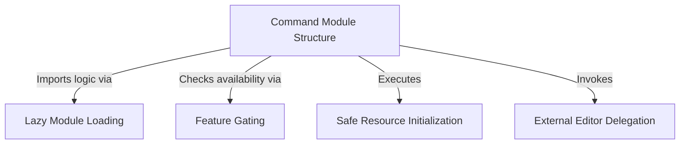

# Tutorial: keybindings

This project manages the setup of user **keybindings** by providing a specific CLI command. It ensures the feature is enabled via **feature gating** before safely creating a configuration file (preventing accidental data loss) and opening it in the user's preferred *external text editor*. The system is optimized to load the heavy execution logic **lazily**, only when the specific command is requested.

## Chapters

1. [Command Module Structure](01_command_module_structure.md)
2. [Feature Gating](02_feature_gating.md)
3. [Safe Resource Initialization](03_safe_resource_initialization.md)
4. [External Editor Delegation](04_external_editor_delegation.md)
5. [Lazy Module Loading](05_lazy_module_loading.md)

---

Generated by [Code IQ](https://github.com/adityasoni99/Code-IQ)