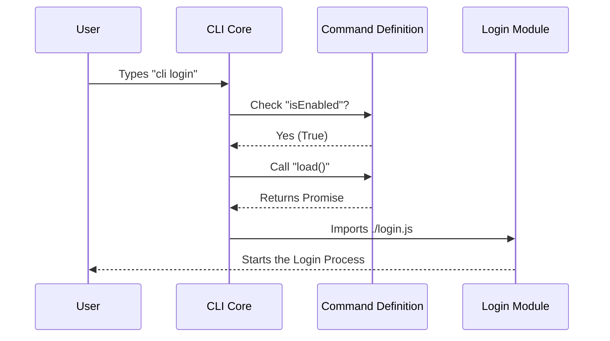

# Chapter 1: Command Definition

Welcome to the first chapter of the **Login** project tutorial! In this series, we will build a robust login feature for a Command Line Interface (CLI).

Before we write any complex logic or draw pixels on the screen, we need to tell our CLI tool that this feature exists. This brings us to the **Command Definition**.

## The Motivation: The "Restaurant Menu" Problem

Imagine a CLI tool with 50 different features (login, logout, deploy, build, test, etc.). If the CLI tries to load the code for *all* 50 features every time you type a command, it will be very slow to start.

We need a way to list the features without doing the heavy lifting immediately.

**The Solution:** Think of the Command Definition as a **Restaurant Menu**.
*   The menu lists "Steak," "Pasta," and "Salad" (Descriptions).
*   It doesn't cook the steak until you actually order it (Lazy Loading).
*   If it's breakfast time, the menu might hide the "Steak" option entirely (Active State).

In our project, the `index.ts` file acts as this menu item for the `login` command.

## Key Concepts

To solve our use case—creating a lightweight entry point for our login feature—we use a specific object structure. Here are the parts:

1.  **Metadata:** The name and description users see when they run `--help`.
2.  **The Guard (`isEnabled`):** A rule that decides if this command should be available right now.
3.  **The Lazy Loader (`load`):** A function that imports the heavy code only when the user selects this command.

## How to Define the Command

Let's look at how we construct this in code. We are working in `index.ts`.

### Step 1: Basic Metadata

First, we export a function that returns an object. We give it a `name` (what the user types) and a `type`.

```typescript
import type { Command } from '../../commands.js'

export default () =>
  ({
    type: 'local-jsx', // Tells the CLI this uses a UI
    name: 'login',     // The user types: $ cli login
    // ... logic continues below
  }) satisfies Command
```

*   **`type`**: `local-jsx` means we will eventually render a UI (we cover this in [React-based Terminal UI](02_react_based_terminal_ui.md)).
*   **`name`**: This is the keyword that triggers the command.

### Step 2: Dynamic Description

Descriptions can change based on context. If you are already logged in, the text should reflect that.

```typescript
import { hasAnthropicApiKeyAuth } from '../../utils/auth.js'

// Inside the object...
description: hasAnthropicApiKeyAuth()
  ? 'Switch Anthropic accounts'
  : 'Sign in with your Anthropic account',
```

*   **Logic**: If the user has an API key, we offer to "Switch accounts". If not, we offer to "Sign in".

### Step 3: The Guard (`isEnabled`)

Sometimes, we want to disable a command entirely based on environment variables (like a "Kill Switch").

```typescript
import { isEnvTruthy } from '../../utils/envUtils.js'

// Inside the object...
isEnabled: () => !isEnvTruthy(process.env.DISABLE_LOGIN_COMMAND),
```

*   **`isEnabled`**: This function returns `true` or `false`.
*   **Result**: If `DISABLE_LOGIN_COMMAND` is set to true in your system, this command vanishes from the menu.

### Step 4: Lazy Loading (`load`)

This is the most important part for performance. We use a dynamic `import`.

```typescript
// Inside the object...
load: () => import('./login.js'),
```

*   **What happens here?** The file `./login.js` contains the actual heavy logic (the "steak"). It is **not** read or executed until the CLI specifically asks for it.

## Internal Implementation: Under the Hood

How does the CLI Core interact with this definition? Let's visualize the flow.

### Sequence Diagram

When you type `cli login` in your terminal, the following conversation happens inside the program:



### Understanding the Flow

1.  **Discovery**: When the CLI starts, it quickly scans the `index.ts` file. Because this file is tiny and has no heavy imports, this is instant.
2.  **Validation**: It runs the `isEnabled` function. If it returns `false`, the CLI prints "Command not found."
3.  **Execution**: Only if the user chose `login`, the `load()` function is triggered.
4.  **Handoff**: The heavy `./login.js` file is loaded into memory, and the CLI hands control over to it.

This `login.js` file usually contains the User Interface, which we will discuss in depth in the next chapter: [React-based Terminal UI](02_react_based_terminal_ui.md).

## Conclusion

In this chapter, we learned how to create a **Command Definition**. We solved the problem of slow startup times by creating a lightweight "menu item" that describes our feature without loading it immediately.

We defined:
*   The **Name** and **Description** for the help menu.
*   The **`isEnabled`** logic to control availability.
*   The **`load`** function to import the heavy code on demand.

Now that we have successfully registered our command, we need to build the actual interface that the user sees when the command loads.

[Next Chapter: React-based Terminal UI](02_react_based_terminal_ui.md)

---

Generated by [Code IQ](https://github.com/adityasoni99/Code-IQ)