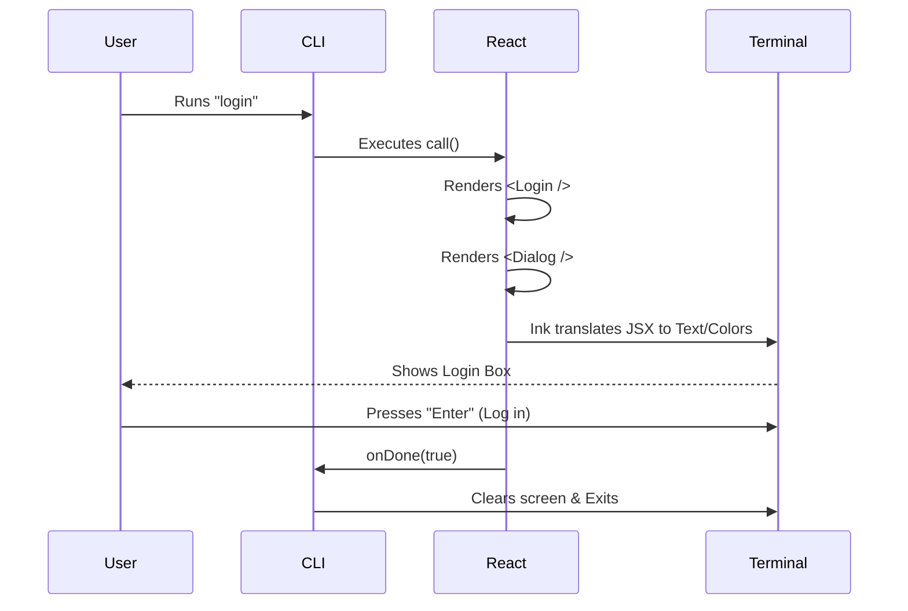

# Chapter 2: React-based Terminal UI

Welcome to the second chapter of the **Login** project tutorial!

In the previous chapter, [Command Definition](01_command_definition.md), we created the "menu item" for our login feature. We told the CLI *that* the login command exists.

Now, we need to decide *what happens* when the user actually clicks that menu item. We are going to build the visual interface.

## The Motivation: Beyond Simple Text

In traditional terminal scripts, user interaction is very linear and often boring:

1.  Script asks: "Username?"
2.  You type: "Alice" <Enter>
3.  Script asks: "Password?"
4.  You type: "****" <Enter>

**The Problem:** Modern login flows (like OAuth) are complex. We need to show a device code, poll a server status, show a spinner, and listen for the "Escape" key—all at the same time.

**The Solution:** We use **React**. Yes, the same React used for websites! By using a library called **Ink**, we can render React components (like `<Text>` and `<Box>`) directly into the terminal. This allows us to build "Modals" and "Dialogs" inside your command line window.

## Key Concepts

To build our Login UI, we compose three main layers. Think of this like framing a painting:

1.  **The Entry Point (`call`):** The bridge between the raw CLI and React.
2.  **The Container (`Dialog`):** The pretty border, title, and "Exit" instructions.
3.  **The Content (`ConsoleOAuthFlow`):** The actual logic (showing codes, waiting for authentication).

## Step-by-Step Implementation

We are working in the `login.tsx` file.

### Step 1: The Entry Point (`call`)

When the CLI runs `load()`, it looks for a function named `call`. This function is responsible for starting the React process.

```typescript
import * as React from 'react';
import { Login } from './loginComponents'; // We will define this next

// This function is called by the CLI Core
export async function call(onDone, context): Promise<React.ReactNode> {
  // We return a React Component!
  return <Login onDone={onDone} context={context} />;
}
```

*   **`call`**: An async function that the CLI awaits.
*   **`onDone`**: A callback function. When our React app finishes (success or failure), we call this to tell the CLI to close.
*   **Return Value**: We return JSX, just like a web app.

### Step 2: The Login Component

Now we define the `<Login />` component. This acts as the "Page" controller. It handles the layout and what happens when the logic finishes.

```tsx
import { Dialog } from '../../components/design-system/Dialog.js';
import { ConsoleOAuthFlow } from '../../components/ConsoleOAuthFlow.js';

export function Login({ onDone }) {
  // We use a Dialog component to give our UI a nice border and title
  return (
    <Dialog title="Login" color="permission" onCancel={() => onDone(false)}>
      {/* The actual logic lives inside here */}
      <ConsoleOAuthFlow onDone={(success) => onDone(success)} />
    </Dialog>
  );
}
```

*   **`<Dialog>`**: A pre-built component that draws a box around our content. It handles the title ("Login") and the border color.
*   **`onCancel`**: If the user presses `Esc`, the Dialog calls this function. We pass `false` to `onDone` to signify failure/cancellation.

### Step 3: Handling Completion

Real-world applications need to clean up data after a login. In our `call` function, we wrap the `onDone` logic to handle things like resetting caches.

```typescript
// Inside export async function call...
return <Login onDone={async (success) => {
  if (success) {
    // 1. Reset user caches
    resetUserCache();
    // 2. Refresh permissions
    await refreshPolicyLimits();
  }
  // 3. Tell the CLI we are finished
  onDone(success ? 'Login successful' : 'Login interrupted');
}} />;
```

*   **Why here?** We want the UI to close *after* we've successfully updated the system state.
*   **`success`**: A boolean passed up from the `<ConsoleOAuthFlow>` component.

## Internal Implementation: Under the Hood

How does a text-based terminal understand React components?

### Sequence Diagram



### The Rendering Cycle

1.  **Mounting:** When `call()` returns the `<Login />` component, Ink creates a virtual DOM.
2.  **Painting:** Ink calculates layout (using Flexbox!) and translates it into ANSI escape codes (colored text strings).
3.  **Updates:** If `<ConsoleOAuthFlow>` updates its state (e.g., changing from "Loading..." to "Success"), React re-renders, and Ink repaints only the changed parts of the terminal screen.

### Deep Dive: The Dialog Wrapper

The `Dialog` component is crucial for making the tool feel like a cohesive application.

```tsx
// Simplified concept of Dialog usage
<Dialog
  title="Login"
  color="permission" // Sets the border color to purple/blue
  inputGuide={state =>
    state.pending ? <Text>Press Esc to exit</Text> : <Text>Esc to cancel</Text>
  }
>
   {children}
</Dialog>
```

By wrapping our content in `<Dialog>`, we don't have to worry about drawing borders or listening for the `Esc` key in every single feature. It abstracts that "Window Management" logic away from us.

## Conclusion

In this chapter, we learned how to build a **React-based Terminal UI**.

*   We moved away from linear text prompts.
*   We used **Ink** to render React components in the terminal.
*   We composed a `<Login>` screen using a generic `<Dialog>` container and a specific `<ConsoleOAuthFlow>` logic component.

However, simply rendering the UI isn't enough. When the user successfully logs in, we need to set up their environment, clear old caches, and prepare the CLI for use. We touched on this in Step 3, but there is more detail to cover.

[Next Chapter: Session Initialization & Cleanup](03_session_initialization___cleanup.md)

---

Generated by [Code IQ](https://github.com/adityasoni99/Code-IQ)