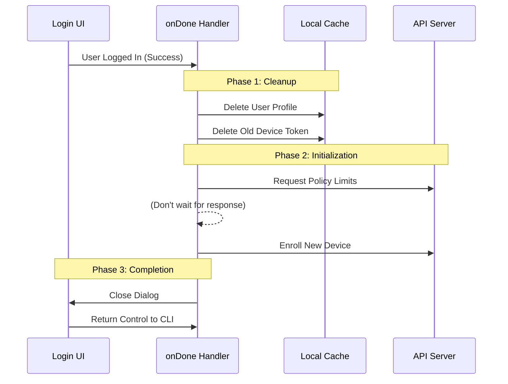

# Chapter 3: Session Initialization & Cleanup

Welcome to the third chapter of the **Login** project tutorial!

In the previous chapter, [React-based Terminal UI](02_react_based_terminal_ui.md), we built the visual interface. We created a nice dialog box that accepts credentials and tells us if the login was successful.

But getting a "Success" message is just the beginning. Now we face the **"Hotel Room" Problem**.

## The Motivation: The "Hotel Room" Problem

Imagine a hotel room. When Guest A checks out and Guest B checks in, the hotel staff doesn't just hand Guest B the key. They have to:
1.  Remove Guest A's towels and trash (**Cleanup**).
2.  Stock fresh soap and coffee for Guest B (**Initialization**).
3.  Register Guest B with the front desk for room service (**Security/Permissions**).

If the hotel skipped step 1, Guest B would find someone else's trash. If they skipped step 3, Guest B couldn't order food.

**The Solution:**
In our CLI, when a user logs in, we must perform a choreographed routine of **Side Effects**. We need to wipe stale data (caches, old tokens) and fetch new data (permissions, settings) *before* the user starts typing commands.

## Key Concepts

We manage this process using a "Cleanup & Setup" pattern inside the callback function we discovered in the last chapter.

### 1. The Handoff (`onDone`)
The React UI is just for display. When it finishes, it calls a function saying, "I'm done, here is the result." This is where our cleanup logic lives.

### 2. Stale Data Destruction
Before we trust the new user, we must ensure no data from the previous user remains. This includes cached profiles, cost tracking, and "trusted device" tokens.

### 3. Asynchronous Initialization
Once the room is clean, we start fetching data. Because network requests take time, we trigger them immediately so they are ready by the time the user types their next command.

## Step-by-Step Implementation

We are looking at the `login.tsx` file again. Specifically, we are looking inside the `call` function, at the logic inside `onDone`.

### Step 1: Handling the API Key

First, we need to tell the CLI context that the key has changed. This is like re-keying the door lock.

```typescript
// Inside the call() function in login.tsx
return <Login onDone={async (success) => {
  // 1. Swap the API Key in memory
  context.onChangeAPIKey();
  
  // 2. Clear old text formatting that might be signed by the old key
  context.setMessages(stripSignatureBlocks);
  
  // ... continued below
}} />;
```

*   **`onChangeAPIKey`**: Updates the internal state to use the new credentials.
*   **`stripSignatureBlocks`**: Removes sensitive text blocks (like "Thinking..." indicators) that were verified by the *old* key.

### Step 2: The Cleanup Phase

If the login was successful (`if (success)`), we immediately wipe old data.

```typescript
if (success) {
  // Reset session cost tracking ($0.00 for the new session)
  resetCostState();

  // Clear the user profile cache (Name, Email, Avatar)
  resetUserCache();
  
  // Remove the old "Trusted Device" token so we don't accidentally send it
  clearTrustedDeviceToken();
}
```

*   **`resetUserCache`**: Deletes the local JSON file containing the previous user's info.
*   **`clearTrustedDeviceToken`**: This is crucial. If we send a token belonging to "User A" while trying to authenticate "User B", the server will reject us.

### Step 3: The Initialization Phase

Now that the environment is clean, we start fresh processes.

```typescript
// Inside the if (success) block...

// Fetch new settings from the server (e.g. "Is this user allowed to use Beta features?")
void refreshRemoteManagedSettings();

// Check usage limits (e.g. "Does this user have credits left?")
void refreshPolicyLimits();

// Register this computer as a "Trusted Device" for this new account
void enrollTrustedDevice();
```

*   **`void` keyword**: Notice we put `void` before these functions? We trigger these background tasks *without awaiting them*. We want the CLI to feel snappy, so we let these run in the background while the UI closes.

## Internal Implementation: Under the Hood

What actually happens during this choreography? Let's look at the sequence of events.

### Sequence Diagram



### Deep Dive: Trusted Device Enrollment

One of the most complex parts of this cleanup is the **Trusted Device** logic.

1.  **The Risk:** If I switch from my Personal Account to my Work Account, my computer might still hold a "Pass" meant for my Personal Account.
2.  **The Fix:**
    *   First, `clearTrustedDeviceToken()` deletes the file on the disk.
    *   Then, `enrollTrustedDevice()` asks the server: "Hello, I am a new session for the Work Account. Please trust this computer."

If we didn't clear the token first, the `enroll` request might attach the *old* Personal token to the header. The server would see a mismatch ("Why is Personal Token asking about Work Account?") and reject the request.

### Deep Dive: Analytics and Flags

We also need to update our feature flags (like A/B tests or permission toggles).

```typescript
// Refresh feature flags (GrowthBook) to get updated permissions
refreshGrowthBookAfterAuthChange();
```

This ensures that if the new user has access to a feature like "Claude 3.5 Sonnet", the CLI knows about it immediately.

## Conclusion

In this chapter, we learned about **Session Initialization & Cleanup**.

We discovered that logging in is more than just checking a password. It requires a strict protocol:
1.  **Stop** using old keys.
2.  **Delete** old cache and tokens.
3.  **Start** background tasks to fetch new permissions and enroll devices.

This ensures that every time you switch accounts, you get a fresh, secure, and bug-free experience.

Now that our session is clean and initialized, how does the rest of the application know that the login status changed? We need to broadcast this update to the rest of the app.

[Next Chapter: Context-Driven State Updates](04_context_driven_state_updates.md)

---

Generated by [Code IQ](https://github.com/adityasoni99/Code-IQ)