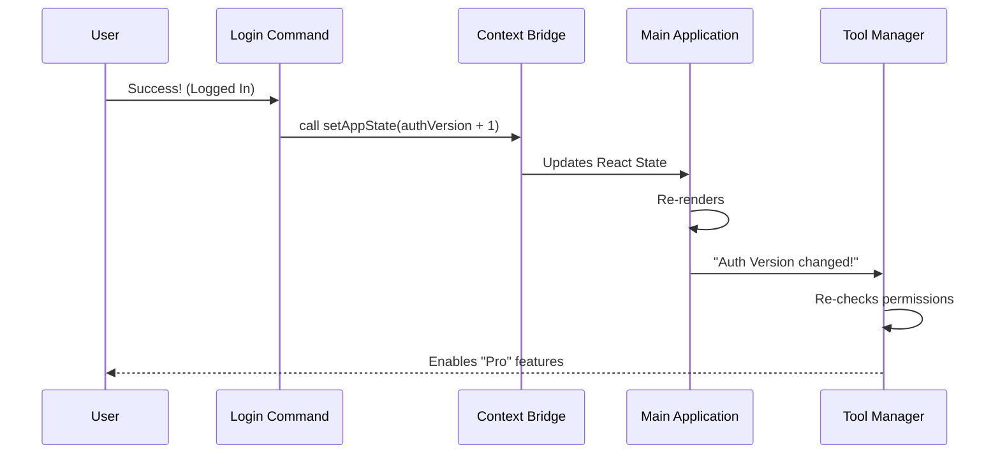

# Chapter 4: Context-Driven State Updates

Welcome to the final chapter of the **Login** project tutorial!

In the previous chapter, [Session Initialization & Cleanup](03_session_initialization___cleanup.md), we handled the housekeeping tasks: cleaning up old caches and enrolling trusted devices.

However, we have one final problem. Even though we updated the cache files on the hard drive, the **currently running application** doesn't know about it yet. The main loop is still holding onto the old configuration in its memory.

We need a way to shout, "Hey everyone, the user has changed!" to the rest of the application. This is where **Context-Driven State Updates** come in.

## The Motivation: The "Live News" Problem

Imagine you are watching a news channel (the CLI Application). You are the producer (the Login Command), and you just received breaking news that the President has changed (User Logged In).

Writing the news on a piece of paper (updating the cache file) isn't enough. You need to **broadcast** it so the ticker at the bottom of the screen updates immediately.

**The Solution:** The `context` object.
When the CLI Core loads our login command, it hands us a `context` object. This object is our direct line to the "Broadcast Control Room." By calling methods on this object, we can instantly update the live application state.

## Key Concepts

To understand how we update the app, we need to understand the three buttons on our control panel (the `context` object):

1.  **`onChangeAPIKey`:** This tells the core networking layer to drop the old API key and reload the new one from disk immediately.
2.  **`setMessages`:** This allows us to modify the chat history displayed on the screen (e.g., removing secret text meant for the previous user).
3.  **`setAppState`:** This is the big switch. It triggers a "Re-render" of the entire application, forcing all tools and services to check their permissions again.

## Step-by-Step Implementation

We are still working inside the `call` function in `login.tsx`. This function receives `context` as its second argument.

```typescript
// login.tsx
export async function call(
  onDone: LocalJSXCommandOnDone, 
  context: LocalJSXCommandContext // <--- The Broadcast Controller
): Promise<React.ReactNode> {
  // ...
}
```

Let's look at how we use this inside our `onDone` callback.

### Step 1: Swapping the Credentials

When the user logs in, the API Key on the disk changes. We must tell the app to swap the key in memory.

```typescript
// Inside onDone...

// 1. Tell the CLI Core to reload the API Key immediately
context.onChangeAPIKey();
```

*   **Result:** The very next network request made by the application will use the new user's credentials.

### Step 2: Sanitizing the Chat History

Sometimes, the chat history contains "Thinking" blocks or signatures verified by the *old* user's key. We need to strip these out so the new session doesn't get confused by invalid signatures.

```typescript
import { stripSignatureBlocks } from '../../utils/messages.js';

// Inside onDone...

// 2. Remove verified blocks from the old user
context.setMessages(stripSignatureBlocks);
```

*   **`setMessages`**: This accepts a function that transforms the message history array.
*   **Result:** The visual chat history is cleaned up, removing sensitive data blocks from the previous session.

### Step 3: Triggering the Global Refresh

Finally, we need to force the rest of the application (like the Tool Manager or the Model Selector) to realize a change happened. We do this by incrementing a version number in the global state.

```typescript
// Inside onDone...

// 3. Update the global state to trigger a re-render
context.setAppState(prev => ({
  ...prev,
  authVersion: prev.authVersion + 1
}));
```

*   **`authVersion`**: This is a simple number. Other parts of the app "watch" this number. When it changes, they re-fetch their data (like available AI models or MCP servers).
*   **Result:** The UI updates instantly to show features available to the new user.

## Internal Implementation: Under the Hood

How does calling a function in `login.tsx` affect the rest of the application? This relies on React's "State Lifting."

### Sequence Diagram

Imagine the flow of data like this:



### The Mechanism

1.  **The Parent:** The `MainLoop` (the core app) holds the state.
2.  **The Bridge:** It creates the `context` object containing functions like `setAppState` that modify *its own* state.
3.  **The Child:** It passes this `context` down to `login.tsx`.
4.  **The Action:** When `login.tsx` calls `setAppState`, it is actually modifying variables inside `MainLoop`.
5.  **The Reaction:** React notices the state change in `MainLoop` and automatically refreshes all components that depend on that state.

## Deep Dive: Permissions & Safety

We also use the context to handle safety checks immediately. For example, if the previous user had "Auto Mode" (autonomous AI) enabled, but the new user doesn't have permission for it, we must disable it instantly.

```typescript
// Inside onDone (simplified)...

const appState = context.getAppState();

// Check if we need to turn off "Bypass Permissions" for the new user
checkAndDisableBypassPermissionsIfNeeded(
  appState.toolPermissionContext, 
  context.setAppState
);
```

*   **`getAppState()`**: Allows us to peek at the current settings before we change them.
*   **Safety First:** This ensures we don't accidentally give "Admin Powers" to a "Guest User" just because the previous user left them turned on.

## Conclusion

In this final chapter, we learned about **Context-Driven State Updates**.

We discovered that:
*   The `login` command isn't just a UI; it's a state controller.
*   The **`context`** object bridges the gap between our command and the global application.
*   We use **`setAppState`** and **`authVersion`** to notify the entire system that a new user has arrived.

### Project Summary

Congratulations! You have explored the full architecture of the `login` feature:
1.  **[Command Definition](01_command_definition.md)**: Putting the item on the menu.
2.  **[React-based Terminal UI](02_react_based_terminal_ui.md)**: Building the visual interface.
3.  **[Session Initialization & Cleanup](03_session_initialization___cleanup.md)**: Managing the data on the disk.
4.  **Context-Driven State Updates**: Managing the live application state.

You now understand how a modern CLI tool handles complex authentication flows while keeping the user experience snappy and the state consistent.

---

Generated by [Code IQ](https://github.com/adityasoni99/Code-IQ)