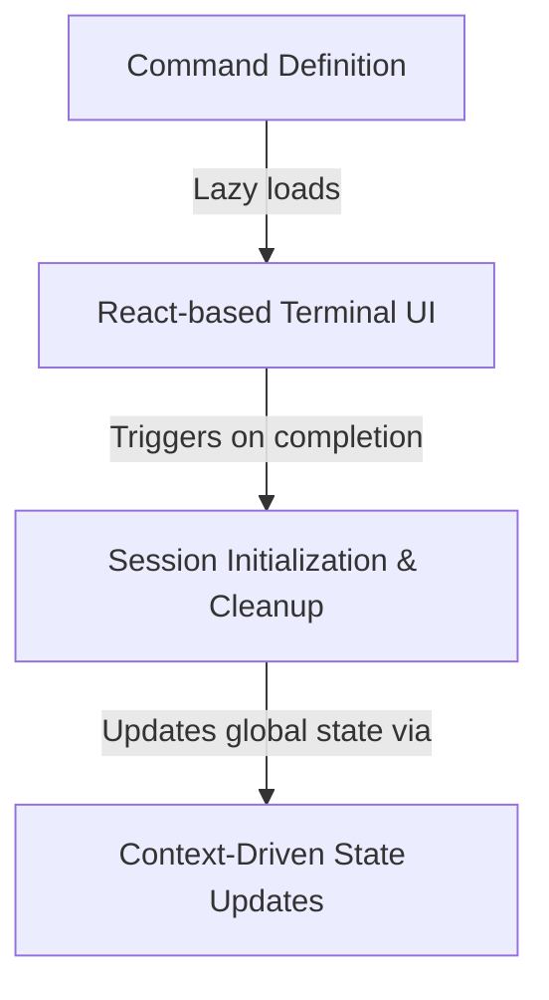

# Tutorial: login

This project implements a **login command** for a CLI tool, utilizing a *React-based* terminal interface to handle user authentication. It manages the full lifecycle of a sign-in event, from lazy-loading the UI to performing **session cleanup** (like clearing caches and enrolling devices) and propagating the new authentication state globally via a *shared context*.

## Chapters

1. [Command Definition](01_command_definition.md)
2. [React-based Terminal UI](02_react_based_terminal_ui.md)
3. [Session Initialization & Cleanup](03_session_initialization___cleanup.md)
4. [Context-Driven State Updates](04_context_driven_state_updates.md)

---

Generated by [Code IQ](https://github.com/adityasoni99/Code-IQ)