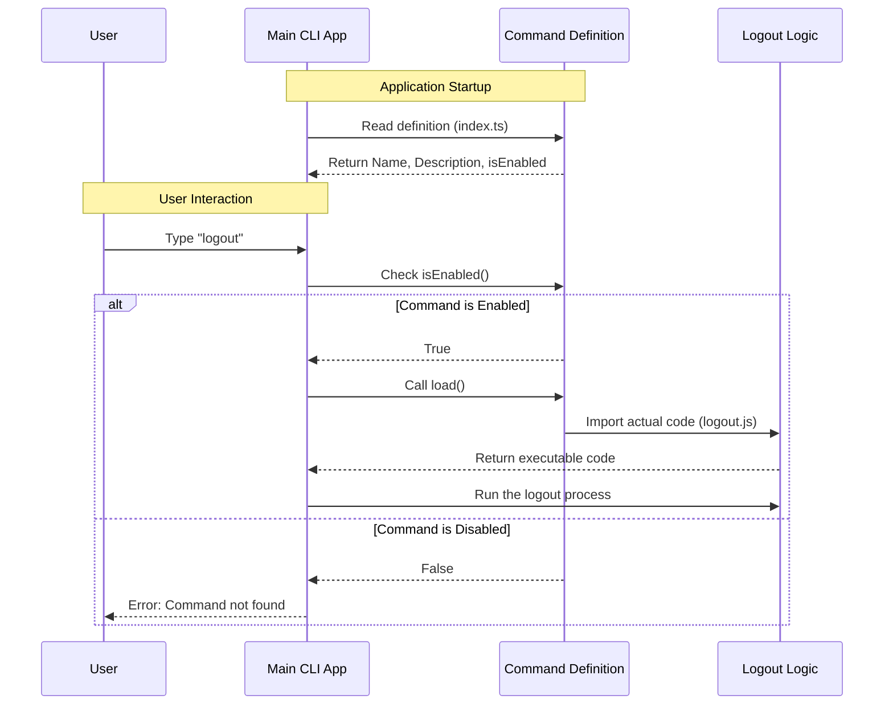

# Chapter 1: Command Definition

Welcome to the first chapter of the `logout` feature tutorial! Before we write any complex logic for signing a user out, we first need to tell our application that this command simply *exists*.

## Why do we need a Command Definition?

Imagine you are building a restaurant menu. Before a chef cooks a meal, the item must be listed on the paper menu so customers know it's available.

The **Command Definition** is exactly like that menu entry. It serves two main purposes:

1.  **Registration:** It tells the main Command Line Interface (CLI) application: *"Hi, I am a command named 'logout', and here is what I do."*
2.  **Performance:** It uses a technique called **Lazy Loading**. Instead of loading all the code for logging out immediately when the app starts (which is like the chef cooking every meal before customers arrive), we only load the code *after* the user actually selects the command.

### The Use Case

Our goal for this chapter is simple: We want the user to be able to type `logout` in their terminal and see a description, but we want to ensure this command is hidden if a specific system setting disables it.

## Setting up the Menu Entry

Let's look at how we define this command in `index.ts`. We will break the code down into small, digestible pieces.

### Step 1: Basic Identity
First, we define the basics: the name the user types and a helpful description.

```typescript
// File: index.ts
export default {
  type: 'local-jsx',
  name: 'logout',
  description: 'Sign out from your Anthropic account',
  // ... more code coming up
```

**Explanation:**
*   `name`: This is the keyword the user types (e.g., `$ my-app logout`).
*   `description`: This text appears in the help menu (e.g., when the user types `--help`).

### Step 2: The Bouncer (Conditional Visibility)
Sometimes, you might want to hide a command. For example, maybe an administrator wants to prevent users from logging out on a shared machine.

```typescript
// ... inside the export object
  isEnabled: () => !isEnvTruthy(process.env.DISABLE_LOGOUT_COMMAND),
```

**Explanation:**
*   `isEnabled`: This is a function that returns `true` or `false`.
*   If `process.env.DISABLE_LOGOUT_COMMAND` is set to "true", this function returns `false`, and the "logout" command effectively disappears from the menu.

### Step 3: Lazy Loading (The "Magic" Link)
This is the most important part. We link the definition to the actual code that performs the logout.

```typescript
// ... inside the export object
  load: () => import('./logout.js'),
} satisfies Command
```

**Explanation:**
*   `load`: This function uses a dynamic `import()`.
*   **Crucial Concept:** The file `./logout.js` is **NOT** read when the application starts. It is only read and executed when the user actually runs the `logout` command. This makes the application start up much faster.
*   `satisfies Command`: This ensures our object follows the strict rules of a Command structure (TypeScript magic to prevent typos).

## How It Works Under the Hood

To understand how the Command Definition fits into the bigger picture, let's visualize the flow.

### Sequence Diagram

The following diagram shows what happens when the CLI application starts up and when a user interacts with it.



### Internal Implementation Details

The `index.ts` file acts as a lightweight proxy. It doesn't know *how* to log the user out; it only knows *where* to find the instruction manual (the `logout.js` file).

1.  **Low Overhead:** Because `index.ts` is so small, the Main CLI App can scan hundreds of commands instantly without slowing down.
2.  **Safety:** By checking `isEnabled` before `load`, we prevent unauthorized code from even being fetched into memory.

When the `load()` function is finally called, it triggers the [Logout Workflow Orchestrator](02_logout_workflow_orchestrator.md), which is the subject of our next chapter.

## Putting It All Together

Here is the complete file context again. You can now see how the identity, the visibility check, and the lazy loading come together to form the interface.

```typescript
// File: index.ts
import type { Command } from '../../commands.js'
import { isEnvTruthy } from '../../utils/envUtils.js'

export default {
  type: 'local-jsx',
  name: 'logout',
  description: 'Sign out from your Anthropic account',
  isEnabled: () => !isEnvTruthy(process.env.DISABLE_LOGOUT_COMMAND),
  load: () => import('./logout.js'),
} satisfies Command
```

## Summary

In this chapter, we learned how to create a **Command Definition**. We covered:
*   Giving the command a **name** and **description**.
*   Using **`isEnabled`** to conditionally hide the command based on environment variables.
*   Using **`load`** to optimize performance by fetching the heavy logic only when needed.

Now that we have defined *what* the command is, it's time to define *what it actually does*.

[Next Chapter: Logout Workflow Orchestrator](02_logout_workflow_orchestrator.md)

---

Generated by [Code IQ](https://github.com/adityasoni99/Code-IQ)