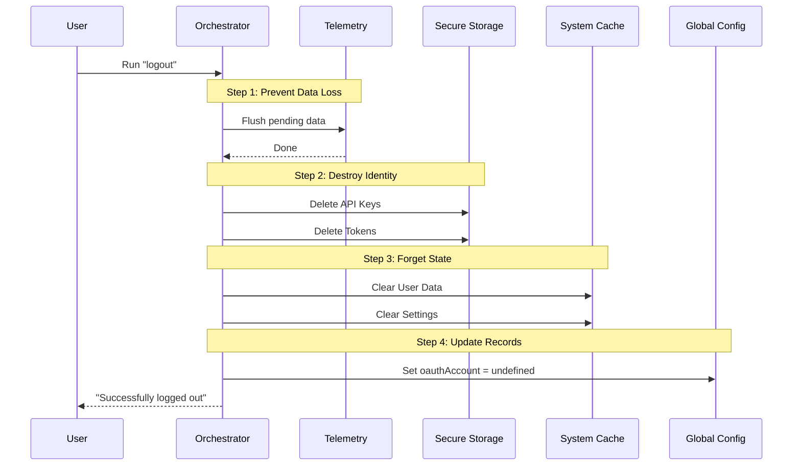

# Chapter 2: Logout Workflow Orchestrator

In the previous [Command Definition](01_command_definition.md) chapter, we learned how to register the `logout` command so the CLI knows it exists. But right now, that command is just an empty shell.

Now, we need to fill that shell with logic. We need a "Conductor" to organize the cleanup process.

## The Problem: Cleaning Up is Complicated

Imagine checking out of a hotel room. You don't just run out the door. You follow a specific routine:
1.  Check the drawers for personal items.
2.  Turn off the lights.
3.  Return the key card to the front desk.
4.  Walk out.

If you return the key card *before* checking the drawers, you might lock yourself out while your personal items are still inside!

**The Logout Workflow Orchestrator** solves this exact problem for our application. It ensures we perform cleanup tasks in a **strict, specific order** to avoid errors or security leaks.

## The Solution: `performLogout`

The heart of this chapter is a single function called `performLogout`. It doesn't do all the heavy lifting itself; instead, it tells other systems what to do and when to do it.

Let's build this function step-by-step.

### Step 1: The "Last Words" (Telemetry)

Before we delete the user's credentials, we must send any pending usage data (telemetry) to our servers. If we delete the credentials first, the server might reject our data because we are no longer "authenticated."

```typescript
// File: logout.tsx
export async function performLogout({ clearOnboarding = false }): Promise<void> {
  // 1. Lazy load telemetry to save startup time
  const { flushTelemetry } = await import('../../utils/telemetry/instrumentation.js');
  
  // 2. Send data BEFORE clearing credentials
  await flushTelemetry();
```

**Explanation:**
*   **Lazy Loading:** We use `await import(...)` so we don't load the heavy telemetry code until the very moment we need to log out.
*   **Flush:** This forces any data sitting in memory to be sent to the server immediately.

### Step 2: Shredding the Keys (Credentials)

Once the data is sent, it is safe to destroy the user's identity keys.

```typescript
  // ... inside performLogout
  
  // 3. Remove the API Key from memory
  await removeApiKey();

  // 4. Wipe the hard drive's secure storage
  const secureStorage = getSecureStorage();
  secureStorage.delete();
```

**Explanation:**
*   `removeApiKey`: clears the key from the current running process.
*   `secureStorage.delete()`: deletes the encrypted file on the user's computer.
*   We will dive deeper into this in [Secure Credential Management](03_secure_credential_management.md).

### Step 3: Clearing the Memory (Caches)

Even if the keys are gone, the application might still "remember" the user's name or settings in a temporary cache. We need to wipe that slate clean.

```typescript
  // ... inside performLogout

  // 5. Clear all caches (User data, Project settings, etc.)
  await clearAuthRelatedCaches();
```

**Explanation:**
*   `clearAuthRelatedCaches`: This is a helper function that runs through every part of the app (like specific project settings or user profile data) and empties them.
*   We will explore how this works in [Cache Invalidation Strategy](05_cache_invalidation_strategy.md).

### Step 4: Resetting Global Settings

Finally, we update the main configuration file to reflect that no one is logged in anymore.

```typescript
  // ... inside performLogout

  // 6. Update the global config file
  saveGlobalConfig(current => {
    const updated = { ...current };
    
    // Remove the OAuth account link
    updated.oauthAccount = undefined;
    
    return updated;
  });
} // End of performLogout
```

**Explanation:**
*   `saveGlobalConfig`: Opens the main config file, modifies it, and saves it back.
*   We explicitly set `oauthAccount` to `undefined`.
*   This is covered in [Global Configuration State](04_global_configuration_state.md).

## Internal Implementation: The Orchestration Flow

To help you visualize how the **Orchestrator** manages these distinct systems, look at this sequence diagram. Notice how strict the order is.



### The User Interface Wrapper

While `performLogout` does the logical work, we need a small wrapper to show a message to the user and exit the program gracefully. This is the `call` function.

```typescript
// File: logout.tsx
export async function call(): Promise<React.ReactNode> {
  // Run the orchestrator we just built
  await performLogout({ clearOnboarding: true });

  // Display success message
  const message = <Text>Successfully logged out.</Text>;

  // Wait a tiny bit, then kill the process
  setTimeout(() => {
    gracefulShutdownSync(0, 'logout');
  }, 200);

  return message;
}
```

**Explanation:**
*   This function connects the visual output (React Component) with the logic (`performLogout`).
*   `gracefulShutdownSync`: Ensures the CLI creates a new line in the terminal and exits cleanly.

## Summary

In this chapter, we built the **Logout Workflow Orchestrator**. We learned:
1.  **Strict Sequencing:** Telemetry must be flushed *before* credentials are wiped.
2.  **Orchestration:** The `performLogout` function doesn't do the low-level work itself; it coordinates other systems.
3.  **Cleanup:** We must handle credentials, caches, and configuration files separately.

Now that the conductor is ready, let's look at the first major instrument in our orchestra. How do we actually find and destroy the sensitive keys?

[Next Chapter: Secure Credential Management](03_secure_credential_management.md)

---

Generated by [Code IQ](https://github.com/adityasoni99/Code-IQ)