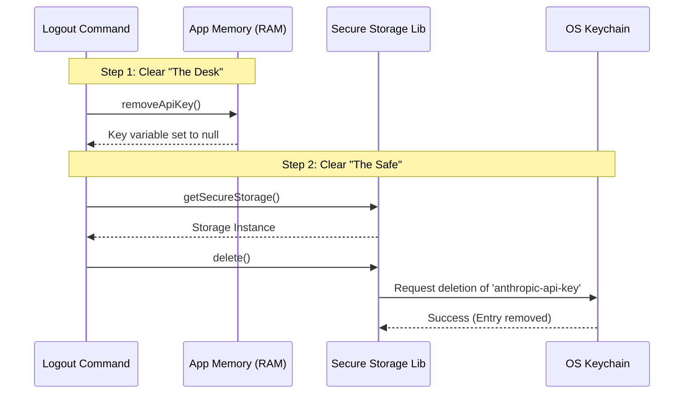

# Chapter 3: Secure Credential Management

In the previous chapter, [Logout Workflow Orchestrator](02_logout_workflow_orchestrator.md), we built the conductor that organizes the cleanup process. Now, we are going to look at the most critical instrument in that orchestra: **The mechanism that handles your secrets.**

## Why do we need Secure Credential Management?

When you log in to an application, the server gives you a secret "badge" (an API Key or Token). As long as your computer holds this badge, you are authenticated.

**The Problem:**
If we simply deleted the code that *displays* your username but left the secret badge hidden in a file on your computer, a hacker could find it and pretend to be you.

**The Solution:**
We need a **Digital Shredder**. We need a way to find every copy of that badge—whether it's currently being held in the application's hand (RAM) or locked in a safe on the hard drive (Disk)—and destroy it completely.

### The Use Case

When the user types `logout`, we want to ensure that if they immediately restart the application, the computer has "forgotten" who they are, forcing them to log in again.

## Key Concepts

To manage credentials securely, we deal with two types of memory. Think of it like working in an office:

1.  **Memory (RAM):** This is like the **desk surface**. You put documents here while you are working on them. It's fast, but it gets cleared when you go home (quit the app).
2.  **Secure Storage (Disk):** This is like a **locked safe**. You put documents here to keep them safe overnight. They stay there even if the app restarts.

A proper logout must clean **both** the desk and the safe.

## How to Use the Abstraction

Our project provides two simple tools to handle this complex task. You don't need to know how encryption works; you just need to know how to call the cleanup crew.

### Tool 1: Clearing the Desk (RAM)

First, we remove the key from the running application. This prevents the app from making any more accidental requests immediately after logout.

```typescript
// File: logout.tsx
import { removeApiKey } from '../../utils/auth.js';

// Inside performLogout function...
await removeApiKey();
```

**Explanation:**
*   `removeApiKey()`: This function finds the variable holding the API key in the current session and sets it to `null` or `undefined`.

### Tool 2: Emptying the Safe (Disk)

Next, we need to access the persistent storage on the user's hard drive and wipe it.

```typescript
// File: logout.tsx
import { getSecureStorage } from '../../utils/secureStorage/index.js';

// Inside performLogout function...
const secureStorage = getSecureStorage();
secureStorage.delete();
```

**Explanation:**
*   `getSecureStorage()`: This gets us a handle to the "Safe." It abstracts away the differences between Windows, Mac, and Linux security systems.
*   `.delete()`: This is the "shred" button. It removes the file or entry from the operating system's keychain.

## How It Works Under the Hood

What happens when you call `secureStorage.delete()`? It doesn't just delete a text file. It talks to the Operating System's most secure facility.

### Sequence Diagram



### Internal Implementation Details

While the code acts like a simple delete button, the `SecureStorage` class is doing some heavy lifting to ensure compatibility across different computers.

Here is a simplified view of what that abstraction looks like internally:

```typescript
// Simplified pseudo-code for utils/secureStorage/index.js
export class SecureStorage {
  // The name of our secret in the system keychain
  private keyName = 'anthropic-api-key';

  delete() {
    // We use a library like 'keytar' to talk to the OS
    try {
        keytar.deletePassword('my-app-service', this.keyName);
        console.log("Secret deleted from OS Keychain");
    } catch (error) {
        console.error("Failed to delete secret", error);
    }
  }
}
```

**Explanation:**
1.  **`keytar`**: This is a popular library that knows how to talk to **macOS Keychain**, **Windows Credential Manager**, and **Linux Secret Service**.
2.  **`deletePassword`**: This instruction tells the OS to locate the encrypted entry for our app and remove it.

## Putting It All Together

In our `logout.tsx` file, we combine these steps. We clear the memory first for speed and immediate safety, then we clear the disk storage for permanence.

```typescript
// File: logout.tsx
export async function performLogout() {
  // ... telemetry code ...

  // 1. Clear Memory
  await removeApiKey();

  // 2. Clear Disk/OS Storage
  const secureStorage = getSecureStorage();
  secureStorage.delete();
  
  // ... cache clearing code ...
}
```

## Summary

In this chapter, we learned about **Secure Credential Management**. We covered:
*   The difference between **Memory (RAM)** and **Secure Storage (Disk)**.
*   How to use `removeApiKey()` to clear the current session.
*   How to use `secureStorage.delete()` to remove the persistent secret from the OS Keychain.

Now that the secrets are gone, we still have a problem: the application remembers the user's *name*, their *settings*, and their *previous activity*. To fix this, we need to clear the application's short-term memory.

[Next Chapter: Global Configuration State](04_global_configuration_state.md)

---

Generated by [Code IQ](https://github.com/adityasoni99/Code-IQ)