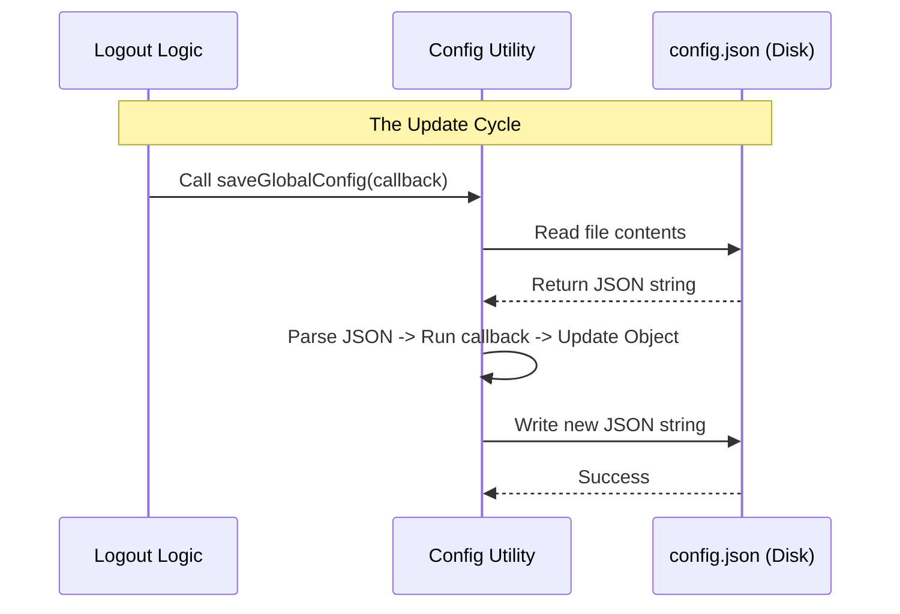

# Chapter 4: Global Configuration State

In the previous chapter, [Secure Credential Management](03_secure_credential_management.md), we successfully destroyed the sensitive API keys stored in the secure "safe" of the operating system.

However, security isn't just about keys. It's also about **State**.

## The Problem: The "Logbook" Remembers

Imagine a hotel. You have returned your room key (the credentials), so you can no longer open the door. However, the hotel's main logbook still has a checkmark next to your name saying: *"Guest has completed the welcome tour"* or *"Guest is linked to Room 204."*

If a new user sits down at this computer, the application might look at its internal logbook and say, "Oh, you've already finished the tutorial," skipping the introduction they actually need.

**The Global Configuration State** is that logbook. It is a file stored on the disk that remembers non-sensitive user preferences and history. To perform a true logout, we must erase these records.

## The Solution: `saveGlobalConfig`

We use a utility function called `saveGlobalConfig`. It allows us to safely open this logbook, cross out specific lines, and close it again.

### Use Case: The Fresh Start

When a user logs out, we want to ensure:
1.  The link to their OAuth (Google/GitHub) account is removed.
2.  If they requested a full reset, the "Onboarding Completed" flag is unchecked.

## How to Use the Abstraction

The `saveGlobalConfig` function handles the heavy lifting of reading files and writing to the disk. You simply provide a "recipe" for how the data should change.

### Step 1: The Basic Structure

The function takes the `current` configuration object and asks you to return the `updated` version.

```typescript
// File: logout.tsx
import { saveGlobalConfig } from '../../utils/config.js';

// Inside performLogout...
saveGlobalConfig(current => {
  // Create a copy of the current settings
  const updated = { ...current };

  // ... modifications go here ...

  return updated;
});
```
**Explanation:**
*   We use `{ ...current }` to make a copy. We never want to modify the original object directly (this is a concept called **immutability**).

### Step 2: Unlinking the Account

The most important part of the state cleanup is removing the link to the external account provider.

```typescript
  // ... inside the saveGlobalConfig callback
  
  // Remove the OAuth account link
  updated.oauthAccount = undefined;
  
  return updated;
```
**Explanation:**
*   Setting `oauthAccount` to `undefined` effectively erases that line from the configuration file when it is saved.

### Step 3: Resetting the User Journey (Optional)

Sometimes, we want to go further. If the `clearOnboarding` flag is true, we act as if the user has never used the app before.

```typescript
  // ... inside the saveGlobalConfig callback
  if (clearOnboarding) {
    // Reset flags so the next user sees the tutorial
    updated.hasCompletedOnboarding = false;
    
    // Reset subscription knowledge
    updated.hasAvailableSubscription = false;
    updated.subscriptionNoticeCount = 0;
  }
```
**Explanation:**
*   `hasCompletedOnboarding = false`: Forces the "Welcome" flow to run again next time.
*   `hasAvailableSubscription = false`: Ensures the app doesn't assume a paid plan exists until the new user proves it.

## How It Works Under the Hood

You might be wondering, "Where is this file?" and "What happens if two parts of the app try to write to it at the same time?"

The `saveGlobalConfig` utility handles these problems.

### Sequence Diagram



### Internal Implementation Details

The configuration system acts as a **Transaction**. It reads the current state, applies your changes, and saves it immediately.

Here is a simplified version of what `utils/config.js` does internally:

```typescript
// Simplified pseudo-code for utils/config.js
import fs from 'fs';

export function saveGlobalConfig(modifierFunction) {
  // 1. Read the file from disk
  const fileContent = fs.readFileSync('path/to/config.json');
  const currentConfig = JSON.parse(fileContent);

  // 2. Run the logic we wrote in logout.tsx
  const newConfig = modifierFunction(currentConfig);

  // 3. Write the result back to disk
  fs.writeFileSync('path/to/config.json', JSON.stringify(newConfig));
}
```

**Why is this abstraction useful?**
1.  **Safety:** It prevents us from accidentally deleting settings we didn't intend to touch (because we copy `...current` first).
2.  **Simplicity:** We don't have to worry about file paths, JSON parsing errors, or file permissions in our logout code.

## Putting It All Together

Here is the complete block used in our project. Notice how it combines the unlinking and the optional onboarding reset.

```typescript
// File: logout.tsx
saveGlobalConfig(current => {
  const updated = { ...current };
  
  // 1. Conditional Reset
  if (clearOnboarding) {
    updated.hasCompletedOnboarding = false;
    updated.hasAvailableSubscription = false;
  }
  
  // 2. Always Unlink Account
  updated.oauthAccount = undefined;
  
  return updated;
});
```

## Summary

In this chapter, we learned about **Global Configuration State**. We covered:
*   The difference between **Credentials** (Keys) and **Configuration** (State/Preferences).
*   How to use **`saveGlobalConfig`** to modify the persistent JSON "logbook" on the disk.
*   How to reset the user's "Journey" so the application behaves as if it's brand new.

At this point, we have cleared the **Secure Storage** and the **Global Configuration**. The hard drive is clean.

However, there is one last place where data might still be hiding: the **Application Memory (RAM)**. If the app is still running, it might remember data from 5 minutes ago. We need to clear its short-term memory.

[Next Chapter: Cache Invalidation Strategy](05_cache_invalidation_strategy.md)

---

Generated by [Code IQ](https://github.com/adityasoni99/Code-IQ)