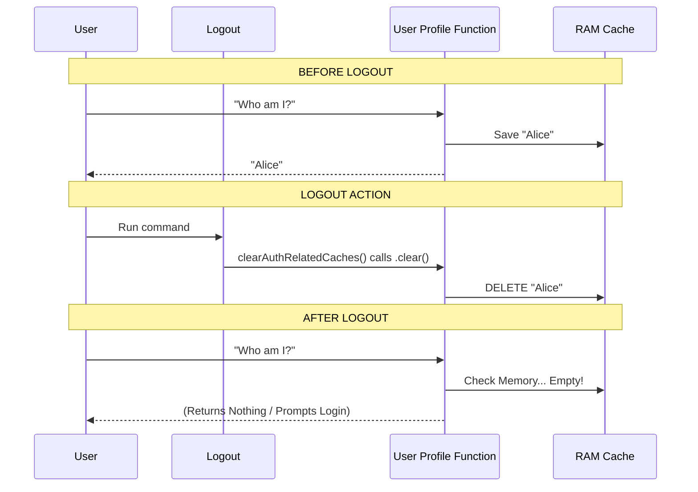

# Chapter 5: Cache Invalidation Strategy

Welcome to the final chapter of the `logout` tutorial!

In the previous chapter, [Global Configuration State](04_global_configuration_state.md), we learned how to scrub the hard drive (Disk) of user settings. In [Secure Credential Management](03_secure_credential_management.md), we learned how to delete the keys.

However, we have one final hiding spot to clean: **The Application's Short-Term Memory (RAM).**

## The Problem: The "Zombie" Session

Imagine you are working on a whiteboard during a meeting. When the meeting ends, you leave the room (delete credentials) and file away your notes (reset config).

But... **you forgot to erase the whiteboard.**

If the next person walks into the room 5 seconds later, they will still see your diagrams, secrets, and plans right there on the board.

In software, this "whiteboard" is called a **Cache**. To make our application fast, we often save the results of expensive tasks (like fetching a user profile) in memory. If we don't wipe this memory during logout, the application might still "think" you are logged in for the next few seconds or minutes until the program closes.

## The Solution: `clearAuthRelatedCaches`

We use a strategy called **Cache Invalidation**. This is a fancy way of saying "Wiping the Whiteboard."

We group all the cleanup tasks into a single function called `clearAuthRelatedCaches`. Its job is to find every subsystem in the app that might be holding onto data and tell it to let go.

### The Use Case

The user types `logout`. Immediately after, they type `settings`.
*   **Without Cache Invalidation:** The `settings` command might show the *previous* user's email because it pulled the data from the quick-access memory instead of checking the empty credential storage.
*   **With Cache Invalidation:** The `settings` command sees an empty memory, tries to fetch data, realizes there are no keys, and correctly asks the user to log in.

## Key Concepts

### 1. Memoization (The Memory)
Our application uses a technique called **Memoization**.
*   **First time you ask:** The app calculates 500 + 500 = 1000. It saves "1000" in a variable.
*   **Second time you ask:** The app instantly replies "1000" without doing the math.

### 2. Invalidation (The Reset)
When we log out, the answer "1000" is no longer valid (maybe the new user's math is different). We must force the app to forget that answer so it calculates it fresh next time.

## How to Use the Abstraction

Using this strategy is straightforward. We simply await the cleanup function at the end of our workflow.

```typescript
// File: logout.tsx
import { clearAuthRelatedCaches } from './logout.js'; // (simplified import)

// Inside performLogout...
await clearAuthRelatedCaches();
```

However, the magic happens *inside* this function. Let's break down what it actually does, step-by-step.

### Step 1: Forgetting the Tokens

First, we clear the cache for functions that retrieve authentication tokens.

```typescript
// File: logout.tsx
export async function clearAuthRelatedCaches(): Promise<void> {
  // 1. Clear the OAuth token cache
  // If the function has a memory (.cache), wipe it (.clear)
  getClaudeAIOAuthTokens.cache?.clear?.();
  
  // Clear other security tokens
  clearTrustedDeviceTokenCache();
```

**Explanation:**
*   `getClaudeAIOAuthTokens` is a function that usually remembers the token so it doesn't have to read the disk every millisecond.
*   `.cache?.clear?.()`: This is safe-guard code. It says: "If this function has a cache, and that cache has a clear button, press it."

### Step 2: Forgetting the User

Next, we clear data related to *who* the user is.

```typescript
  // ... inside clearAuthRelatedCaches
  
  // 2. Clear user data cache
  resetUserCache();
  
  // 3. Refresh analytics ID
  refreshGrowthBookAfterAuthChange();
```

**Explanation:**
*   `resetUserCache()`: Forces the app to forget the user's name, email, and ID.
*   `refreshGrowthBook...`: Tells our analytics tool (GrowthBook) that the current user is gone, so it stops tracking events under that ID.

### Step 3: Forgetting Remote Settings

Finally, we clear caches for settings that we downloaded from the server (like beta features or limits).

```typescript
  // ... inside clearAuthRelatedCaches

  // 4. Clear Feature Flags and Remote Configs
  clearBetasCaches();
  await clearRemoteManagedSettingsCache();

  // 5. Clear Limits (e.g. "You have 5 requests left")
  await clearPolicyLimitsCache();
}
```

**Explanation:**
*   If we didn't clear `clearBetasCaches`, the next user might see "Beta Feature X" enabled just because the previous user had access to it.

## How It Works Under the Hood

How does a function "have a cache"? Let's look at the implementation pattern.

### Sequence Diagram



### Internal Implementation Details

Most of the functions we are clearing use a helper (often usually a library like `mem` or `lodash.memoize`, or a custom wrapper) that attaches a `.cache` property to the function itself.

Here is a simplified example of what `getClaudeAIOAuthTokens` looks like internally:

```typescript
// Simplified pseudo-code of a memoized function
const cache = new Map();

function getTokens() {
  if (cache.has('token')) {
    return cache.get('token'); // Return memory
  }
  // ... fetch from disk ...
  cache.set('token', result);
  return result;
}

// We attach the map to the function so we can reach it from the outside
getTokens.cache = cache;
```

When we call `getClaudeAIOAuthTokens.cache.clear()`, we are emptying that `Map`.

## Putting It All Together

We have now seen every piece of the puzzle. Here is the final `performLogout` function again, showing how **Cache Invalidation** sits alongside the other concepts we learned.

```typescript
// File: logout.tsx
export async function performLogout() {
  // Chapter 2 & 3: Telemetry & Credentials
  await flushTelemetry();
  await removeApiKey();
  getSecureStorage().delete();

  // Chapter 5: Cache Invalidation (Wipe the Whiteboard)
  await clearAuthRelatedCaches();

  // Chapter 4: Global Config (Update the Logbook)
  saveGlobalConfig(/* ... */);
}
```

## Conclusion

Congratulations! You have completed the tutorial for the `logout` command.

Let's recap what makes a secure and robust logout system:
1.  **Command Definition:** We told the CLI the command exists.
2.  **Orchestrator:** We created a conductor (`performLogout`) to ensure tasks happen in order.
3.  **Credentials:** We securely deleted the keys from both RAM and the Disk Safe.
4.  **Configuration:** We updated the persistent state file to remove account links.
5.  **Cache Invalidation:** We wiped the application's short-term memory to prevent "zombie" data.

By following these steps, you ensure that when a user says "Goodbye," the application truly forgets them—keeping their data safe and the system ready for the next user.

---

Generated by [Code IQ](https://github.com/adityasoni99/Code-IQ)