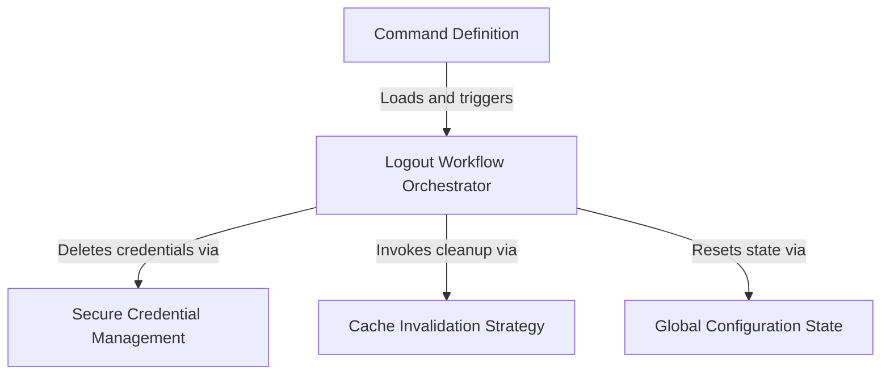

# Tutorial: logout

This project implements a **secure logout** workflow for a CLI application. It acts as a central coordinator that systematically removes *sensitive credentials*, clears temporary memory caches, and resets the persistent configuration file to ensure the user is completely signed out and no data leaks occur.

## Chapters

1. [Command Definition](01_command_definition.md)
2. [Logout Workflow Orchestrator](02_logout_workflow_orchestrator.md)
3. [Secure Credential Management](03_secure_credential_management.md)
4. [Global Configuration State](04_global_configuration_state.md)
5. [Cache Invalidation Strategy](05_cache_invalidation_strategy.md)

---

Generated by [Code IQ](https://github.com/adityasoni99/Code-IQ)