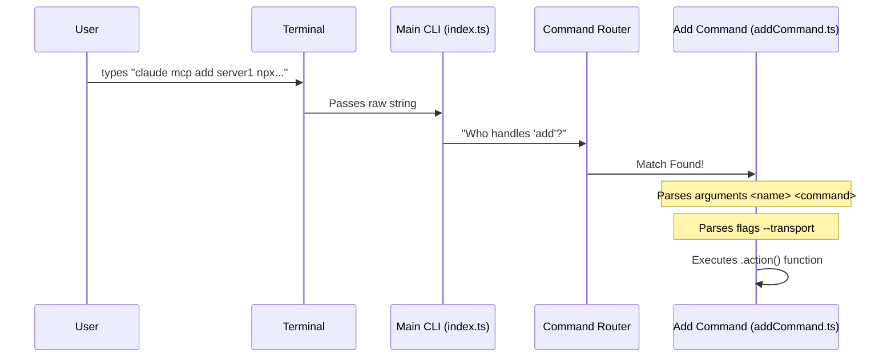

# Chapter 1: CLI Command Architecture

Welcome to the **MCP (Model Context Protocol)** project tutorial! In this series, we will build a robust command-line tool used to manage servers that talk to AI models.

We begin with the foundation: **CLI Command Architecture**.

## Motivation: The Hotel Switchboard

Imagine you are walking into a large hotel. You approach the front desk and say, "I need extra towels." The receptionist doesn't run to get them; they look up the housekeeping department's number and route your request there. If you said, "I want to check out," they would route you to the billing department.

A **CLI (Command Line Interface)** works exactly the same way.
1.  **The User** types a command: `claude mcp add my-server`.
2.  **The CLI Architecture** acts as the receptionist (switchboard). It analyzes the text.
3.  **The Router** sends the request to the specific code responsible for "adding servers."

Without this architecture, the application is just a confusing blob of code that doesn't know what the user wants.

## Central Use Case: Adding a Server

Throughout this chapter, we will focus on this specific command:

```bash
claude mcp add my-weather-server npx weather-cli
```

**What needs to happen?**
1.  The app recognizes `mcp` is the main tool.
2.  It recognizes `add` is the specific **Subcommand**.
3.  It captures `my-weather-server` as the **Name Argument**.
4.  It captures `npx weather-cli` as the **Command Argument**.

## Key Concepts

To build this, we use a pattern involving four main components.

### 1. The Command Object
This represents a specific action (like `add`, `list`, or `xaa`). It holds the definition of what the user is allowed to type.

### 2. Arguments
These are required pieces of information. In our use case, you *must* provide a name for the server.
*   Format: Usually defined with brackets `<name>`.

### 3. Options (Flags)
These are modifiers. They aren't strictly required but change how the command behaves.
*   Example: `--transport http` or `-e KEY=value`.

### 4. The Action Handler
This is a standard JavaScript function that runs only when the command matches.

---

## Step-by-Step Implementation

Let's look at how we build this structure using the code from `addCommand.ts`. We use a library called `Commander.js` to do the heavy lifting.

### Step 1: Defining the Command Structure
We start by creating a function that registers our command onto the main program.

```typescript
// From: addCommand.ts
import { type Command } from '@commander-js/extra-typings'

// We export a function that takes the main 'mcp' program
export function registerMcpAddCommand(mcp: Command): void {
  
  // We define the trigger word "add" and the required arguments
  mcp.command('add <name> <commandOrUrl> [args...]')
     // We add a description for the help menu
    .description('Add an MCP server to Claude Code.')
```

**Explanation:**
*   `.command('add ...')`: This tells the switchboard: "If the user types 'add', send them here."
*   `<name>`: This is a **required argument**.
*   `[args...]`: The square brackets `[]` mean this is optional, and the `...` means it captures everything else typed after it.

### Step 2: Adding Options (Flags)
Next, we define what special flags the user can use.

```typescript
    // Continuing the chain...
    .option(
      '-t, --transport <transport>',
      'Transport type (stdio, sse, http). Defaults to stdio.',
    )
    .option(
      '-e, --env <env...>',
      'Set environment variables (e.g. -e KEY=value)',
    )
```

**Explanation:**
*   If the user types `claude mcp add ... --transport http`, the code receives `options.transport = "http"`.
*   This keeps the main command clean while allowing for advanced configurations.

### Step 3: The Action Handler
Finally, we define the `.action()`. This is where the actual logic lives.

```typescript
    // The logic that runs when the command matches
    .action(async (name, commandOrUrl, args, options) => {
      
      // 'name' comes from <name>
      // 'commandOrUrl' comes from <commandOrUrl>
      // 'options' contains flags like --transport
      
      if (!name) {
         // Handle error if name is missing
         cliError('Error: Server name is required.')
      }

      // ... Logic to save the configuration ...
    })
}
```

**Explanation:**
*   The `.action` function receives the arguments we defined in `<...>` as variables.
*   This is the bridge between "Text in Terminal" and "JavaScript Logic."

---

## Internal Implementation: The Flow

What actually happens under the hood when you press Enter?



1.  **Main CLI:** The entry point (usually `index.ts`) initializes the application.
2.  **Routing:** The library looks at the first word after `mcp`. Is it `add`? Is it `xaa`?
3.  **Dispatch:** It calls the specific `register...` function for that command.

### Handling Complexity: The XAA Example

Sometimes commands act as "folders" for other commands. Look at `xaaIdpCommand.ts`.

```typescript
// From: xaaIdpCommand.ts
export function registerMcpXaaIdpCommand(mcp: Command): void {
  // Create a parent command 'xaa'
  const xaaIdp = mcp
    .command('xaa')
    .description('Manage the XAA (SEP-990) IdP connection')

  // Register a child command 'setup' UNDER 'xaa'
  xaaIdp.command('setup')
    .description('Configure the IdP connection')
    .action(options => { /* ... */ })
}
```

**Explanation:**
This creates a nested structure: `claude mcp xaa setup`.
*   `mcp` is the root.
*   `xaa` is a category.
*   `setup` is the executable action.

This is critical for keeping large applications organized. You will learn more about what "XAA" actually does in [XAA Identity Management](04_xaa_identity_management.md).

## Deep Dive: Validation and Logic

The CLI Architecture isn't just about routing; it's the first line of defense against bad data.

In `addCommand.ts`, before we do any heavy lifting (like provisioning servers), we validate inputs:

```typescript
// From: addCommand.ts (inside .action)

// 1. Check if the user is trying to use XAA without enabling it
if (options.xaa && !isXaaEnabled()) {
  cliError('Error: --xaa requires CLAUDE_CODE_ENABLE_XAA=1')
}

// 2. Validate dependent options
if (Boolean(options.xaa)) {
  const missing: string[] = []
  if (!options.clientId) missing.push('--client-id')
  // ... check other required flags ...
}
```

**Why do this here?**
It provides immediate feedback. If the CLI architecture detects a missing flag, it stops execution *before* the application tries to connect to a database or write a file.

Once validation passes, the command delegates the actual work to a service.
*   For adding servers, it calls `addMcpConfig` (covered in [MCP Server Provisioning](02_mcp_server_provisioning.md)).
*   For secure credentials, it calls `saveMcpClientSecret` (covered in [Secure Credential Handling](05_secure_credential_handling.md)).

## Conclusion

The **CLI Command Architecture** is the "User Interface" of a terminal application. It translates human intent (text) into machine action (function calls). By organizing commands into a structured hierarchy of names, arguments, and options, we create a tool that is intuitive to use and easy to maintain.

Now that we know how to *parse* the command to add a server, let's learn how to actually *create* and save that server configuration.

[Next Chapter: MCP Server Provisioning](02_mcp_server_provisioning.md)

---

Generated by [Code IQ](https://github.com/adityasoni99/Code-IQ)