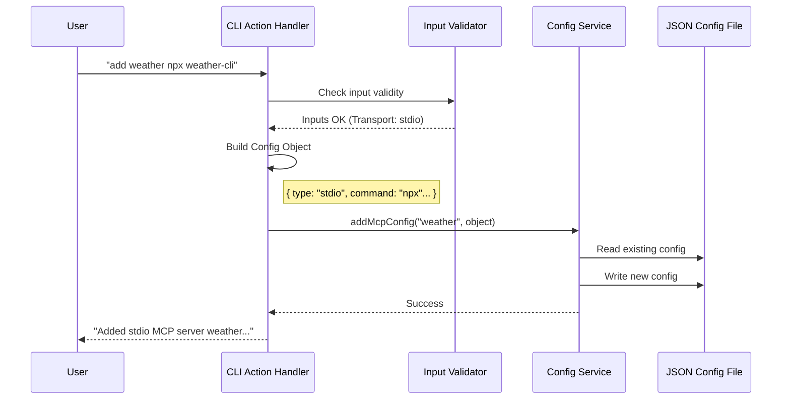

# Chapter 2: MCP Server Provisioning

Welcome back! in [Chapter 1: CLI Command Architecture](01_cli_command_architecture.md), we built the "Switchboard" that routes user commands to the right place.

Now, we will look at what happens when that call is actually answered. specifically, we will explore **MCP Server Provisioning**.

## Motivation: The Device Manager

Think about when you plug a new printer into your computer.
1.  You plug it in.
2.  Your computer detects it.
3.  The computer asks: "How do I talk to this? Is it USB? Is it WiFi?"
4.  It saves the settings so you can print anytime.

**MCP Server Provisioning** does the exact same thing for AI tools.

When a user wants to give Claude a new tool (like a Weather API or a Database connector), the CLI needs to know:
1.  **What is it called?** (e.g., "my-weather-server")
2.  **How do we talk to it?** (The Transport)
3.  **Where does it live?** (A URL or a command on your computer)

We call this process **Provisioning**. It converts a user's request into a saved configuration file.

## Central Use Case

We are still focusing on this command:

```bash
claude mcp add my-weather-server npx weather-cli
```

**Goal:** Take this text and turn it into a JSON configuration that the main application can read later.

## Key Concepts

Before we look at the code, we need to understand the three "languages" (Transports) an MCP server can speak.

### 1. Stdio (Standard Input/Output)
This is like a **Direct Cable**.
*   The server runs locally on your machine.
*   The CLI talks to it by typing into its "input" and reading its "output."
*   *Example:* Running a Python script or a Node.js CLI.

### 2. HTTP (HyperText Transfer Protocol)
This is like **Sending a Letter**.
*   The server is a URL (e.g., `https://api.myserver.com`).
*   The CLI sends a request, and the server sends a response back.
*   Stateless (no permanent connection).

### 3. SSE (Server-Sent Events)
This is like a **Phone Call**.
*   The server is also a URL.
*   The CLI opens a connection and keeps it open so the server can "push" messages instantly.

---

## Step-by-Step Implementation

We are working inside the `.action()` function of `addCommand.ts`.

### Step 1: Determining the Scope
First, we decide *where* to save this printer driver. Is it just for this project folder, or for the whole computer?

```typescript
// Inside .action()
import { ensureConfigScope } from '../../services/mcp/utils.js'

// 1. Determine Scope (local project vs global user)
const scope = ensureConfigScope(options.scope)
```
*   **Explanation:** `options.scope` comes from the `-s` flag. If the user doesn't specify it, we default to `local`.

### Step 2: Validating the Request
Before we do work, we check for common mistakes. For example, if a user provides a URL but forgets to say it's a URL.

```typescript
// 2. Check if the input looks like a URL
const looksLikeUrl =
  actualCommand.startsWith('http://') ||
  actualCommand.startsWith('https://') ||
  actualCommand.endsWith('/sse')

// We use this later to warn the user if they made a mistake
```
*   **Explanation:** This is a "User Experience" check. If the user types `add my-server https://google.com` but forgets `--transport http`, we want to warn them.

### Step 3: Handling HTTP/SSE Transports
If the user specifies `--transport sse` or `--transport http`, we build a configuration object specifically for web communication.

```typescript
if (transport === 'sse' || transport === 'http') {
  // Validate: We need a URL, not a command
  if (!actualCommand) {
    cliError('Error: URL is required for this transport.')
  }

  // Create the config object
  const serverConfig = {
    type: transport, // 'sse' or 'http'
    url: actualCommand,
    headers: options.header ? parseHeaders(options.header) : undefined
  }
  
  // Save it!
  await addMcpConfig(name, serverConfig, scope)
}
```
*   **Explanation:** We create a JSON object containing the URL and any headers (like authentication tokens). Then we pass it to `addMcpConfig`, which writes the file.

### Step 4: Handling Stdio (The Default)
If it's not a web URL, we assume it's a command running on your computer.

```typescript
else {
  // Warn if it looks like a URL but is treated as a command
  if (!transportExplicit && looksLikeUrl) {
    process.stderr.write('Warning: This looks like a URL, but --transport was not set.\n')
  }

  // Create the Stdio config object
  await addMcpConfig(
    name,
    { 
      type: 'stdio', 
      command: actualCommand, 
      args: actualArgs, 
      env: parseEnvVars(options.env) 
    },
    scope,
  )
}
```
*   **Explanation:** Here, `command` is the program (e.g., `npx`) and `args` are the arguments (e.g., `weather-cli`). We also parse environment variables (`-e KEY=VALUE`) here.

---

## Internal Implementation: The Flow

Here is the visual flow of what happens inside the Provisioning logic.



## Deep Dive: Specialized Logic

### Handling XAA (Identity Management)
You might see references to "XAA" in the code. This stands for an advanced authentication standard.

```typescript
// XAA Fail-fast check
if (options.xaa && !isXaaEnabled()) {
  cliError('Error: --xaa requires CLAUDE_CODE_ENABLE_XAA=1')
}
```
The provisioning logic acts as a gatekeeper. It ensures you don't try to configure advanced identity features without the proper environment setup. We will cover exactly what XAA is in [Chapter 4: XAA Identity Management](04_xaa_identity_management.md).

### Secure Credentials
If a user provides a Client Secret (a password), we **do not** save it in the plain text configuration file.

```typescript
const clientSecret = options.clientSecret ? await readClientSecret() : undefined

if (clientSecret) {
  // Handled separately from the main config file!
  saveMcpClientSecret(name, serverConfig, clientSecret)
}
```
This splits the sensitive data from the configuration data. We will explore how this works in [Chapter 5: Secure Credential Handling](05_secure_credential_handling.md).

## Conclusion

**MCP Server Provisioning** is the bridge between a human desire ("I want to use this tool") and a machine configuration (JSON files).

By the end of this process, we have successfully:
1.  Validated the user's input.
2.  determined the correct transport (Cable, Letter, or Phone).
3.  Saved the configuration to a file.

However, a command-line tool isn't just about text. Sometimes, we need to show rich, interactive feedback while these servers are running.

[Next Chapter: Reactive Terminal UI](03_reactive_terminal_ui.md)

---

Generated by [Code IQ](https://github.com/adityasoni99/Code-IQ)