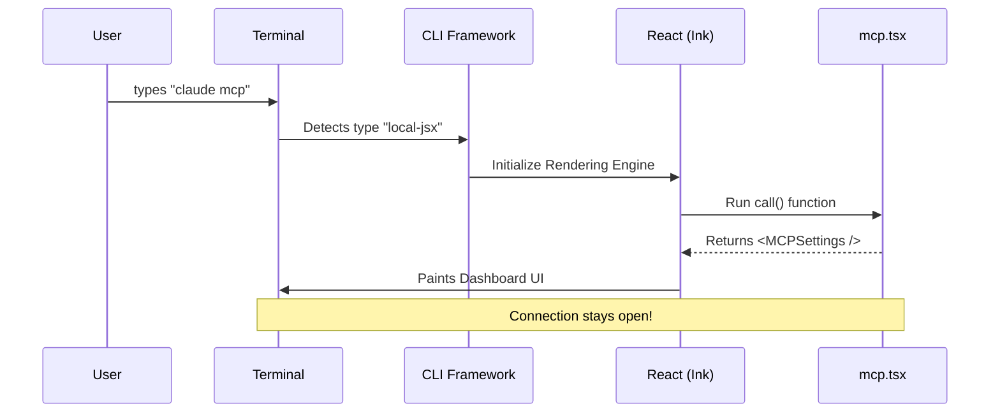

# Chapter 3: Reactive Terminal UI

Welcome back! In [Chapter 2: MCP Server Provisioning](02_mcp_server_provisioning.md), we learned how to create and save server configurations.

Now, we need a way to **manage** these servers. While standard command-line tools just print text and quit, the MCP project does something special. It builds a **Reactive Terminal UI**.

## Motivation: The Static vs. Dynamic Display

Imagine you are at an airport.

1.  **The Old Way (Static CLI):** You have to walk up to a desk and ask, "Is flight 101 on time?" The agent says "Yes." If you want to know if it changes 5 minutes later, you have to ask again.
2.  **The Reactive Way (Terminal UI):** You look at the big Departure Board. It hangs on the wall, stays open, and **automatically updates** when flight statuses change.

In this chapter, we will build that "Departure Board" inside your terminal using **React**.

## Central Use Case: The MCP Dashboard

We want the user to type a single command to open an interactive control panel:

```bash
claude mcp
```

**What happens?**
Instead of printing "Done" and exiting, the terminal clears. A dashboard appears showing a list of servers, their status (Connected/Disconnected), and error logs. You can navigate this menu with your arrow keys.

## Key Concepts

To achieve this magic, we use three specific concepts found in `index.ts` and `mcp.tsx`.

### 1. `local-jsx` Command Type
Standard CLI commands run a function. Reactive commands render a Component. We tell our framework to expect a UI by setting a special type.

### 2. The `call()` Entry Point
In a normal React website, `App.tsx` is your entry point. Here, we export a function named `call`. It receives the command-line arguments and decides which Component to show.

### 3. Headless UI Logic
Sometimes we want to use React's state management (to toggle a server) without showing a full dashboard. We call these "Headless" components—they run logic inside `useEffect` and then exit.

---

## Step-by-Step Implementation

Let's look at how this is built, starting with how the command is defined in `index.ts`.

### Step 1: Defining the UI Command
We define the command, but notice the `type`.

```typescript
// From: index.ts
import type { Command } from '../../commands.js'

const mcp = {
  type: 'local-jsx', // <--- The Magic Ingredient
  name: 'mcp',
  description: 'Manage MCP servers',
  load: () => import('./mcp.js'),
} satisfies Command

export default mcp
```

**Explanation:**
*   `type: 'local-jsx'`: This tells the CLI, "Do not treat this as a text script. Boot up the React renderer (via a library like Ink)."
*   `load`: We lazy-load the actual UI code (`mcp.js`) so the CLI starts fast.

### Step 2: The Router (The `call` function)
Now let's look at `mcp.tsx`. This file acts like a router on a website. It checks what the user typed and returns the correct React tag.

```typescript
// From: mcp.tsx
export async function call(
  onDone: LocalJSXCommandOnDone, 
  _context: unknown, 
  args?: string
): Promise<React.ReactNode> { // <--- Returns a React Node!
  
  // 1. If arguments exist, handle sub-commands
  if (args) {
    const parts = args.trim().split(/\s+/)
    
    // Example: claude mcp enable server1
    if (parts[0] === 'enable' || parts[0] === 'disable') {
      return <MCPToggle action={parts[0]} target={parts[1]} onComplete={onDone} />
    }
  }

  // 2. Default: Show the main Dashboard
  return <MCPSettings onComplete={onDone} />
}
```

**Explanation:**
*   **Inputs:** `args` contains the text typed after `mcp`.
*   **Routing:**
    *   If the user types `mcp enable ...`, we return the `<MCPToggle />` component.
    *   If the user just types `mcp`, we return the `<MCPSettings />` component (the Dashboard).

### Step 3: The Dashboard Component
The `<MCPSettings />` component (imported at the top) is a complex UI. It renders the list of servers. Because it is **Reactive**, it hooks into the application state.

When the state of a server changes (e.g., it crashes), the `MCPSettings` component re-renders automatically, updating the text in the terminal immediately.

---

## Internal Implementation: The Flow

How does a text terminal run React?



1.  **Detection:** The CLI sees the command is `local-jsx`.
2.  **Mounting:** It starts a process that takes control of the terminal screen (hiding the cursor, listening to keystrokes).
3.  **Rendering:** It "paints" the output of the React component using text characters.

## Deep Dive: Managing State with Hooks

One of the most powerful features of using React in the terminal is **Hooks**.

Let's look at the `MCPToggle` component in `mcp.tsx`. This component is interesting because it reads the global state of the app to find servers.

### 1. Reading State
```typescript
// Inside MCPToggle component
import { useAppState } from '../../state/AppState.js'

function MCPToggle({ action, target, onComplete }) {
  // We subscribe to the list of MCP clients
  const mcpClients = useAppState(s => s.mcp.clients)
  
  // ... logic continues ...
}
```
**Explanation:** `useAppState` is a custom hook. It ensures that if a new server is added *while* this command is running, `mcpClients` updates immediately.

### 2. Modifying State
```typescript
import { useMcpToggleEnabled } from '../../services/mcp/MCPConnectionManager.js'

// Get the function to change state
const toggleMcpServer = useMcpToggleEnabled()

// Inside useEffect:
for (const s of toToggle) {
  toggleMcpServer(s.name) // <--- Takes action
}
```
**Explanation:** We don't manually edit JSON files here. We call a function (`toggleMcpServer`) provided by our Connection Manager. This ensures the change is saved safely and propagates to the rest of the app.

### 3. Exiting
In a terminal, a command must eventually finish.

```typescript
useEffect(() => {
  // ... perform the toggling ...

  // Tell the CLI we are finished and print a message
  onComplete(`Enabled ${toToggle.length} MCP server(s)`)
}, [/* dependencies */])
```
**Explanation:** `onComplete` is a callback passed down from the CLI framework. Calling it kills the React process and returns the user to their standard command prompt.

## Conclusion

**Reactive Terminal UI** allows us to build tools that feel like modern applications, not just scripts. By using `local-jsx` and React, we create interfaces that respond to state changes instantly.

We have covered how to define commands, provision servers, and now, how to control them with an interactive UI. But connecting to servers often requires proving who you are.

Next, we will learn how to handle advanced identity management.

[Next Chapter: XAA Identity Management](04_xaa_identity_management.md)

---

Generated by [Code IQ](https://github.com/adityasoni99/Code-IQ)