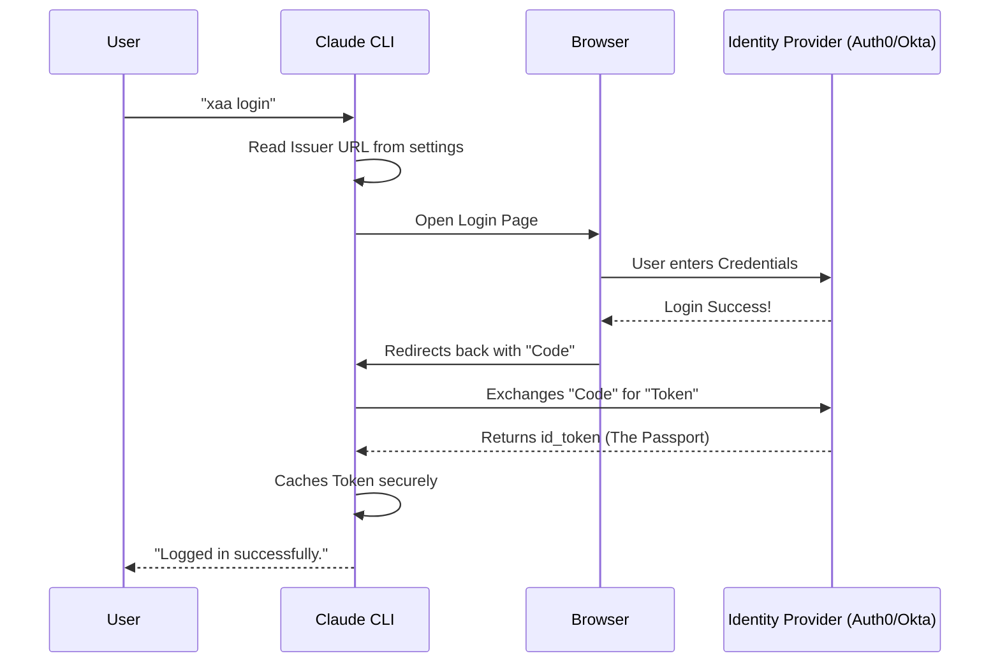

# Chapter 4: XAA Identity Management

Welcome back! In [Chapter 3: Reactive Terminal UI](03_reactive_terminal_ui.md), we built a beautiful dashboard to monitor our servers.

Now we face a security challenge. Imagine you have 20 different MCP servers (tools). If every single one requires a unique username and password, you will spend all day logging in.

In this chapter, we introduce **XAA (Extended Authentication Architecture)**.

## Motivation: The Passport Office

Think about how you travel internationally.
1.  **The Old Way:** You arrive at a country's border. The guard interviews you, calls your employer, checks your bank, and finally lets you in. You do this for *every* country. It's slow and annoying.
2.  **The XAA Way:** You go to your home government **(The Identity Provider)** *once*. They vet you and give you a **Passport (The Token)**. Now, when you go to other countries **(MCP Servers)**, you just show the passport. They trust the passport, so they trust you.

**XAA Identity Management** turns the CLI into that Passport holder. You log in once, and the system automatically handles security for all your tools.

## Central Use Case: Single Sign-On

We want to achieve a workflow where the user configures the "Passport Office" once, and then never worries about individual logins again.

**Step 1: Setup the Office**
```bash
claude mcp xaa setup --issuer https://my-idp.com --client-id claude-cli
```

**Step 2: Get the Passport**
```bash
claude mcp xaa login
```

**Step 3: Use the Passport**
```bash
claude mcp add my-secure-server --xaa ...
```

## Key Concepts

To make this work, we need to understand four terms from the OIDC (OpenID Connect) world.

### 1. The Identity Provider (IdP)
This is the "Passport Office" (e.g., Okta, Auth0, Google, or a corporate login server). It holds your user directory.

### 2. The Issuer URL
This is the address of the Passport Office (e.g., `https://accounts.google.com`).

### 3. The Client ID
This is the name of our application. When the CLI knocks on the IdP's door, it says, "Hi, I am `claude-cli`."

### 4. The `id_token` (JWT)
This is the Passport itself. It is a digital file (JSON Web Token) that proves who you are. The CLI holds onto this tightly.

---

## Step-by-Step Implementation

The code for this lives in `xaaIdpCommand.ts`. It handles the lifecycle of that "Passport."

### Step 1: Configuring the Connection (`setup`)
First, we need to save the address of the IdP.

```typescript
// From: xaaIdpCommand.ts (inside .action)
import { updateSettingsForSource } from '../../utils/settings/settings.js'

// We validate that the issuer is a proper URL
const issuerUrl = new URL(options.issuer)

// We save the configuration to the user's settings file
updateSettingsForSource('userSettings', {
  xaaIdp: {
    issuer: options.issuer,
    clientId: options.clientId,
    // callbackPort is optional (for local testing)
    callbackPort: options.callbackPort, 
  },
})
```
**Explanation:**
This doesn't log you in yet. It just writes down "When we need to log in, go to `https://my-idp.com`."

### Step 2: The Login Flow (`login`)
This is where the magic happens. The CLI opens your web browser so you can log in securely.

```typescript
// From: xaaIdpCommand.ts
import { acquireIdpIdToken } from '../../services/mcp/xaaIdpLogin.js'

// Trigger the browser flow
await acquireIdpIdToken({
  idpIssuer: idp.issuer,
  idpClientId: idp.clientId,
  // If we have a stored password (secret) for the app, use it
  idpClientSecret: getIdpClientSecret(idp.issuer),
  
  // Tell the user what to do if the browser doesn't pop up
  onAuthorizationUrl: url => {
    process.stdout.write(`Visit this URL: ${url}\n`)
  },
})
```
**Explanation:**
`acquireIdpIdToken` starts a local mini-server, opens your browser to the IdP, waits for you to click "Approve", and catches the `id_token` sent back.

### Step 3: Using the Token
Once we have the token, we need to make sure new servers can use it. This happens in `addCommand.ts`.

```typescript
// From: addCommand.ts
// If the user wants to use XAA, we must check if it's set up
if (options.xaa) {
  // Check 1: Is the feature enabled globally?
  if (!isXaaEnabled()) {
    cliError('Error: XAA is not enabled in environment.')
  }
  
  // Check 2: Did they run 'setup' yet?
  if (!getXaaIdpSettings()) {
    cliError("Error: Run 'claude mcp xaa setup' first.")
  }
}
```
**Explanation:**
We treat XAA as a strict requirement. If a user tries to add a secure server (`--xaa`) but hasn't configured the identity provider, we stop them immediately.

---

## Internal Implementation: The Flow

What happens when you run `claude mcp xaa login`?



1.  **Initiation:** The CLI looks up the URL you saved in `setup`.
2.  **Authentication:** You don't give your password to the CLI. You give it to the IdP in your browser. This is much safer.
3.  **Exchange:** The IdP gives the CLI a temporary code, which the CLI swaps for the actual Token.
4.  **Storage:** The CLI saves this token in memory (or a secure cache) to use later.

## Deep Dive: Managing Secrets

You might notice the code mentions `clientSecret`.

```typescript
// From: xaaIdpCommand.ts

if (options.clientSecret) {
  // We read the secret from an environment variable (safer than typing it)
  const secret = process.env.MCP_XAA_IDP_CLIENT_SECRET
  
  // We save it to the system Keychain, NOT a text file
  saveIdpClientSecret(options.issuer, secret)
}
```

Sometimes, the CLI itself needs a password to talk to the IdP (this is called a Confidential Client).
We **never** save this secret in the plain text `userSettings` JSON file. If we did, anyone reading your config file could impersonate the CLI. Instead, we use the operating system's secure keychain.

We also handle clearing data carefully to prevent "ghost" credentials:

```typescript
// From: xaaIdpCommand.ts (inside clear command)

// 1. Remove the public config
updateSettingsForSource('userSettings', { xaaIdp: undefined })

// 2. Remove the secure secrets and tokens
clearIdpIdToken(idp.issuer)
clearIdpClientSecret(idp.issuer)
```

## Conclusion

**XAA Identity Management** simplifies security by centralizing it. Instead of managing 50 passwords for 50 tools, we manage one Identity Provider connection. The CLI acts as a smart agent, obtaining a "Passport" (Token) and presenting it to any MCP server that asks for it.

However, we touched on a critical topic: **Secrets**. Where exactly do we put passwords, API keys, and Client Secrets so they don't get stolen?

[Next Chapter: Secure Credential Handling](05_secure_credential_handling.md)

---

Generated by [Code IQ](https://github.com/adityasoni99/Code-IQ)