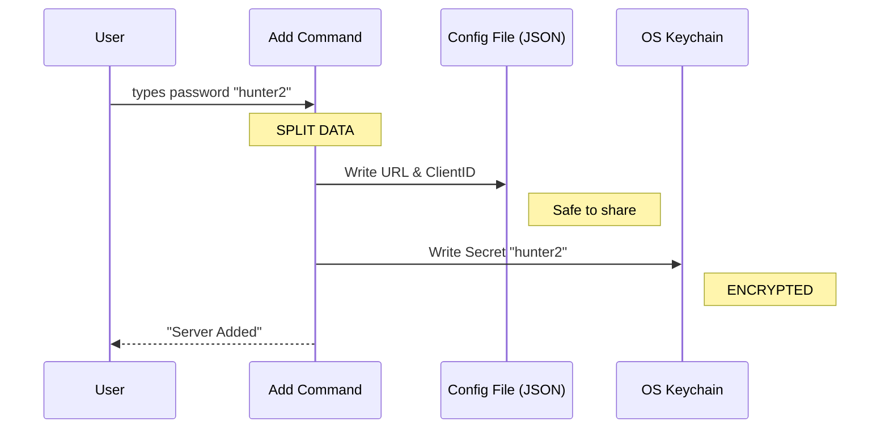

# Chapter 5: Secure Credential Handling

Welcome to the final chapter! In [Chapter 4: XAA Identity Management](04_xaa_identity_management.md), we learned how to use a "Passport" (Identity Provider) to log in to multiple servers.

However, to get that passport, or to talk to certain servers, we often need **Secrets** (Passwords, API Keys, or Client Secrets).

This raises a critical question: **Where do we save these secrets?**

If we save them in a plain text file, anyone who sees your computer can steal them. If you commit that file to GitHub, the whole world can steal them.

In this chapter, we will build **Secure Credential Handling**.

## Motivation: The Public Directory vs. The Safe

Imagine a large office building.
*   **The Directory (Lobby):** Lists everyone's name and office number. This is public. It helps people find where to go.
*   **The Safe (Manager's Office):** Holds the actual keys to open those offices. This is strictly private.

In the MCP CLI:
1.  **Configuration Files (`config.json`)** are the **Directory**. They hold URLs and Names. It is safe to copy/paste these to a friend.
2.  **The System Keychain** is the **Safe**. This is a special encrypted database built into your operating system (like macOS Keychain or Windows Credential Manager).

**Secure Credential Handling** is the logic that automatically splits your data: names go to the file, passwords go to the Keychain.

## Central Use Case: Adding a Confidential Server

Let's look at this command:

```bash
claude mcp add my-server https://api.company.com --client-id 123 --client-secret
```

Note the `--client-secret` flag. The CLI will prompt you to type the password.

**Our Goal:**
1.  Save `https://api.company.com` and `client-id: 123` into a JSON file.
2.  Save the secret password securely into the OS Keychain.
3.  Link them together so the app works automatically.

## Key Concepts

### 1. The Separation of Concerns
We never write secrets to `config.json`. The application code must explicitly separate "Public Config" from "Secret Config" before saving.

### 2. The Keychain Key
To find the password later, we need a label. Usually, we use the Server Name or the Issuer URL as the "Key" to look up the password in the Keychain.

### 3. Ghost Credentials
If you delete the server from the config file, you must remember to delete the password from the Keychain. If you don't, you leave "Ghost Credentials" cluttering the secure storage.

---

## Step-by-Step Implementation

Let's see how this separation works inside `addCommand.ts`.

### Step 1: Capturing the Secret
We don't want the user to type the password in the command line history (where it stays visible). We prompt for it or read it from the environment.

```typescript
// From: addCommand.ts

// 1. Check if the user wants to use a secret
const clientSecret =
  options.clientSecret && options.clientId
    ? await readClientSecret() // <--- Prompts user securely
    : undefined
```
**Explanation:** `readClientSecret()` hides what you type (showing `***`), just like `sudo` on Linux.

### Step 2: Saving the Public Config
Next, we create the configuration object *without* the secret.

```typescript
// 2. Create the Public Config Object
const serverConfig = {
  type: 'sse',
  url: actualCommand,
  oauth: {
    clientId: options.clientId
    // NOTICE: No clientSecret here!
  }
}

// 3. Save to JSON file
await addMcpConfig(name, serverConfig, scope)
```
**Explanation:** This writes to the file system. If you opened the file later, you would see the URL and ID, but the secret would be missing.

### Step 3: Saving the Private Secret
Finally, we put the secret in the "Digital Safe."

```typescript
// 4. Save the secret to the Keychain
if (clientSecret) {
  // We use the 'name' and 'serverConfig' to generate a unique key
  saveMcpClientSecret(name, serverConfig, clientSecret)
}
```
**Explanation:** `saveMcpClientSecret` calls the operating system's native security API. It encrypts the password and stores it.

---

## Internal Implementation: The Flow

Here is what happens when you press Enter.



## Deep Dive: Managing the Lifecycle

Writing secrets is easy. Managing them when things change is harder. Let's look at `xaaIdpCommand.ts` to see how we handle updates and deletion.

### Reading Secrets
When the application needs to log in, it pulls from both sources.

```typescript
// From: xaaIdpCommand.ts

// 1. Get public settings
const idp = getXaaIdpSettings()

// 2. Get private secret
const secret = getIdpClientSecret(idp.issuer)

// 3. Combine them to log in
await acquireIdpIdToken({
  idpClientId: idp.clientId,
  idpClientSecret: secret, 
  // ...
})
```
**Explanation:** The application reconstructs the full credential set in memory, uses it for a millisecond to authenticate, and then discards it. The secret never touches the disk.

### Updating Secrets (The "Stale" Problem)
What if you change the URL of a server? The old password in the keychain is now linked to a URL that doesn't exist. We must clean it up.

```typescript
// From: xaaIdpCommand.ts (inside setup command)

// If the Issuer URL changed...
if (oldIssuer && oldIssuer !== newIssuer) {
  // ...delete the OLD secret
  clearIdpClientSecret(oldIssuer)
}

// Then save the NEW secret
if (newSecret) {
  saveIdpClientSecret(newIssuer, newSecret)
}
```
**Explanation:** We compare the old settings (before saving) with the new ones. If they differ, we "garbage collect" the old secrets to keep the user's keychain clean.

### Clearing Everything
When a user runs `clear` or `remove`, we must be thorough.

```typescript
// From: xaaIdpCommand.ts (inside clear command)

// 1. Remove from Public Config
updateSettingsForSource('userSettings', { xaaIdp: undefined })

// 2. Remove from Keychain
if (idp) {
  clearIdpClientSecret(idp.issuer)
  // Also remove any cached tokens
  clearIdpIdToken(idp.issuer)
}
```
**Explanation:** We perform a synchronized delete. If we only did step 1, the secret would stay in the keychain forever (a "ghost credential").

## Conclusion

**Secure Credential Handling** is about trust. By respecting the difference between "Configuration" (Public) and "Credentials" (Private), we build a tool that professionals can use safely.

In this tutorial series, you have built a complete CLI application:
1.  **[CLI Command Architecture](01_cli_command_architecture.md)**: You built the switchboard to route commands.
2.  **[MCP Server Provisioning](02_mcp_server_provisioning.md)**: You learned to save server configurations.
3.  **[Reactive Terminal UI](03_reactive_terminal_ui.md)**: You created a live dashboard.
4.  **[XAA Identity Management](04_xaa_identity_management.md)**: You implemented a global passport system.
5.  **Secure Credential Handling**: You secured the application keys.

You now possess the foundational knowledge of the MCP CLI architecture. Happy coding!

---

Generated by [Code IQ](https://github.com/adityasoni99/Code-IQ)