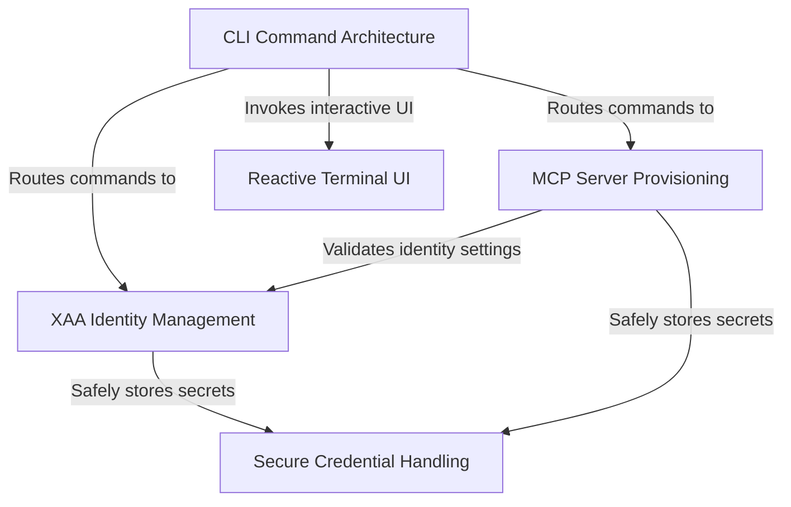

# Tutorial: mcp

This project serves as a comprehensive management tool for the **Model Context Protocol (MCP)**, enabling users to easily register, configure, and control AI servers and tools via the command line. It features a **reactive terminal UI** for interactive state management and employs a centralized **Extended Authentication Architecture (XAA)** to handle identities across multiple servers, ensuring sensitive credentials are stored securely in the system keychain rather than in plain text configurations.

## Chapters

1. [CLI Command Architecture](01_cli_command_architecture.md)
2. [MCP Server Provisioning](02_mcp_server_provisioning.md)
3. [Reactive Terminal UI](03_reactive_terminal_ui.md)
4. [XAA Identity Management](04_xaa_identity_management.md)
5. [Secure Credential Handling](05_secure_credential_handling.md)

---

Generated by [Code IQ](https://github.com/adityasoni99/Code-IQ)