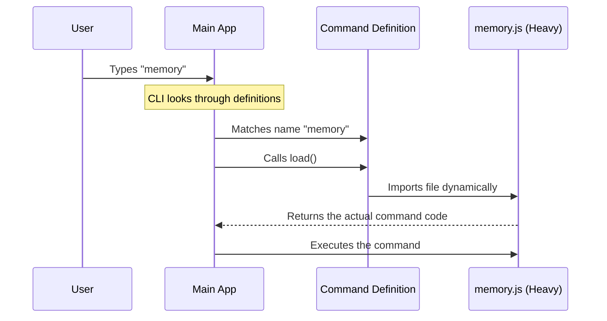

# Chapter 1: Command Module Definition

Welcome to the **Memory** project tutorial! In this series, we are going to build a tool that helps you edit specific files (which we call "memory files") directly from your terminal.

We will start with the absolute basics: **How do we tell the application that a command exists?**

### Why do we need this?

Imagine walking into a library. You don't immediately see every single page of every book spread out on the floor. Instead, you check the **catalog**. The catalog tells you the title of the book and where to find it. You only go get the actual book when you decide you want to read it.

The **Command Module Definition** is exactly like that library catalog.

**The Use Case:**
We want to create a command called `memory`.
1.  **Performance:** We don't want to load all the complex code for editing files every time the application starts. We only want to load it if the user actually types `memory`.
2.  **Discovery:** The application needs to know the command's name and a helpful description to show in help menus.

---

### Step-by-Step Implementation

Let's look at the file `index.ts`. This file acts as the registration card for our command. We will break it down into tiny pieces.

#### 1. Importing the Type

First, we need to tell TypeScript what a "Command" looks like so it can help us prevent spelling mistakes.

```typescript
// We import the 'Command' type definition
import type { Command } from '../../commands.js'
```

**Explanation:** This line imports a "blueprint" (Type) called `Command`. It ensures our code follows the rules required by the main application.

#### 2. Defining Basic Metadata

Now, we create the command object and give it some basic identity details.

```typescript
const memory: Command = {
  // Tells the CLI we will render a UI
  type: 'local-jsx',
  // The keyword the user types to run this
  name: 'memory',
  // A helpful hint for the help menu
  description: 'Edit Claude memory files',
```

**Explanation:**
*   `type`: This tells the system what *kind* of command this is. `'local-jsx'` means this command will draw a user interface in the terminal (like a mini-website in text).
*   `name`: This is the magic word. When the user types `memory`, this command triggers.
*   `description`: This text appears if the user runs a `--help` command.

#### 3. Lazy Loading (The "Magic" Part)

This is the most important part. We tell the application *where* to find the heavy code, but we don't load it yet.

```typescript
  // Only import the heavy code when needed!
  load: () => import('./memory.js'),
}

export default memory
```

**Explanation:**
*   `load`: This is a function. It uses `import(...)` to fetch the actual logic file (`./memory.js`).
*   **Lazy Loading:** Because this is inside a function, the file `./memory.js` is **not** read when the application starts. It is only read when the application calls `load()`.
*   `export default`: This exposes our definition so the main application can add it to its list.

---

### Under the Hood: How it Works

What happens when you run the application? Let's visualize the flow. The main application (the CLI) scans these definition files first. It's lightweight because it hasn't loaded the real logic yet.



1.  **Startup:** The CLI reads the `index.ts` definition. It knows "memory" exists, but it hasn't loaded `memory.js` yet.
2.  **User Action:** You type `memory`.
3.  **Trigger:** The CLI sees the match and executes the `load()` function we defined.
4.  **Execution:** Now (and only now), the heavy `memory.js` file is loaded into memory, and the command begins.

---

### Deep Dive: Internal Implementation

The key pattern here is the separation of **Definition** from **Implementation**.

In our file `index.ts`, we are essentially making a promise: *"If you ask for the 'memory' command, I promise to go get the code from `./memory.js`."*

The `type: 'local-jsx'` property is also crucial. It signals to the system that the code inside `./memory.js` will return a UI component rather than just a simple text output. This prepares the system to render an interactive interface, which we will discuss in [Interactive CLI Component](03_interactive_cli_component.md).

The code inside `./memory.js` (which is loaded by our `load` function) controls the behavior of the command once it starts. The lifecycle of that code is complex, involving asynchronous operations (like reading files). We cover how that code starts up in the next chapter: [Async Command Lifecycle](02_async_command_lifecycle.md).

### Summary

In this chapter, you learned how to register a command using a **Command Module Definition**.

*   **Metadata** allows the CLI to know your command's name and description without running it.
*   **Lazy Loading** keeps the application fast by only importing code when the user asks for it.

Now that we have successfully defined *where* the command is, let's see what happens *after* it loads.

[Next Chapter: Async Command Lifecycle](02_async_command_lifecycle.md)

---

Generated by [Code IQ](https://github.com/adityasoni99/Code-IQ)