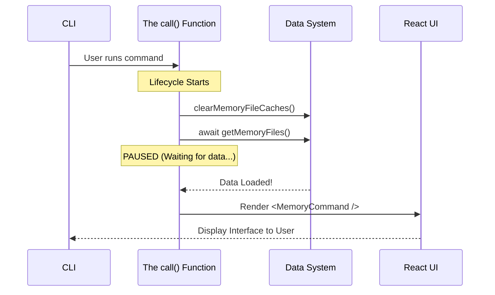

# Chapter 2: Async Command Lifecycle

In the previous chapter, [Command Module Definition](01_command_module_definition.md), we set up the "catalog card" for our command. We told the CLI that a command named `memory` exists and where to find its code.

Now, we are going to look at what happens the exact moment the user hits `Enter`.

### The Problem: The "Empty Plate" Effect

Imagine you go to a restaurant. You order dinner. The waiter immediately places a plate in front of you—but it's empty. Five seconds later, they throw the steak on it. Five seconds after that, they dump the potatoes on top.

It works, but it feels messy, right?

In software, this is called a **Flash of Unstyled Content** or a "loading flicker." If we launch our command and immediately show the UI before we have loaded the data (the memory files), the user might see an empty list or a spinning wheel for a split second.

**The Solution:**
We want to act like a good chef: prepare the ingredients (data) *before* serving the plate (the UI). We use the **Async Command Lifecycle** to pause execution until everything is ready.

---

### The `call` Function

In our implementation file (`memory.tsx`), the magic happens inside a specific function exported as `call`. This is the bridge between the Command Line Interface (CLI) and the React User Interface.

#### 1. Defining the Entry Point

We start by defining the function. Note the `async` keyword. This tells the application: "Hang on, I might need some time to finish this."

```typescript
import type { LocalJSXCommandCall } from '../../types/command.js';

// The CLI calls this function when 'memory' is run
export const call: LocalJSXCommandCall = async (onDone) => {
```
*   `onDone`: This is a tool we pass down to the UI. It allows the UI to eventually say, "I'm finished now, you can close the app."

#### 2. Clearing the Table (Cache Clearing)

Before we fetch new data, we want to make sure we aren't accidentally using old, stale data from the last time the command ran.

```typescript
  // clearMemoryFileCaches is a utility helper
  clearMemoryFileCaches();
```
*   **Why?** If you added a memory file outside of this tool, we want to make sure this tool sees it immediately.

#### 3. Pre-fetching Ingredients (The Wait)

This is the most critical step. We ask for the files, and we use `await` to pause the function.

```typescript
  // Fetch data AND wait for it to finish
  await getMemoryFiles();
```
*   **What happens here?** The application stops right here. It does **not** draw any UI yet. It waits until `getMemoryFiles()` returns the list of files.
*   **Benefit:** Because we wait here, the UI will never render with an empty list. When the UI appears, the data is guaranteed to be there.

#### 4. Rendering the UI

Finally, once the data is ready (cached in memory), we return the React component.

```typescript
  // Return the actual interactive component
  return <MemoryCommand onDone={onDone} />;
};
```
*   We pass `onDone` to the component so it can handle exiting the app later.

---

### Visualizing the Lifecycle

Let's look at the sequence of events. Notice how the "User Interface" doesn't appear until the "Data" is ready.



If we didn't use `await` in the `call` function, the `CallFn` would trigger the `UI` immediately, resulting in that "Empty Plate" effect we discussed earlier.

---

### Internal Implementation Details

The file `memory.tsx` handles this logic. While the `call` function is simple, it relies on complex helpers under the hood.

**The Wrapper Component:**
You might notice we return `<MemoryCommand />`. This is a React component. In the next chapter, we will build that component.

**Why not use React Suspense?**
React has a feature called "Suspense" that handles loading states. In fact, our code *does* use Suspense inside the component as a backup!

However, using the **Async Command Lifecycle** (the `await` in the `call` function) provides a better user experience for the *initial* load. It ensures the terminal window doesn't resize or flicker. It makes the command feel "solid" and native.

### Summary

In this chapter, we learned:
1.  **The Goal:** Prevent UI flashes by loading data before rendering.
2.  **The Tool:** The `call` function, which is the asynchronous entry point for the command.
3.  **The Pattern:** Clear Cache -> Await Data -> Return UI.

Now that our data is pre-loaded and our `call` function has returned a Component, we need to actually build that Component to show something on the screen.

[Next Chapter: Interactive CLI Component](03_interactive_cli_component.md)

---

Generated by [Code IQ](https://github.com/adityasoni99/Code-IQ)